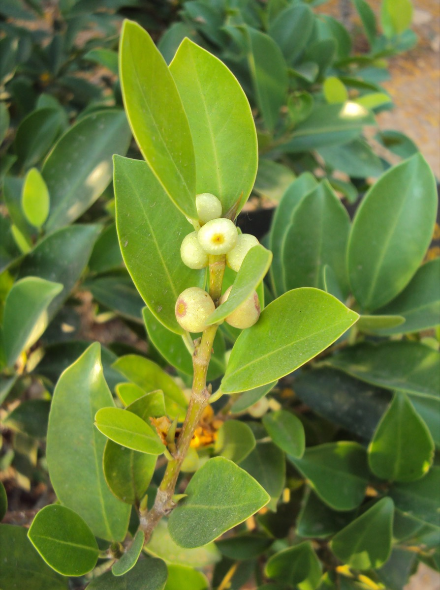

# Ficus microcarpa - Laurel

[TOC]

**Ficus microcarpa** is a banyan native in the range from Sri Lanka to India, southern People's Republic of China, the Malay Archipelago, the Ryukyu Islands, Australia, and New Caledonia.
## Uses
Wounds, Ulcers, Bruises, Flatulent colic, Hepatopathy, Dysentery, Diabetes, Hyperdipsia, Burning sensation

## Parts Used
Leaves, Bark.

## Chemical Composition
Hydroxypentracosanoylamino]- heptadecane triol, ursa-dien-3alpha-ol, epifriedelanol, alpha-amyrin acetate, beta-sitosterol, beta-daucosterol, hexacosanoic acid, heneicosanoic acid

## Common names
| Language | Names |
| --- | --- |
| Kannada | Peeladamara |
| Malayalam | Itti, Kallithi |
| Tamil | Kallichchi |
| Telugu | Plaksa |
| Hindi | Kamarup |
| English | Laurel Fig, Chinese Banyan |

## Properties
Reference: Dravya - Substance, Rasa - Taste, Guna - Qualities, Veerya - Potency, Vipaka - Post-digesion effect, Karma - Pharmacological activity, Prabhava - Therepeutics.
### Dravya
### Rasa
Kashaya (Astringent)
### Guna
Ruksha (Dry), Guru (heavy)
### Veerya
Sheeta (Cold)
### Vipaka
Katu (Pungent)
### Karma
Kapha, Pitta
### Prabhava
## Habit
Tree

## Identification
### Leaf
Simple, Alternate, Leathery, deep glossy green, oval-elliptic to diamond-shaped

### Flower
Unisexual, 2-4cm long, Yellow, 5-20, Flowers Season is June - August

### Fruit
Tiny, 1 cm in diameter, Specialized receptacle that develops into a multiple fruit, With hooked hairs, Many

### Other features
## List of Ayurvedic medicine in which the herb is used
* [Vishatinduka Taila](../medicines/Vishatinduka_Taila.md) as *root juice extract*

## Where to get the saplings
## Mode of Propagation
Seeds, Cuttings.

## How to plant/cultivate
Succeeds in full sun to partial shade. Prefers a moist, fertile soil

## Commonly seen growing in areas
Grows in widely varying locations, Limestone hills, Montane forest.

## Photo Gallery

## References

## External Links
* [Ficus microcarpa on bonsaiempire](https://www.bonsaiempire.com/tree-species/ficus)
* [Assimilation of Ficus microcarpa Hawaii plant growth and chemical constituents](http://sphinxsai.com/2016/ph_vol9_no10/1/(201-206)V9N10PT.pdf)
* [Chemical composition and Biological studies of Ficus benjamina](https://www.ncbi.nlm.nih.gov/pmc/articles/PMC4015825/)

## References

1. [constituents](Chemical)(https://www.researchgate.net/publication/24348507_Studies_on_chemical_constituents_of_aerial_roots_of_Ficus_microcarpa)
2. Kappatagudda - A Repertoire of  Medicianal Plants of Gadag by Yashpal Kshirasagar and Sonal Vrishni, Page No. 192
3. [Details](Cultivation)(http://tropical.theferns.info/viewtropical.php?id=Ficus+microcarpa)
