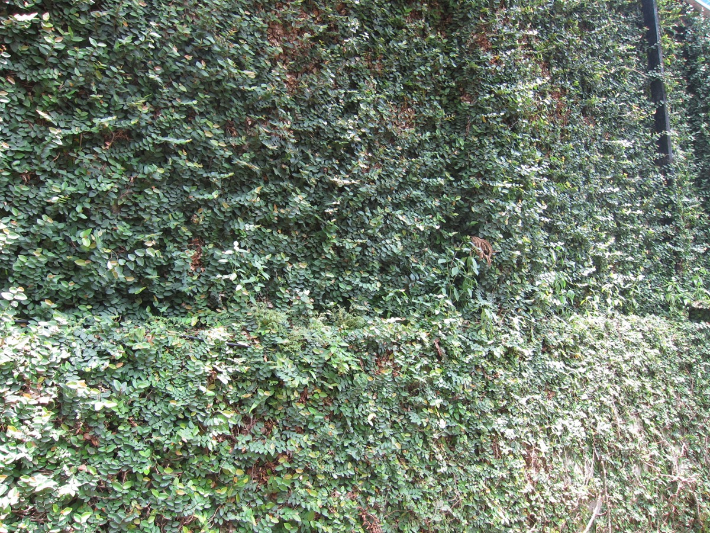

# Ficus pumila - Malayu

[TOC]

**Ficus pumila** is a species of flowering plant in the mulberry family. It is native to East Asia and naturalized in parts of the southeastern and south-central United States. This species has been widely grown as an ornamental. In China, Taiwan, and Japan, it is commercially cultivated to make jellies from the fruit.
## Uses
Impotence, Lumbago, Rheumatism, Anaemia, Haematuria, Chronic dysentery, Haemorrhoids

## Parts Used
Fruits, Leaves.

## Chemical Composition
Kaempferol, Rhamnopyranosyl, Glucopyranoside, Isoquercitrin, Quercitrin, Dihydrokaempferol, Glucopyranoside, Dihydro-kaempferol, Glucopyranoside.

## Common names
| Language | Names |
| --- | --- |
| English | Malayu |

## Properties
Reference: Dravya - Substance, Rasa - Taste, Guna - Qualities, Veerya - Potency, Vipaka - Post-digesion effect, Karma - Pharmacological activity, Prabhava - Therepeutics.
### Dravya
### Rasa
### Guna
### Veerya
### Vipaka
### Karma
### Prabhava
## Habit
Perenial shrub

## Identification
### Leaf
Simple, Non-Palm Foliage, Mature Foliage Texture is Leathery, Rough and Prominent Young Flush Colour is Red

### Flower
Unisexual, 2-4cm long, Yellow, 5-20, Flower Size is Very small, gathered on inner surface of synconium and Flowering Habit is Polycarpic

### Fruit
Fleshy Fruit, Fruit Classification is Simple, Mature Fruit Colour is Purple, red, Many

### Other features
## List of Ayurvedic medicine in which the herb is used
* [Vishatinduka Taila](../medicines/Vishatinduka_Taila.md) as *root juice extract*

## Where to get the saplings
## Mode of Propagation
Seeds, Cuttings.

## How to plant/cultivate
Succeeds in tropical and subtropical areas.

## Commonly seen growing in areas
Terrestrial, Subtropical area, Open Ground.

## Photo Gallery

_1.jpg)
_2.jpg)
_3.jpg)
.jpg)

## References

## External Links
* [Ficus pumila in missouri garden plants](http://www.missouribotanicalgarden.org/PlantFinder/PlantFinderDetails.aspx?kempercode=b599)
* [Chemical composition and Biological studies of Ficus benjamina](https://www.ncbi.nlm.nih.gov/pmc/articles/PMC4015825/)
* [Phytochemical and pharmacological study of Ficus palmata](https://www.sciencedirect.com/science/article/pii/S1319016413001217)]
* [Ficus pumila-Phytochemistry, Traditional Uses and Biological Activities](https://www.hindawi.com/journals/ecam/2013/974256/)

## References

1. [constituents](Chemical)(https://www.researchgate.net/publication/288975921_Chemical_constituents_from_Ficus_pumila)
2. [Morphology](https://florafaunaweb.nparks.gov.sg/special-pages/plant-detail.aspx?id=1403)
3. [Details](Cultivation)(http://tropical.theferns.info/viewtropical.php?id=Ficus+pumila)
