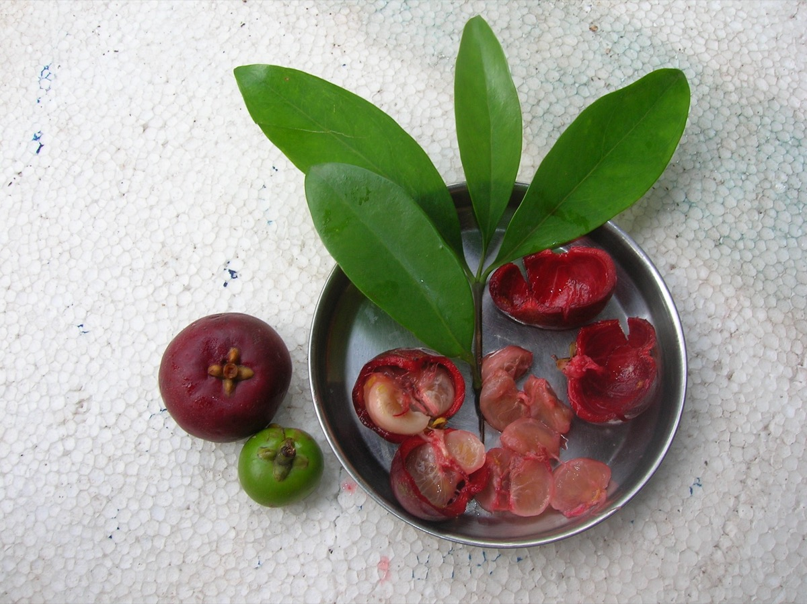

# Garcinia indica - Vrikshamia

[TOC]

**Garcinia indica** a plant in the mangosteen family. It is native to Asia and Africa. Garcinia indica is indigenous to the Western Ghats region of India located along the western coast of the country.
## Uses
Indigestion, Cuts, Snakebites, Diabetes, Cancers, Skin problems, Pimples, Diarrhea, Sore throats.

### Food
Garcinia indica can be used in Food. Leaves are used in curry and syrup is made from fruit pulp. The outer rind of the fruit is dried and used in curries. Edible fat from the plant which is known as Kokam butter is also used in some preparations.

## Parts Used
Leaves, Fruits.

## Chemical Composition
Cyanidin-3-glucoside and cyanidin-3-sambubioside.

## Common names
| Language | Names |
| --- | --- |
| Kannada | Murgina, Punarpuli |
| Malayalam | Kaattampi |
| Sanskrit | Vrikshamia, Amlabija |
| Tamil | Murgal, Murgal-mara |
| Hindi | Kokum |
| English | Kokam, Goa butter tree |

## Properties
Reference: Dravya - Substance, Rasa - Taste, Guna - Qualities, Veerya - Potency, Vipaka - Post-digesion effect, Karma - Pharmacological activity, Prabhava - Therepeutics.
### Dravya
### Rasa
Amla (sour), Madhura (sweet)
### Guna
Ruksha (Dry), Guru (heavy)
### Veerya
Ushna (Hot)
### Vipaka
Madhura (sweet)
### Karma
Kapha, Vata
### Prabhava
### Nutritional components
Garcinia indica Contains the Following nutritional components like - Vitamin-B and C; Citric acid, Malic acid; Hydro citric acid and Garcinol Manganese, Magnesium, Potassium.

## Habit
Tree

## Identification
### Leaf
Simple, Opposite, Estipulate; petiole 5-12 mm long, slender, glabrous; lamina 6.5-11 x 1.5-4 cm, lanceolate or obovate-oblong, base attenuate.

### Flower
Polygamodieocious, Axillary and terminal fascicles, Many, Pedicels 6 mm long; sepals 4, yellowish-orange to pinkish-orange, coriaceous, ovate-rotundate, outer ones 3-4.5 mm long, inner ones 4.5-5 mm long.

### Fruit
Berry, 2.5-4 cm across, 4-8 loculed, purple or wine brown, surrounded by persistent calyx; pulp red, Seeds 5-8, compressed in acidic pulp

### Other features
## List of Ayurvedic medicine in which the herb is used
* [Hingvadi churna](Hingvadi_churna.md)
* [Yavanyadi churna](Yavanyadi_churna.md)

## Where to get the saplings
## Mode of Propagation
Seeds, Grafting.

## Cultivation Details
It can be propagated through soft wood grafts. Garcinia indica requires a warm and humid tropical climate. Garcinia indica is available through December- March<ref name.

## Commonly seen growing in areas
Forest lands, Riversides, Wastelands.

## Photo Gallery

## References

## External Links
* [Garcinia indica on india agronet.com](https://www.indiaagronet.com/indiaagronet/crop%20info/kokam.htm)
* [Garcinia indica on ccari.res.in ](http://www.ccari.res.in/dss/kokum.html)
* [Kokum Farming Information](http://www.knowfarming.com/kokum-farming-information)

## References

1. [constituents](Main)(https://www.tandfonline.com/doi/full/10.1080/10942910802626754?src=recsys)
2. FLOWERING PLANTS OF KERALA VER.2, N. Sasidharan-Botanical description
3. [preparations](Ayurvedic)(https://easyayurveda.com/2015/05/18/kokum-garcinia-indica-uses-dose-research-side-effects/)
4. "Forest food for Northern region of Western Ghats" by Dr. Mandar N. Datar and Dr. Anuradha S. Upadhye, Page No.80, Published by Maharashtra Association for the Cultivation of Science (MACS) Agharkar Research Institute, Gopal Ganesh Agarkar Road, Pune
