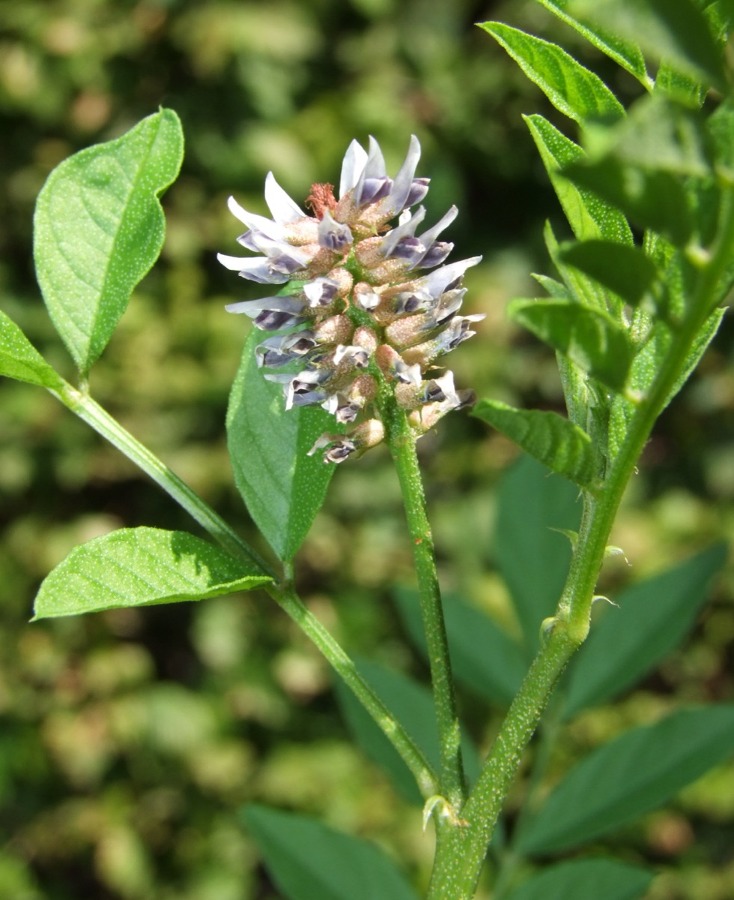

# Glycyrrhiza glabra - Yashtimadhu

[TOC]

** Glycyrrhiza glabra** is the root of Glycyrrhiza glabra from which a sweet flavour can be extracted. The liquorice plant is a herbaceous perennial legume native to southern Europe and parts of Asia, such as India. It is not botanically related to anise, star anise, or fennel, which are sources of similar flavouring compounds.
## Uses
Arthritis, Mouth ulcers, Cough, Asthma, Bronchitis, Blotches, Peptic ulcer, Allergic complaints, High blood pressure, Kidney disease, Herpes, Acidity, Increases strength, Throat disorder, Hair problems, Respiratory disorder.

## Parts Used
Roots, Leaves.

## Chemical Composition
Glycosides, glycyrrhizin (about 7%) and glycyrrhizinic acid, triterpenoid glycosides (saponins), flavonoids

## Common names
| Language | Names |
| --- | --- |
| Sanskrit | Yashtimadhu |

## Properties
Reference: Dravya - Substance, Rasa - Taste, Guna - Qualities, Veerya - Potency, Vipaka - Post-digesion effect, Karma - Pharmacological activity, Prabhava - Therepeutics.
### Dravya
### Rasa
Madhura (Sweet)
### Guna
Guru (Heavy), Snigda (unctous)
### Veerya
Sheeta (Cold)
### Vipaka
Madhura (Sweet)
### Karma
Vata, Pitta
### Prabhava
## Habit
Herb

## Identification
### Leaf
Simple, Divided into 9–17 leaflets, held on a leaf stalk 10–20 cm long

### Flower
Unisexual, 1.0–1.5 cm long, Violet, 5-20, The flowers are held in loose, conical spires, almost as long as the leaves

### Fruit
1–3 cm long and 4–5 mm wide, Each pod contains 2–5 brown to blackish seeds, With hooked hairs, Many

### Other features
## List of Ayurvedic medicine in which the herb is used
* [Yashtimadhu taila](Yashtimadhu_taila.md)
* [Kumkumadi taila](Kumkumadi_taila.md)

## Where to get the saplings
## Mode of Propagation
Seeds, Cuttings.

## How to plant/cultivate
Requires a deep well cultivated fertile moisture-retentive soil for good root production

## Commonly seen growing in areas
Dry open places, Sandy places near the sea.

## Photo Gallery
.JPG)
.JPG)

## References

## External Links
* [Licorice abuse: time to send a warning message](https://www.ncbi.nlm.nih.gov/pmc/articles/PMC3498851/)
* [Glycyrrhiza glabra-Neuroprotection by Spice-Derived Nutraceuticals](https://www.ncbi.nlm.nih.gov/pmc/articles/PMC3183139/pdf/nihms307525.pdf)
* [Liquorice, Glycyrrhiza glabra L.—Composition, uses and analysis](https://www.sciencedirect.com/science/article/pii/0308814690901592)
* [Glycyrrhiza glabra on INTERNATIONAL JOURNAL OF PHARMACEUTICAL SCIENCES AND RESEARCH](http://ijpsr.com/bft-article/glycyrrhiza-glabra-a-phytopharmacological-review/?view=fulltext)

## References

1. [Phytochemicals](https://www.mdidea.com/products/new/new01103.html)
2. [description](Plant)(http://powo.science.kew.org/taxon/urn:lsid:ipni.org:names:496941-1)
3. [preparations](Ayurvedic)(https://easyayurveda.com/2012/12/08/licorice-benefits-medicinal-qualities-complete-ayurveda-details/)
4. [details](Cultivation)(https://www.pfaf.org/user/Plant.aspx?LatinName=Glycyrrhiza+glabra)
