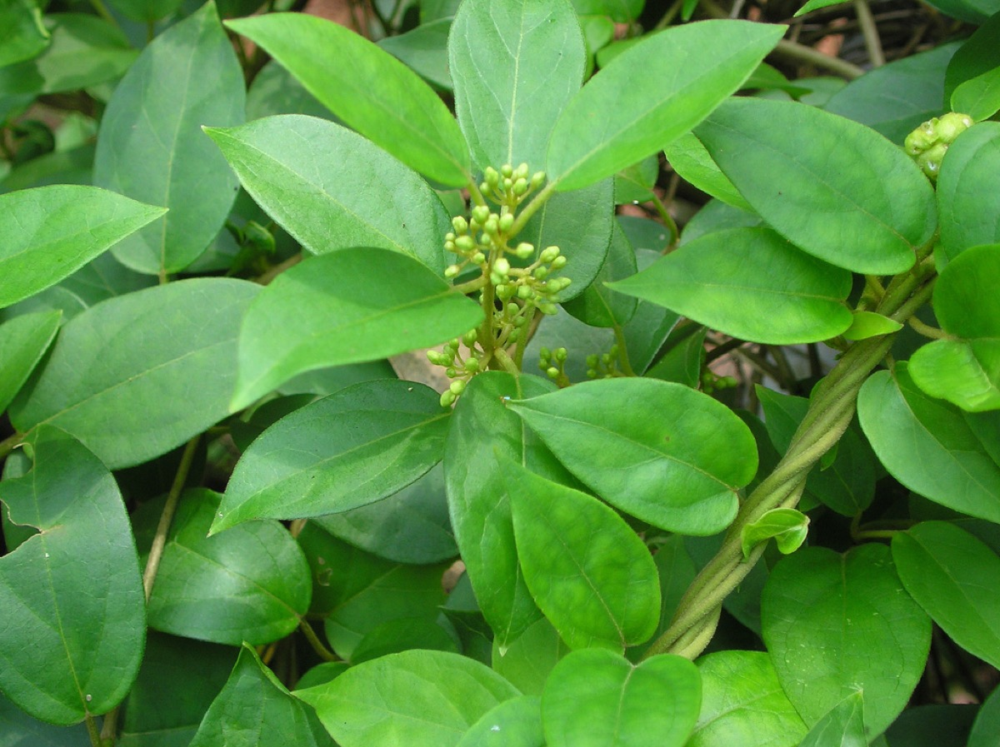

# Gymnema sylvestre - Madhunaashini

[TOC]

**Gymnema sylvestre** is an herb native to the tropical forests of southern and central India and Sri Lanka. Common names include Gymnema,Cowplant, Australian Cowplant, and Periploca of the woods.
## Uses
Diabetes, Fever, Cough, Swollen glands, Epilepsy, Boils, Pimples, Diarrhoea, Sore throats.

## Parts Used
Leaves, Roots.

## Chemical Composition
Flavones, Anthraquinones, Hentri-acontane, Pentatriacontane, α and β-chlorophylls, Phytin, Resins, D-quercitol, Tartaric acid, Formic acid, Butyric acid, Lupeol, β-amyrin.

## Common names
| Language | Names |
| --- | --- |
| Kannada | Madhunashini  ಮಧುನಾಶಿನಿ |
| Malayalam | Cakkarakkolli |
| Sanskrit | Madhunashini, Ajashringi |
| Tamil | Cirukurinca |
| Telugu | Podapatri |
| Marathi | Bedakicha pala |
| Hindi | Gurmar |
| English | Gurmar, Cowplant |

## Properties
Reference: Dravya - Substance, Rasa - Taste, Guna - Qualities, Veerya - Potency, Vipaka - Post-digesion effect, Karma - Pharmacological activity, Prabhava - Therepeutics.
### Dravya
### Rasa
Tikta (Bitter), Kashaya (Astringent)
### Guna
Laghu (Light), Ruksha (Dry)
### Veerya
Ushna (Hot)
### Vipaka
Katu (Pungent)
### Karma
Kapha, Vata
### Prabhava
## Habit
Climber

## Identification
### Leaf
Simple, Elliptic, Leaves are elliptic, narrow tipped, base narrow. Leaves are smooth above, and sparsely or densely velvety beneath

### Flower
Unisexual, 2-4cm long, Pale yellow, 5-20, Pale yellow flowers are small, in axillary and lateral umbel like cymes. Flowering season is October-May

### Fruit
Simple, Clearly grooved lengthwise, Lowest hooked hairs aligned towards crown, With hooked hairs, Fruiting season is season is October-May

### Other features
## List of Ayurvedic medicine in which the herb is used
[Amritamehari churna](Amritamehari_churna.md), [Glukostat](../medicines/Glukostat.md), [Goranchi](../medicines/Goranchi.md), [Jabrushila](../medicines/Jabrushila.md), [Daifort](../medicines/Daifort.md), [Daibin](../medicines/Daibin.md), [Daibeno](../medicines/Daibeno.md), [Daibecon](../medicines/Daibecon.md), [Daibet](../medicines/Daibet.md),  [Madhumardhan](../medicines/Madhumardhan.md), [Madhumehari Vati](../medicines/Madhumehari_Vati.md), [Losubit](../medicines/Losubit.md)

## Where to get the saplings
## Mode of Propagation
Seeds, Cuttings.

## How to plant/cultivate
The plant grows best in areas with a well-distributed rainfall of 600 - 1,000mm annually.
The plant can be multiplied either by seeds or by stem cuttings.

## Commonly seen growing in areas
Tropical forests, Southeast Asia, Plentiful moisture.

## Photo Gallery
_(16714280583).jpg)
_(17148318709).jpg)

_(4757589585).jpg)
_R.Br._ex_Sm._(27663398884).jpg)
.jpg)

## References

## External Links
* [Divya Madhunashini Vati Benefits and Side Effects](http://ollopage.com/herbs-and-spices/divya-madhunashini-vati-benefits-side-effects.html)
* [Gymnema sylvestre-benefits, sideeffects, remedies](https://easyayurveda.com/2016/12/13/madhunashini-gudmar-gymnema-sylvestre/)
* [Gymnema sylvestre on horticulture.in](http://horticulture.kar.nic.in/APMAC_website_files/madhunasini2.htm)
* [Gymnema sylvestre on ayur times](https://www.ayurtimes.com/divya-madhunashini-vati/)
* [Divya Madhunashini Vati For Diabetes, Ingredients and Side-Effects](https://www.bimbima.com/ayurveda/divya-madhunashini-vati-for-diabetes/1625/)

## References

1. [Phytochemistry](https://www.ncbi.nlm.nih.gov/pmc/articles/PMC2170951/)
2. [descriotion](Plant)(http://www.flowersofindia.net/catalog/slides/Gurmar.html)
3. [preparations](Ayurvedic)(https://easyayurveda.com/2016/12/13/madhunashini-gudmar-gymnema-sylvestre/)
4. [details](Cultivation)(http://agritech.tnau.ac.in/horticulture/horti_medicinal%20crops_gymnema.html)
5. ”Karnataka Medicinal Plants Volume-3” by Dr.M. R. Gurudeva, Page No.299, Published by Divyachandra Prakashana, #6/7, Kaalika Soudha, Balepete cross, Bengaluru
