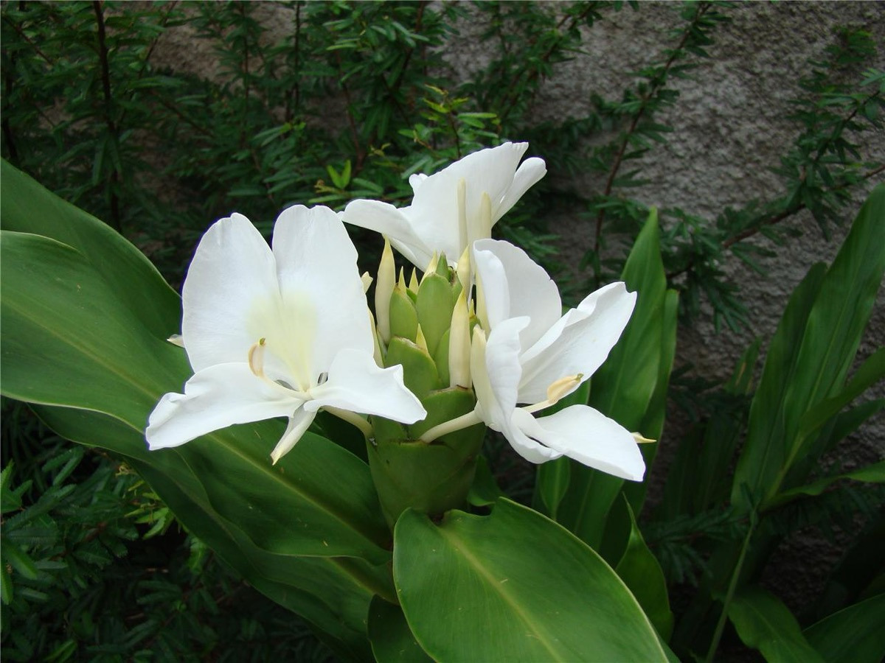

# Hedychium coronarium - Butterfly ginger lily

[TOC]

**Hedychium coronarium** is the National Flower of Cuba. The plant has become wild in the cool rainy mountains in Sierra del Rosario, Pinar del Rio Province in the west, Escambray Mountains in the center of the island, and in Sierra Maestra in the very west of it.
## Uses
Febrifuge, Chest pain, Tonsillitis, Infected nostrils, Abdominal complaint, Stiff joints, Pain in arms

## Parts Used
Young buds, Flowers, Roots

## Chemical Composition
Three new labdane-type diterpenes 1-3, named coronarins G-I as well as seven known 4-10, coronarin D, coronarin D methyl ether, hedyforrestin C, (E)-nerolidol, β-sitosterol, daucosterol, and stigmasterol were isolated

## Common names
| Language | Names |
| --- | --- |
| Kannada | Suruli Sugandhi |
| Malayalam | Elipoochedihankitam, Chantikantam |
| Tamil | Chankitam, Chantikantam |
| Telugu | Kichchiligadda |
| Hindi | Dolan champa |
| English | Butterfly Ginger Lily |

## Properties
Reference: Dravya - Substance, Rasa - Taste, Guna - Qualities, Veerya - Potency, Vipaka - Post-digesion effect, Karma - Pharmacological activity, Prabhava - Therepeutics.
### Dravya
### Rasa
Tikta (Bitter), Kashaya (Astringent)
### Guna
Laghu (Light), Tikshna (Sharp)
### Veerya
Ushna (Hot)
### Vipaka
Katu (Pungent)
### Karma
Vata
### Prabhava
## Habit
Perennial herb

## Identification
### Leaf
Sharp-pointed, Lance-shaped, 8-24 in long and 2-5 in wide and arranged in 2 neat ranks that run the length of the stem

### Flower
Unisexual, 6-12 in long, White, 5, Flowers are like  Showy, Fragrant

### Fruit
7–10 mm (0.28–0.4 in.) long pome, Clearly grooved lengthwise, Lowest hooked hairs aligned towards crown, With hooked hairs

### Other features
## List of Ayurvedic medicine in which the herb is used
## Where to get the saplings
## Mode of Propagation
Seeds, By clump.

## How to plant/cultivate
Very rarely froms seeds. Rhizome division is the best method. Dig up the clump and divide it with a sharp spade or knife, making sure that each division has a growing shoot.

## Commonly seen growing in areas
Tropical area, Subtropical area, Moist places along streams, Forest edges, Along the banks of river.

## Photo Gallery

## References

## External Links
* [Hedychium coronarium on missouribotanicalgarden](http://www.missouribotanicalgarden.org/PlantFinder/PlantFinderDetails.aspx?kempercode=a521)
* [Hedychium coronarium on cabi.org](https://www.cabi.org/isc/datasheet/26678)
* [Hedychium coronarium on keys lucidcentral.org](https://keys.lucidcentral.org/keys/v3/eafrinet/weeds/key/weeds/Media/Html/Hedychium_coronarium__(White_Ginger).htm)
* [Hedychium coronarium on biosecurity queensland edition](https://keyserver.lucidcentral.org/weeds/data/media/Html/hedychium_coronarium.htm)

## References

1. [constituents](Chemical)(https://www.ncbi.nlm.nih.gov/pubmed/22071304)
2. [of india Leaves](Flowers)(http://www.flowersofindia.net/catalog/slides/Butterfly%20Ginger%20Lily.html)
3. [Details](Cultivation)(http://tropical.theferns.info/viewtropical.php?id=Hedychium+coronarium)
