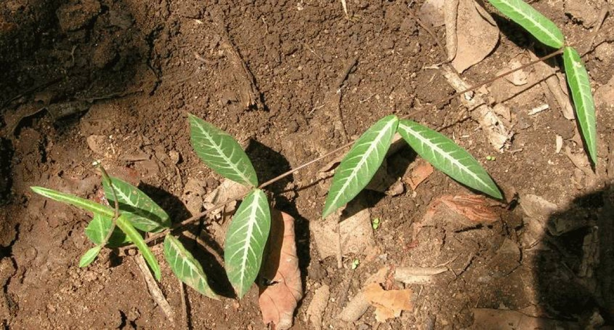

# Hemidesmus indicus - Ananthamoola

[TOC]

**Hemidesmus indicus** is a climber found throughout India. The plant is widely exploited from the wild for its root, which is used medicinally. Plant populations in some areas have dropped dramatically and the plant is now being experimentally cultivated in India.
## Uses
Gums diseases in teeth, Hair fall, Dysuria, Eye diseases, Jaundice, Rheumatism, Arthritis, Body pain, Abdominal pain, Indigestion, Scabies, Eczema, Thirst, Vomiting.

### Food
Hemidesmus indicus can be used in Food  Leaves cooked as vegetable and roots used in preparation of tea.

## Parts Used
Root

## Chemical Composition
Nerolidol (1.2%), borneol (0.3%), linalyl acetate (0.2%), dihydrocarvyl acetate (0.1%), salicylaldehyde (0.1%), isocaryophyllene (0.1%), alpha terpinyl acetate (traces) and 1, 8-cineol (traces) are important as aromatic and bioactive principles

## Common names
| Language | Names |
| --- | --- |
| Kannada | Sogadeberu, Namadaberu |
| Malayalam | Nannari Narunanti |
| Sanskrit | Nagajihya, Anantamula |
| Tamil | Nannari |
| Telugu | Nannari, Sugandhipal |
| Hindi | Anantamul |
| English | Indian sarsaparilla |

## Properties
Reference: Dravya - Substance, Rasa - Taste, Guna - Qualities, VeNannarierya - Potency, Vipaka - Post-digesion effect, Karma - Pharmacological activity, Prabhava - Therepeutics.
### Dravya
### Rasa
Tikta (Bitter), Madhura (Sweet)
### Guna
Guru (heavy), Snigda (oily)
### Veerya
Sheeta (Cold)
### Vipaka
Madhura (Sweet)
### Karma
Kapha, Pitta
### Prabhava
### Nutritional components
Hemidesmus indicus Contains the Following nutritional components like - Vitamin-C and E; Alkaloids; Flavanoids; Glycosides; Phytosterols; Phenols; Saponins; Terpenoids; Tannins; Calcium, Iron, Magnesium, Phosphorus, Potassium, Sodium, Zinc.

## Habit
Twiner, Climber

## Identification
### Leaf
Simple, Opposite, The leaves are variable, elliptic–oblong to linear–lanceolate, variegated, and white above and silvery-white pubescent beneath

### Flower
Unisexual, 2-4cm long, Greenish purple, 5-20, Flowers are crowded in axillary cymes in small compact clusters. Flowering season is October-January

### Fruit
Paired, Fruits cylindrical, pointed, and slender. Seeds are oblong in shape, Fruits mature in January, Many, Fruiting season is October-January

### Other features
## List of Ayurvedic medicine in which the herb is used
[Sarivadyasavam](Sarivadyasavam.md), [Mathala rasayanam](Mathala_rasayanam.md), [Mahamajishtadi kashayam](Mahamajishtadi_kashayam.md), [Maha Vishagarbha taila](Maha_Vishagarbha_taila.md)[Manasamitra vatakam](Manasamitra_vatakam.md)

## Where to get the saplings
## Mode of Propagation
Seeds, Cuttings.

## How to plant/cultivate
The plant can best be propagated from stem and rootstock cuttings obtained from more than one-year-old plants. Rootstock cuttings have better sprouting and survival rates than stem cuttings. Hemidesmus indicus is available throughout the year

## Commonly seen growing in areas
Tropical area, Subtropical area

## Photo Gallery
_(8067770519).jpg)
_(21953065323).jpg)
_(21951539064).jpg)

_Indian_sarsaparilla_shrub_at_Simhachalam_hill.jpg)
.jpg)

## References

## External Links
* [Hemidesmus indicus on homeremedies](http://www.homeremediess.com/medicinal-plant-anantmool-uses-and-images-hemidesmus-indicus/)
* [Emidesmus indicus on vikaspedea](http://vikaspedia.in/agriculture/crop-production/package-of-practices/medicinal-and-aromatic-plants/hemidesmus-indicus)
* [Hemidesmus Indicus (Anantmool) Health Benefits And Uses](https://www.medicinalplantsanduses.com/hemidesmus-indicus-medicinal-uses)
* [Emidesmus indicus on Envis centre on medicinal plants](http://envis.frlht.org/plantdetails/bebf01836cf2324a00cfd7dc19fdf95a/c0491a6f31fd7b493ffd012e4d99d7ad)

## References

1. [Phytochemicals](https://scialert.net/fulltextmobile/?doi=jps.2008.146.156)
2. [Morphology](http://vikaspedia.in/agriculture/crop-production/package-of-practices/medicinal-and-aromatic-plants/hemidesmus-indicus)
3. [preparations](Ayurvedic)(https://easyayurveda.com/2013/12/20/sariva-hemidesmus-indicus-benefits-usage-dose-side-effects/)
4. [details](Cultivation)(http://vikaspedia.in/agriculture/crop-production/package-of-practices/medicinal-and-aromatic-plants/hemidesmus-indicus)
5. "Forest food for Northern region of Western Ghats" by Dr. Mandar N. Datar and Dr. Anuradha S. Upadhye, Page No.89, Published by Maharashtra Association for the Cultivation of Science (MACS) Agharkar Research Institute, Gopal Ganesh Agarkar Road, Pune
6. ”Karnataka Medicinal Plants Volume-3” by Dr.M. R. Gurudeva, Page No.653, Published by Divyachandra Prakashana, #6/7, Kaalika Soudha, Balepete cross, Bengaluru
