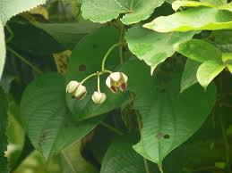

# Holostemma adakodien - Arkapushpi, Holostemma

[TOC]

**Arkapushpi** is a genus of Flowering plants formerly belonging to the plant family Asclepiadaceae. The genus was first described in 1810. As presently constituted, the genus contains only one known species, Holostemma ada-kodien. It is native to southern Asia (China, Nepal, Pakistan, Kashmir, India, Sri Lanka, Myanmar, Thailand).

## Uses
Pregnancy care, Eye care, Skin diseases, Ulcers, Wounds, Gonorrhoea, Diarrhea, Cough, Loss of appetite, Stomachache, Ulcers.

### Food
Arkapushpi can be used in Food. Fleshy flower buds and tender fruits are cooked as vegetable. Buds sometimes eaten raw.

## Parts Used
Rhizome, Latex.

## Chemical Composition
Alpha-amyrin, lupeol and beta-sitosterol

## Common names
| Language | Names |
| --- | --- |
| Kannada | ಅರಣೆ ಬೀಳು Arane beelu, ಜೀವ ಹಾಲೆ Jeevahaale |
| Malayalam | Ada kodien |
| Sanskrit | Jivanti, Arkapushpi |
| Tamil | Palay kirai, |
| Telugu | Palagurugu |
| Hindi | Chhirvel, Arkapushpi |
| English | Holostemma |
| Gujarati | Khaner, Khiran |

## Properties
Reference: Dravya - Substance, Rasa - Taste, Guna - Qualities, Veerya - Potency, Vipaka - Post-digesion effect, Karma - Pharmacological activity, Prabhava - Therepeutics.
### Dravya
### Rasa
### Guna
### Veerya
### Vipaka
### Karma
### Prabhava
### Nutritional components
Arkapushpi Contains the Following nutritional components like - Vitamin-A and C; β-carotene; Calcium, Copper, Iron, Magnesium, Manganese, Potassium, Phosphorus, Sodium, Zinc

## Habit
Climber

## Identification
### Leaf
Large, Triangle, Leaf's Margin is Entire and Venation-Cross venulated. leaves 7-15 cm length and 5-10 cm breadth, top of the leaf is smooth and bottom part is hairy

### Flower
Peduncled cymes, 10–15 cm long, Yellow-white, Peduncles shorter than the petiole, stout; pedicels 1.5 cm long; calyx lobes ovate, 4 mm long; corolla 2.5 cm across, campanulate, pale purple, lobes 8 x 6 mm, ovate, obtuse. Flowering season is April-September

### Fruit
Oblong pod, Thinly septate, pilose, wrinkled, Fruiting season is April-September

### Other features
## List of Ayurvedic medicine in which the herb is used
## Where to get the saplings
## Mode of Propagation
Seeds.

## How to plant/cultivate
The plant can be propagated through seeds. Matured seeds are collected from the plant during December–January before they disperse. Seeds are cleaned, dried, and stored for sowing. Arkapushpi is available through June to October.

## Commonly seen growing in areas
Scrub jungles, Deciduous forests, Plain area

## Photo Gallery

## References

## External Links
* [Jivanthi Information and Medicinal Uses](https://www.bimbima.com/ayurveda/jivanthi-holostemma-ada-kodien-information-and-medicinal-uses/605/)
* [Holostemma on ondis biodiversity portal](https://indiabiodiversity.org/species/show/248774)
* [A review on medicinal plants of Holostemma](http://www.phytojournal.com/archives/2016/vol5issue3/PartD/5-3-29-882.pdf)
* [In vitro propagation ofHolostemma annulare](https://link.springer.com/article/10.1007/BF02823124)

## References

1. [contents](Chemical)(http://www.medicinalplantsindia.com/jivanti.html)
2. [Diagnostic](https://indiabiodiversity.org/species/show/229953)
3. [details](Cultivation)(http://vikaspedia.in/agriculture/crop-production/package-of-practices/medicinal-and-aromatic-plants/holostemma-ada-kodien)
4. "Forest food for Northern region of Western Ghats" by Dr. Mandar N. Datar and Dr. Anuradha S. Upadhye, Page No.93, Published by Maharashtra Association for the Cultivation of Science (MACS) Agharkar Research Institute, Gopal Ganesh Agarkar Road, Pune
