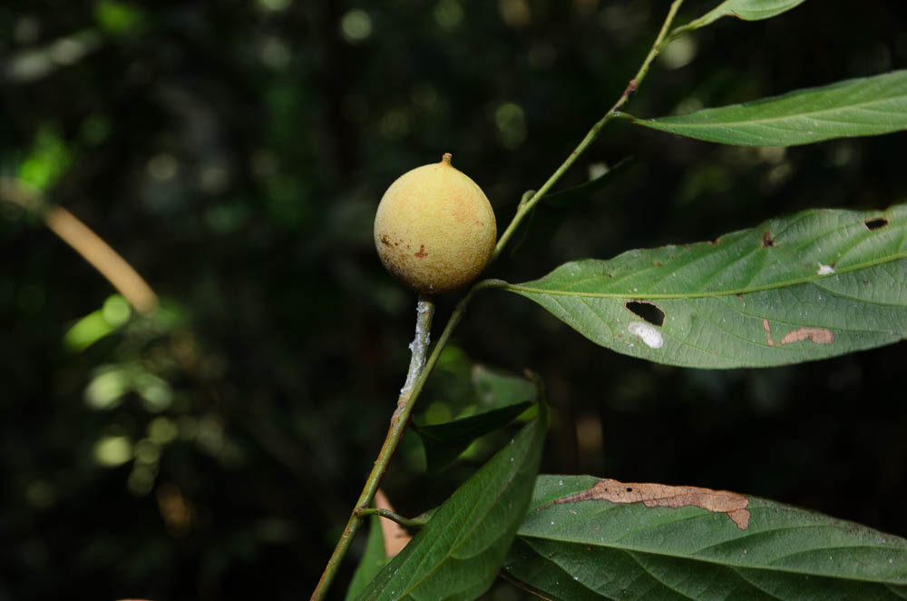

# Hydnocarpus kurzii - Chalmogra

[TOC]

**Hydnocarpus kurzii** is an evergreen tree that usually grows 8 - 20 metres tall. The oil from the seed of this tree was the first known effective treatment for leprosy and became the source of the first synthetic drugs to treat the disease. Although now largely replaced in conventional medicine by these synthetic drugs. It is native to Southeast Asia, tropical Africa and tropical South America.
## Uses
Leprosy, Fever, Internal disorders, Skin diseases.

## Parts Used
Seeds, Bark.

## Chemical Composition
Bark of the tree contains certain tannins.

## Common names
## Properties
Reference: Dravya - Substance, Rasa - Taste, Guna - Qualities, Veerya - Potency, Vipaka - Post-digesion effect, Karma - Pharmacological activity, Prabhava - Therepeutics.
### Dravya
### Rasa
### Guna
### Veerya
### Vipaka
### Karma
### Prabhava
## Habit
Evergreen tree

## Identification
### Leaf

### Flower
### Fruit
### Other features
## List of Ayurvedic medicine in which the herb is used
## Where to get the saplings
## Mode of Propagation
Seeds

## How to plant/cultivate
A plant of the wet tropics, where it can be found at elevations up to 1,800 metres.

## Commonly seen growing in areas
Evergreen forests.

## Photo Gallery

## References

## External Links
* [Hydnocarpus kurzii on pfaf.org](https://pfaf.org/user/Plant.aspx?LatinName=Hydnocarpus+kurzii)
* [Hydnocarpus kurzii Hydnocarpus kurzii on  indiabiodiversity.org](https://indiabiodiversity.org/species/show/227382)

## References

1. [Chemistry]
2. [Morphology]
3. [Cultivation](http://tropical.theferns.info/viewtropical.php?id=Hydnocarpus+kurzii)
4. Indian Medicinal Plants by C.P.Khare
