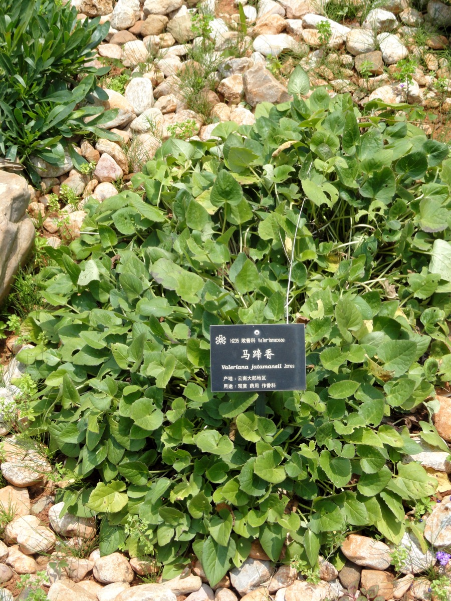

# Jatamansi

[TOC]

Jatamansi or *Nardostachys grandiflora* is a forest perennila herb, 0.5-2 ft tall, velvet-hairy to hairy. Rhizome are elongate, with fibrous roots. Stems are 3-6 in number. Leaves at the base are heart-shaped or ovate, 2-10 cm x 1.5-8 cm, toothed or wavy-toothed. Stem leaves are stalkless, smaller, uppermost often cut. Snow-white flowers are borne in flat-topped clusters on top of the stems. Upper bracts are linear-lanceshaped, about 3 mm long. Stigma is 3-fid. Seed-pods are velvety, shorter than the upper bracts. Jatamansi is found throughout the Himalayas, from Afghanistan to SW China, at altitudes of 1500-3600 m. Flowering: March-May.

## Medicinal uses
[Warning: Unverified information] Jatamansi is well-know in traditional Indian medicine. It is supposedly useful in diseases of eye, blood and livers, is used as a remedy for hysteria, hypochondriasis, nervous unrest and emotional stress. Also useful in clearing voice and acts as stimulant in advance stage of fever and nervous disorder. The paste of roots mashed in water is applied on forehead to alleviate the pain. Externally, the paste of its roots is applied in wounds for better healing.

## Common name
* **English** -  Valeriana jatamansi
* **Kannada** - ನಂದು ಬಟ್ಲು
* **Hindi** -  Balchhari

## External Links
* [Flowers of India - Valeriana jatamansi](https://www.flowersofindia.net/catalog/slides/Jatamansi.html)
* ['Jatamansi' benefits and uses](http://easyayurveda.com/2013/09/06/jatamansi-benefits-usage-side-effects/) - Easy Ayurveda. Retrieved on 10 July 2017.
