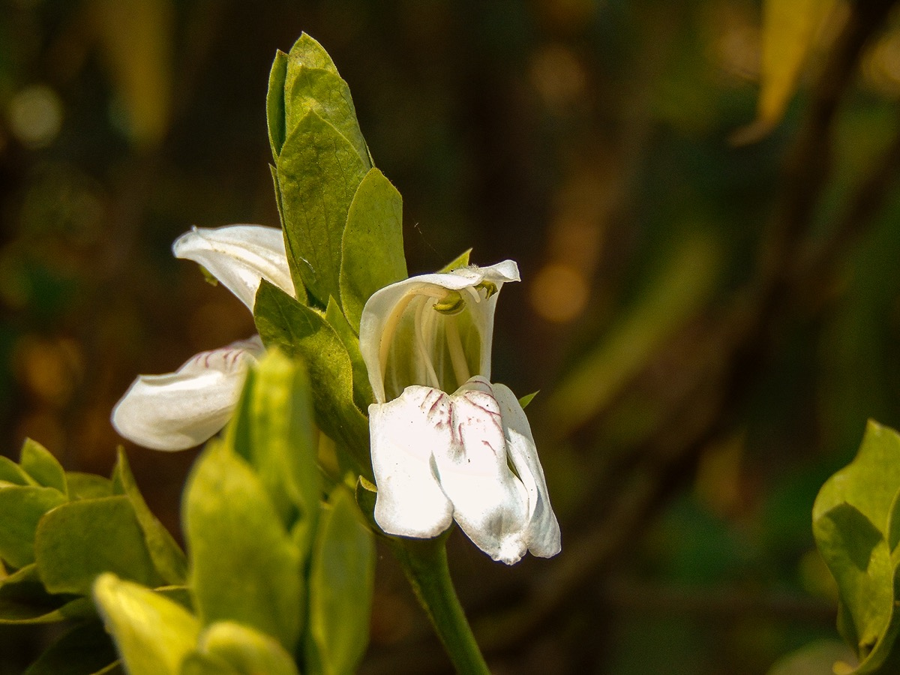

# Justicia Adhatoda - Sinhapuri

[TOC]

**Justicia Adhatoda** plant is very useful in Indian Ayurveda. It is a medicinal plant native to asia , widely used in siddha medicine, ayurvedic, and homeopathy.

## Uses
Asthma, Rheumatic pain, Snakebites, Excessive bleeding, Indigestion, Bleeding Gums, Cough, Phlegm, Sore throats

## Parts Used
Leaves, Roots, Bark.

## Chemical Composition
Contains volatile oils, flavonoids, apigenin, luteolin, quercetin, kaempferol, tiliroside, triterpene glycosides including euscapic acid and tormentic acid, phenolic acids, and 3%–21% tannins

## Common names
| Language | Names |
| --- | --- |
| Kannada | Adusoge |
| Malayalam | Atalotakam |
| Sanskrit | Vasaka |
| Tamil | Adadorai, Arathorai |
| Telugu | Adasaramu |
| Hindi | Vasika |
| English | Malabar nut |

## Properties
Reference: Dravya - Substance, Rasa - Taste, Guna - Qualities, Veerya - Potency, Vipaka - Post-digesion effect, Karma - Pharmacological activity, Prabhava - Therepeutics.
### Dravya
### Rasa
Tikta (Bitter), Kashaya (Astringent)
### Guna
Laghu (Light), Ruksha (Dry)
### Veerya
Sheeta (cold)
### Vipaka
Katu (Pungent)
### Karma
Kapha, Pitta
### Prabhava
## Habit
Shrub

## Identification
### Leaf
Simple, Lanceolate, Slightly acuminate, base tapering, petiolate, petioles 2-8 cm long, exstipulite

### Flower
Unisexual, 2-4cm long, Yellow, 5, It is dense short-pendunculate, bracteate with terminal spike

### Fruit
Simple, 7–10 mm, The fruit is a small capsule, Many

### Other features
## List of Ayurvedic medicine in which the herb is used
* [Vishatinduka Taila](../medicines/Vishatinduka_Taila.md) as *root juice extract*

## Where to get the saplings
## Mode of Propagation
Seeds, Cuttings.

## How to plant/cultivate
Adathoda vasica N. is an evergreen shrub with unpleasant, foetid smell. The older stem is greyish green, warty and woody.

## Commonly seen growing in areas
Lower himalayas, Tropical areas, Moisture areas, Dry soils

## Photo Gallery

## References

## External Links
* [Ragwort – Traditional Uses and Toxicity](https://www.herbal-supplement-resource.com/ragwort-uses.html)
* [Adhatoda Vasica – Health Benefits and Side Effects](https://www.herbal-supplement-resource.com/adhatoda-vasica.html)
* [vasaka on planet ayurveda](http://www.planetayurveda.com/)
* [vasaka on always ayurveda](http://www.alwaysayurveda.com/adhatoda-vasica/)

## References

1. [comoposition of vasaka](Chemical)(http://www.gyanunlimited.com/health/vasaka-malabar-nut-medicinal-uses-benefits-and-side-effects/11317/)
2. [description](Plant)(https://www.bimbima.com/ayurveda/vasa-malabar-nut-benefits-medicinal-uses-and-side-effects/915/)
3. [Cultivation](http://onfarming.com/articles/7188-cultivation-of-malabar-nut-herb-and-its-uses)
