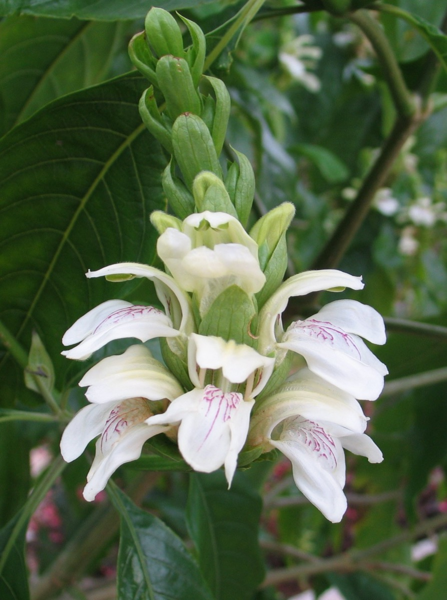
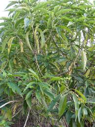
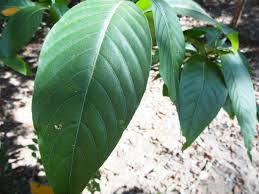
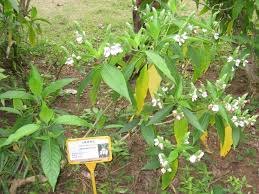

# Justicia adhatoda - Simhaparni

[TOC]

**Simhaparni** is the sanskrit name of **Justicia adhatoda**. It is native to Asia, widely used in Siddha Medicine, Ayurveda, homeopathy and Unani systems of medicine. The plant's range includes Sri Lanka, Nepal, India, Pakistan, Indonesia, Malaysia, and China as well as Panama where it is thought to have been introduced.
## Uses
Joint pain, Cuts, Cough, Skin itchiness, Respiratory disorders, Asthma, Abnormal bleeding, Peptic ulcers, Piles.

## Parts Used
Roots, Leaves, Stem, Flowers.

## Chemical Composition
Adhatoda zeylanica contains a number of chemical constituents which are responsible to cure many diseases and disorders.

## Common names
| Language | Names |
| --- | --- |
| Kannada | Aadu muttada gida, Aadu soge ಅಡುಸೋಗೆ |
| Malayalam | Adel-odagam |
| Sanskrit | Arus, Vajidantakahaatarusha |
| Tamil | Aadaathodai, Acalai |
| Telugu | Addasaramu, Addasarapaku |
| Hindi | Adusa, Vasak |
| English | Malabar nut |
| Marathi | Adulasa |

## Properties
Reference: Dravya - Substance, Rasa - Taste, Guna - Qualities, Veerya - Potency, Vipaka - Post-digesion effect, Karma - Pharmacological activity, Prabhava - Therepeutics.
### Dravya
### Rasa
Tikta (Bitter), Kashaya (Astringent)
### Guna
Laghu (Light), Ruksha (Dry)
### Veerya
Sheeta (Cold)
### Vipaka
Katu (Pungent)
### Karma
Kapha, Pitta
### Prabhava
## Habit
Shrub

## Identification
### Leaf
Simple, Opposite, Lanceolate to ovate-lanceolate, Leaves 10 - 30 cm long, slightly acuminate, base tapering, petiolate, petioles 1 - 2.5 cm long.

### Flower
Unisexual, 2-4cm long, White, 2, Axillary pedunculate spikes, the corolla is large and white with a funnel shaped lower portion, Flowering season: July-September

### Fruit
Capsule, 1.9-2.2 x 0.8 cm wide, The fruit is a small capsule, Many, Fruiting season: July-September

### Other features
## List of Ayurvedic medicine in which the herb is used
* [Vasarishta](Vasarishta.md)
* [Mathala rasayanam](Mathala_rasayanam.md)
* [Maha Vishagarbha taila](Maha_Vishagarbha_taila.md)

## Where to get the saplings
## Mode of Propagation
Seeds, Cuttings.

## How to plant/cultivate
A plant of the drier to wet, lowland tropics, where it is found at elevations up to 1,300 metres

## Commonly seen growing in areas
Himalayas, Tropical area, At cold forest.

## Photo Gallery

.jpg)

## References

## External Links
* [Adhatoda Zeylanica Medikus on ayurtimes.org](https://www.ayurtimes.com/adhatoda-vasica-vasaka/)
* [Zeylanica Medikus on planet ayurveda](http://www.homeremediess.com/medicinal-plant-adhatoda-vasica-benefits-and-images/)
* [Zeylanica Medikus on hoticulture.org](http://www.planetayurveda.com/library/vasaka)
* [Zeylanica Medikus on  herbal-supplement-resource](http://www.ehorticulture.com/tree-plants-seeds/medicinal-plants/adhatoda-zeylanica-detail.html)

## References

1. [constituents](Chemical)(http://www.researchjournal.co.in/upload/assignments/4_304-306.pdf)
2. [Information](General)(https://www.bimbima.com/ayurveda/vasa-malabar-nut-benefits-medicinal-uses-and-side-effects/915/)
3. [Details](Cultivation)(http://tropical.theferns.info/viewtropical.php?id=Justicia+adhatoda)
4. [preparations](Ayurvedic)(https://easyayurveda.com/2014/07/25/vasaka-adhatoda-vasica-uses-side-effects-research/)
5. Karnataka Aushadhiya Sasyagalu By Dr.Maagadi R Gurudeva, Page no:33
6. Kappathagudda - A Repertoire of Medicinal Plants of Gadag, Page no: 42
