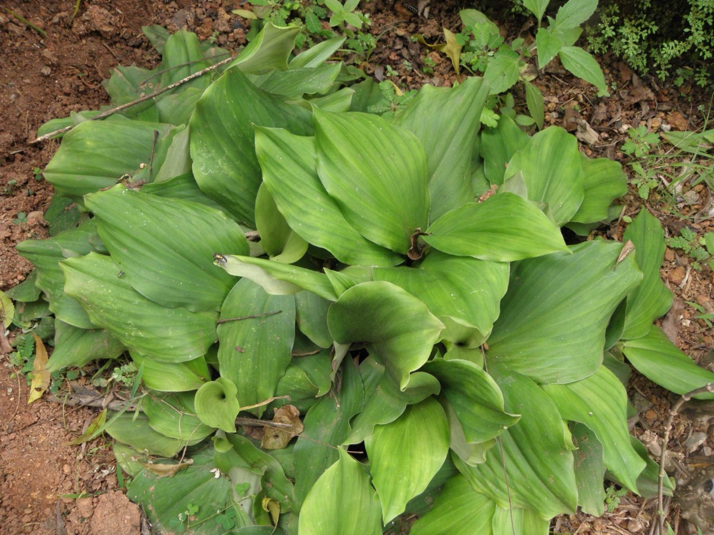

# Kaempferia galanga - Chandramoolika

[TOC]

**Chandramoolika** is a monocotyledonous plant in the Ginger family, and one of four plants called galangal. It is found primarily in open areas in Indonesia, southern China, Taiwan, Cambodia, and India, but is also widely cultivated throughout Southeast Asia.
## Uses
Cold, Bronchial complaints, Dyspepsia, Gastric problems, Headaches, Sore throats, Cough, Asthma, High blood pressure

## Parts Used
Rhizomes, Leaves.

## Chemical Composition
Lesser galanga rhizome contains about 2.5 to 4% essential oil, whose main com­ponents are ethyl cin­namate (25%), ethyl-p‑methoxy cin­namate (30%) and p‑methoxy cinnamic acid; further­more, 3‑carene-5‑one was found (Phytochemistry, 26, 3350, 1987)

## Common names
| Language | Names |
| --- | --- |
| Kannada | Kachchura, Kachhoora |
| Malayalam | Kachhuram, Katjulam |
| Sanskrit | Chandramoolika, corakah |
| Tamil | Kacholum, Pulankilanku |
| Hindi | Chandramula, Sidhoul |
| English | Aromatic Ginger, Resurrection lily, Lesser galangal, Sand ginger |

## Properties
Reference: Dravya - Substance, Rasa - Taste, Guna - Qualities, Veerya - Potency, Vipaka - Post-digesion effect, Karma - Pharmacological activity, Prabhava - Therepeutics.
### Dravya
### Rasa
### Guna
### Veerya
### Vipaka
### Karma
### Prabhava
## Habit
Perennial herb

## Identification
### Leaf
Simple, Non-Palm Foliage, Foliar Arrangement Along Stem is Basal and Foliar Venation is Parallel

### Flower
Bisexual, Tubular, Cruciform / Cross-shaped, Purple, White, Flower Grouping is Cluster / Inflorescence and Flower Location is Terminal

### Fruit
7–10 mm (0.28–0.4 in.) long pome, clearly grooved lengthwise, Lowest hooked hairs aligned towards crown, With hooked hairs

### Other features
## List of Ayurvedic medicine in which the herb is used
## Where to get the saplings
## Mode of Propagation
Seeds, Division of the rhizomes.

## How to plant/cultivate
A plant of the moister tropics with a distinct dry season, it prefers a humid climate and a minimum temperature that seldom falls below about 18°c

## Commonly seen growing in areas
Open forest, Forest edges, Bamboo forest, At elevations up to 1,000 metres

## Photo Gallery
.jpg)

## References

## External Links
* [Kaempferia galanga on flowers of india](http://www.flowersofindia.net/catalog/slides/Aromatic%20Ginger.html)
* [Kaempferia Galanga Benefits, Aromatic Ginger, Sand Ginger](https://www.thealthbenefitsof.com/kaempferia-galanga-benefits/)
* [Kaempferia galanga on entheology](http://entheology.com/plants/kaempferia-galanga-galanga/)
* [A comprehensive review of Kaempferia galanga L](http://www.plantsjournal.com/archives/2016/vol4issue3/PartD/4-3-8-414.pdf)

## References

1. [constitu­ents"]("Main)(http://gernot-katzers-spice-pages.com/engl/Kaem_gal.html)
2. [Morphology "]("Plant)(https://florafaunaweb.nparks.gov.sg/special-pages/plant-detail.aspx?id=2164)
3. [Details"]("Cultivation)(http://tropical.theferns.info/viewtropical.php?id=Kaempferia+galanga)
