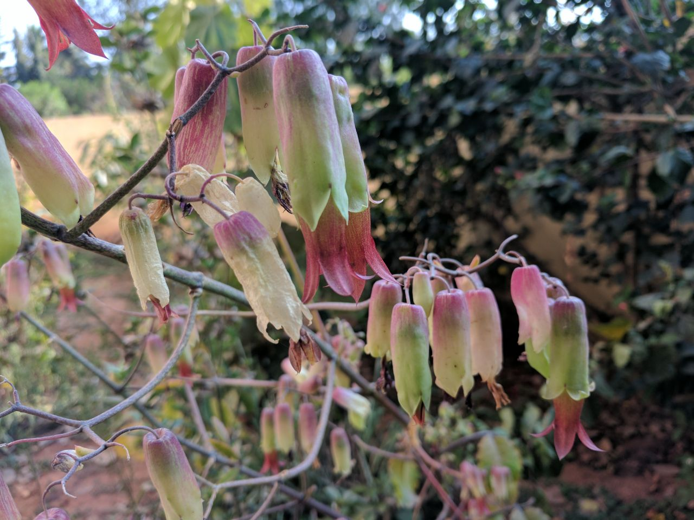

# Kalanchoe pinnata - Asthibhaksha

[TOC]

**Bryophyllum** is a plant genus of the Crassulaceae family. There are about forty species in the group. It is native to South Africa, Madagascar, and Asia. The group is notable for vegetatively growing small plantlets on the fringes of the leaves.
## Uses
Cough, Asthma, Cold with candy sugar, Dysentery, Blood pressure, Cardiac problem, Fever, Diarrhea, Constipation

## Parts Used
Leaves.

## Chemical Composition
Bufadienolide compounds isolated from Bryophyllum pinnatum include bryophillin A which showed strong anti-tumor promoting activity in vitro, and bersaldegenin-3-acetate and bryophillin C which were less active. Bryophillin C also showed insecticidal properties.

## Common names
| Language | Names |
| --- | --- |
| Kannada | Gandukalinga |
| Sanskrit | Parn beej, Raktakusum |
| Tamil | Malaikkalli, Runakkalli |
| Hindi | Jakh me hayat |
| Malayalam | Elamarunna |
| English | Life plant, Cathedral Bells |
.

## Properties
Reference: Dravya - Substance, Rasa - Taste, Guna - Qualities, Veerya - Potency, Vipaka - Post-digesion effect, Karma - Pharmacological activity, Prabhava - Therepeutics.
### Dravya
### Rasa
Kashaya (Astringent), Amla (sour)
### Guna
Laghu (Light), Ruksha (Dry)
### Veerya
Sheeta (Cold)
### Vipaka
Madhura (Sweet)
### Karma
kapha, Pitta
### Prabhava
## Habit
Perennial succulent herbs

## Identification
### Leaf
Simple or pinnate, Elliptic, They are fleshy, oppositely arranged, with a crenate margin, flattened, and the number of leaflets present varies from one near the base of the stems to three or five. Venation obscure.

### Flower
Bell-shaped, up to 7 cm long, Yellowish-green or pale green, 8, Flowers are arranged in branched clusters at the tips of the stems

### Fruit
Papery and membranous, 15 mm long, With four slender compartments (i.e. carpels). They generally remain enclosed within the old flower parts and contain numerous minute, slender, brownish-coloured seeds

### Other features
## List of Ayurvedic medicine in which the herb is used
## Where to get the saplings
## Mode of Propagation
Cuttings, Plantlets

## How to plant/cultivate
Very easily propagated from the planlets that grow on the leaf margins.

## Season to grow
## Required Ecosystem/Climate
## Kind of soil needed
## Commonly seen growing in areas
Weed in banks, Hummocks, Waste grounds, Wet regions

## Photo Gallery
.jpg)
_flowers.jpg)
.jpg)

## References

## External Links
* [Bryophyllum pinnatum on encyclopedea of succelents](http://www.llifle.com/Encyclopedia/SUCCULENTS/Family/Crassulaceae/29120/Bryophyllum_pinnatum)
* [Bryophyllum pinnatum  on plantnet-project](http://uses.plantnet-project.org/en/Bryophyllum_(PROSEA))
* [Bryophyllum on Health benefits of Life plant](https://www.healthbenefitstimes.com/life-plant/)
* [Bryophyllum pinnatum Leaf Extracts Prevent Formation of Renal Calculi in Lithiatic Rats](https://www.ncbi.nlm.nih.gov/pmc/articles/PMC5382824/)
* [Herbs10 Health benefits of Bryophyllum for Kidney and Urinary disorders](http://www.theayurveda.org/ayurveda/herbs/10-health-benefits-of-bryophyllum-for-kidney-and-urinary-disorders/)

## References

1. [pinnatum uses and pics](Bryophyllum)(http://www.homeremediess.com/ayurvedic-plant-bryophyllum-pinnatum-uses-and-pics/)
2. [Cultivation](https://keyserver.lucidcentral.org/weeds/data/media/Html/bryophyllum_pinnatum.htm)
3. [names](Local)(http://www.flowersofindia.net/catalog/slides/Air%20Plant.html)
