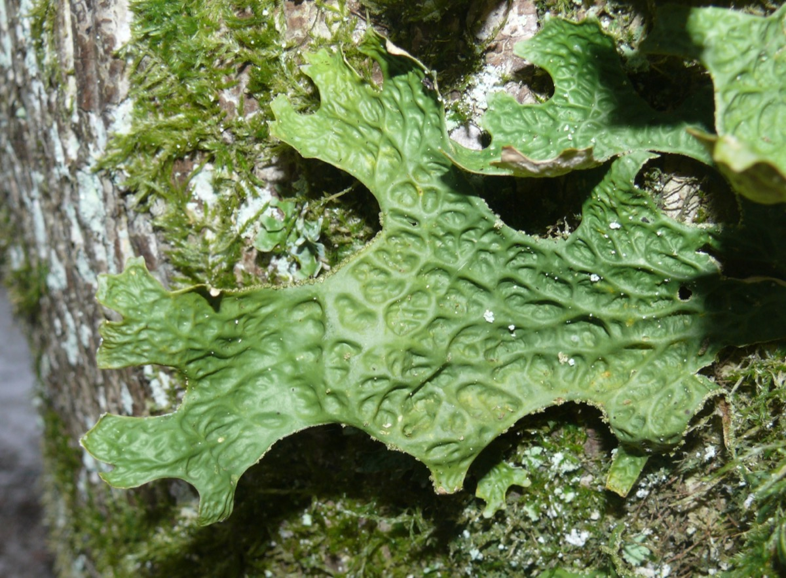

# Lobaria pulmonaria - Tree lungwort

[TOC]

**Lobaria pulmonaria** is a large epiphytic lichen consisting of an ascomycete fungus and a green algal partner living together in a symbiotic relationship with a cyanobacterium symbiosis involving members of three kingdoms of organisms.
## Uses
Coughing, Catarrh, Asthma, Tuberculosis, Burns, Ulcers, Pimples, Hemorrhoids, Eczema.

## Parts Used
Leaves, Dried thallus.

## Chemical Composition
Sticinic, norstitic, gyrophoric, thelophoric and related acids; fatty acids (including palmitic.

## Common names
| Language | Names |
| --- | --- |
| English | Tree Lungwort, Oak Lungs |

## Properties
Reference: Dravya - Substance, Rasa - Taste, Guna - Qualities, Veerya - Potency, Vipaka - Post-digesion effect, Karma - Pharmacological activity, Prabhava - Therepeutics.
### Dravya
### Rasa
### Guna
### Veerya
### Vipaka
### Karma
### Prabhava
## Habit
Tree

## Identification
### Leaf
Simple, Oval, Leaves can be solid green, of varying intensities, or variegated with spots or splashes of white

### Flower
Unisexual, 2-4cm long, Blue and pink, 5-20, Flowers Season is June - August

### Fruit
7–10 mm (0.28–0.4 in.) long pome, Clearly grooved lengthwise, Lowest hooked hairs aligned towards crown, With hooked hairs

### Other features
## List of Ayurvedic medicine in which the herb is used
* [Vishatinduka Taila](../medicines/Vishatinduka_Taila.md) as *root juice extract*

## Where to get the saplings
## Mode of Propagation
Seeds.

## How to plant/cultivate
When planting lungworts in your garden, keep in mind that these plants do best in shady, moist (but not swampy) locations.

## Commonly seen growing in areas
Moist grasslands, Damp woods, Hedgerows.

## Photo Gallery

## References

## External Links
* [Lobaria pulmonaria on britishlichensociety.org](https://www.britishlichensociety.org.uk/resources/species-accounts/lobaria-pulmonaria)
* [Lobaria pulmonaria on wildflowers](https://www.fs.fed.us/wildflowers/plant-of-the-week/lobaria_pulmonaria.shtml)

## References

1. [Constituents](http://www.purplesage.org.uk/profiles/lungwort.htm)
2. [decsription](Plant)(https://www.thespruce.com/pulmonaria-1402859)
3. [to Grow Lungwort](How)(https://www.gardeningknowhow.com/ornamental/flowers/lungwort/growing-lungwort-flower.htm)
