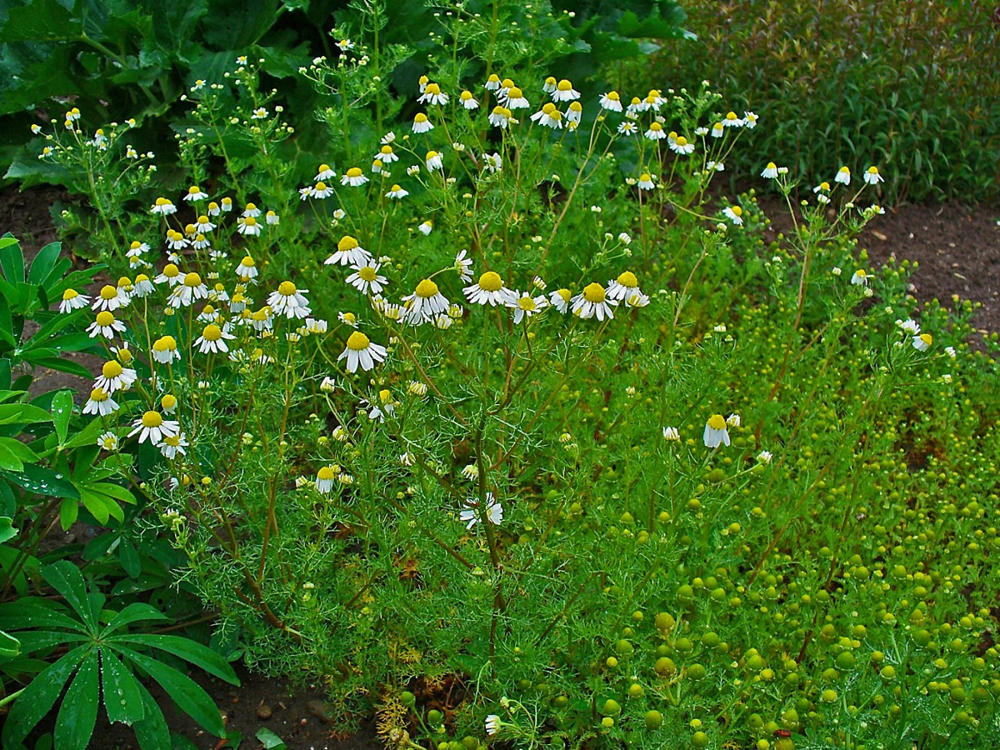

# Matricaria recutita - Matricaria chamomilla

[TOC]

**Chamomile** is the common name for several daisy-like plants of the family Asteraceae that are commonly used to make herb infusions to serve various medicinal purposes.

## Uses
Emotional healing, Indigestion, Hairfall, Minor burns, Eczema, Blotches, Anxiety, Hair rinse, Earache.

## Parts Used
Flowers.

## Chemical Composition
Amino acid, cadmium, co-cultivation, copper, cultivation, medicinal plant, salicylic acid, secondary metabolites, tissue culture

## Common names
| Language | Names |
| --- | --- |
| English | Chamomile |

## Properties
Reference: Dravya - Substance, Rasa - Taste, Guna - Qualities, Veerya - Potency, Vipaka - Post-digesion effect, Karma - Pharmacological activity, Prabhava - Therepeutics.
### Dravya
### Rasa
### Guna
### Veerya
### Vipaka
### Karma
### Prabhava
## Habit
Herb

## Identification
### Leaf
Simple, Alternate, The leaves are light green and feathery with a bipinnate pattern

### Flower
Unisexual, 1 inch, Yellow, 5, Flowers Season is June - August

### Fruit
Simple, 7–10 mm, Clearly grooved lengthwise, Lowest hooked hairs aligned towards crown, Many

### Other features
## List of Ayurvedic medicine in which the herb is used
* [Vishatinduka Taila](../medicines/Vishatinduka_Taila.md) as *root juice extract*

## Where to get the saplings
## Mode of Propagation
Seeds, Cuttings.

## How to plant/cultivate
Matricaria chamomilla is grown in all types of soils and climatic conditions but prefers cool condition.

## Commonly seen growing in areas
Tall grasslands, Meadows, Borders of forests and fields.

## Photo Gallery

## References

## External Links
* [Matricaria recutita on science direct](https://www.sciencedirect.com/science/article/pii/S089158491730309X)
* [Matricaria recutita on http://agris.fao.org](http://agris.fao.org/agris-search/search.do?recordID=US201500185365)
* [Tips For How To Grow Chamomile](https://www.gardeningknowhow.com/edible/herbs/chamomile/growing-chamomile.htm)

## References

1. [constituents](Chemical)(https://www.ncbi.nlm.nih.gov/pmc/articles/PMC3210003/)
2. [description](Plant)(https://www.herbal-supplement-resource.com/german-chamomile.html)
3. [Cultivation"](https://pdfs.semanticscholar.org/4390/bf2bc457a9a5a616a1c81e0c5e6bbb05c8a8.pdf)
