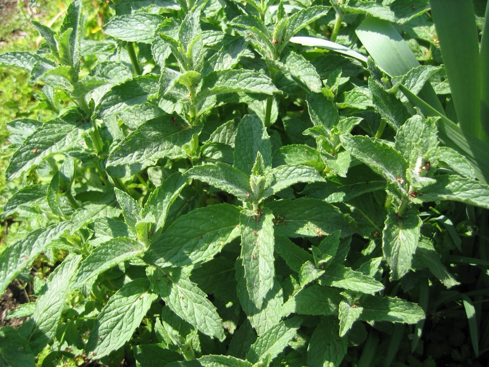

# Mentha - Mint

[TOC]

**Mint** is actually a genus or group of around 15-20 plant species, including **peppermint** and **spearmint**. Mint oil is often used in **toothpaste, gum, candy** and *beauty products* while the **leaves** are used either fresh or dried for teas and food.
## Uses
Gastritis, Intestinal colic, Cold, Bowel syndrome, Skin eruptions, Blotches, Pimples, Diarrhea, Sore throats.

## Parts Used
Leaves.

## Chemical Composition
Contains volatile oils, flavonoids, apigenin, luteolin, quercetin, kaempferol, tiliroside, triterpene glycosides including euscapic acid and tormentic acid, phenolic acids, and 3%–21% tannins

## Common names
| Language | Names |
| --- | --- |
| English | Peppermint, Mint |

## Properties
Reference: Dravya - Substance, Rasa - Taste, Guna - Qualities, Veerya - Potency, Vipaka - Post-digesion effect, Karma - Pharmacological activity, Prabhava - Therepeutics.
### Dravya
### Rasa
Katu (Pungent)
### Guna
Laghu (Light), Tikshna (Sharp)
### Veerya
Ushna (Hot)
### Vipaka
Katu (Pungent)
### Karma
Kapha, Vata
### Prabhava
## Habit
Herb

## Identification
### Leaf
Simple, The leaves are divided into 3-6 toothed leaflets, with smaller leaflets in between

### Flower
Unisexual, 2-4cm long, Yellow, 5-20, Flowers Season is June - August

### Fruit
7–10 mm (0.28–0.4 in.) long pome, clearly grooved lengthwise, Lowest hooked hairs aligned towards crown, With hooked hairs

### Other features
## List of Ayurvedic medicine in which the herb is used
* [Vishatinduka Taila](../medicines/Vishatinduka_Taila.md) as *root juice extract*

## Where to get the saplings
## Mode of Propagation
Seeds, Cuttings.

## How to plant/cultivate
Deep soils, loam to sandy loam well drained, well aerated and loose textured soil. Clay soils are not suitable.

## Commonly seen growing in areas
Tall grasslands, Meadows, Borders of forests and fields.

## Photo Gallery

## References

## External Links
* [Mentha on science direct](https://www.sciencedirect.com/topics/agricultural-and-biological-sciences/mentha)
* [Mentha - Peppermint: Uses, Side Effects, Interactions](https://www.webmd.com/vitamins/ai/ingredientmono-705/peppermint)
* [benefits of mint](https://www.medicalnewstoday.com/articles/275944.php)

## References

1. ["sciencedirect"](https://www.sciencedirect.com/science/article/pii/S0378874112006393?via%3Dihub)
2. [machine"]("wayback)(https://web.archive.org/web/20131226161459/http://www.wildflowers-guide.com/39-agrimony.html)
3. [of Mentha"]("Cultivation)(http://agriinfo.in/default.aspx?page=topic&superid=2&topicid=1406)
