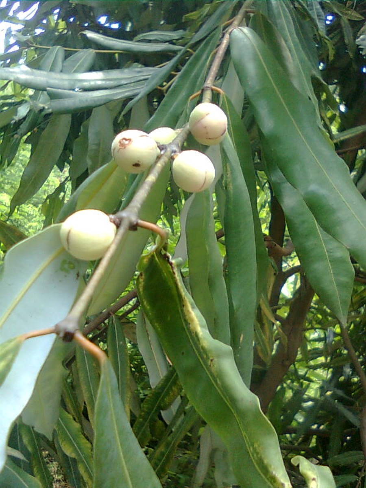

# Mesua ferrea linn - Nagapushpa

[TOC]

**Mesua ferrea** is a species in the family Calophyllaceae. This slow-growing tree is named after the heaviness and hardness of its timber. It is native to wet, tropical parts of Sri Lanka, India, southern Nepal, Burma, Thailand, Indochina, the Philippines, Malaysia and Sumatra.
## Uses
Urinary tract infection, Gout, Itching, Swelling,Inflammatory disease, Indigestion, Fever, Excess thirst

## Parts Used
Dried folaige, Whole herb, Leaf, Bark, Flower, Seeds oil.

## Chemical Composition
Contains Volatile oils, Flavonoids, Apigenin, Luteolin, Quercetin, Kaempferol, Tiliroside, Triterpene glycosides including euscapic acid and Tormentic acid, Phenolic acids, and 3%–21% tannins.

## Common names
| Language | Names |
| --- | --- |
| Kannada | Kesara, Naagakeshara, Naagachampa, Naagasampige |
| Malayalam | Behettachampagam, Bellutta-tsjampakam, Beluttachampagam |
| Sanskrit | Nagkesara, Nagpushpa |
| Tamil | Naagalingam, Aicilam, Aicilanakappu, Akiputam |
| Telugu | Chikatimanu, Cikatimanu, Gajapushpamu, |
| Hindi | Gajapushpam, Nag-kesar |
| English | Ironwood |

## Properties
Reference: Dravya - Substance, Rasa - Taste, Guna - Qualities, Veerya - Potency, Vipaka - Post-digesion effect, Karma - Pharmacological activity, Prabhava - Therepeutics.
### Dravya
### Rasa
Tikta (Bitter), Kashaya (Astringent)
### Guna
Laghu (Light), Ruksha (Dry), Tikshna (Sharp)
### Veerya
Ushna (Hot)
### Vipaka
Katu (Pungent)
### Karma
Kapha, Vata
### Prabhava
## Habit
Tree

## Identification
### Leaf
Simple, Lanceolate, The leaves are divided into 3-6 toothed leaflets, with smaller leaflets in between

### Flower
Unisexual, 2-4cm long, White, 5-20, Flowers fragrant white, large and solitary or in clusters. Flowering from February to May

### Fruit
Ovoid, 7–10 mm, Fruits ovoid with persistent calyx, Dark brown with oily and fleshy cotyledons, 1-4, Fruiting from May to October

### Other features
## List of Ayurvedic medicine in which the herb is used
[Mahanarayana taila](../medicines/Mahanarayana_taila.md), [Puga Khanda](Puga_Khanda.md), [Gulgulvasavam](Gulgulvasavam.md), [Mahadraksha](Mahadraksha.md), [Shringarabhra rasa](Shringarabhra_rasa.md), [Amrita Praasha](Amrita_Praasha.md), [Amrita Bhallataki](../medicines/Amrita_Bhallataki.md), [Amritaarishta](Amritaarishta.md), [Ayapaan](../medicines/Ayapaan.md), [Arimedaadi taila](Arimedaadi_taila.md), [Yelaadi Churna](../medicines/Yelaadi_Churna.md), [Ashwagandharishta](../medicines/Ashwagandharishta.md), [Kandamoola Rasaayana](../medicines/Kandamoola_Rasaayana.md), [Kanakaasava](Kanakaasava.md), [Kalyanaka Gritam](Kalyanaka_Gritam.md), [Kumariyaasava](../medicines/Kumariyaasava.md), [Kumaaryasava](Kumaaryasava.md), [Kesha sanjivini Taila](../medicines/Kesha_sanjivini_Taila.md), [Khadiraarishta](Khadiraarishta.md), [Chandanaadi tailam](../medicines/Chandanaadi_tailam.md). [Chavanaprash](Chavanaprash.md), [Jatiphaladi Churnam](Jatiphaladi_Churnam.md), [Jeeraka Bilvadi Lehyam](../medicines/Jeeraka_Bilvadi_Lehyam.md), [Jeerakaadyarishta](../medicines/Jeerakaadyarishta.md), [Triphaladi Lehyam](../medicines/Triphaladi_Lehyam.md), [Nilibringaraja Taila](../medicines/Nilibringaraja_Taila.md), [Narasimha Lehyam](../medicines/Narasimha_Lehyam.md), [Phalasugandhi Lehya](../medicines/Phalasugandhi_Lehya.md), [Pippaliyaasava](../medicines/Pippaliyaasava.md), [Bilvaadi lehya](../medicines/Bilvaadi_lehya.md), [Babbulaarishta](../medicines/Babbulaarishta.md)

## Where to get the saplings
## Mode of Propagation
Seeds, Cuttings.

## How to plant/cultivate
Seed - easy to handle in the nursery with a germination that is good and rapid. Seedling germination is hypogeal.

## Commonly seen growing in areas
Mountains of eastern himalayas, East bengal, Wetland of Assam.

## Photo Gallery
.jpg)

_(3716711845).jpg)

## References

## External Links
* [Mesua ferrea linn on ijrap.net](http://www.ijrap.net/admin/php/uploads/292_.pdf)
* [Cannonball tree naga pushpa or nagalingam flower and fruits](https://www.naturepowertec.in/2018/03/cannonball-tree-naga-pushpa-or.html)
* [Medicinal Uses of Nagkesar/Mesua ](https://www.bimbima.com/ayurveda/medicinal-uses-of-nagkesarmesua/336/)

## References

1. [Sciencedirect](https://www.sciencedirect.com/science/article/pii/S0378874112006393?via%3Dihub)
2. [description](Plant)(https://www.bimbima.com/ayurveda/medicinal-uses-of-nagkesarmesua/336/)
3. "Karnataka Medicinal Plants Volume - 2" by Dr.M. R. Gurudeva, Page No.125, Published by Divyachandra Prakashana, #45, Paapannana Tota, 1st Main road, Basaveshwara Nagara, Bengaluru.
4. [details](Cultivation)(http://tropical.theferns.info/viewtropical.php?id=Mesua+ferrea)
5. Karnataka Medicinal Plants Volume - 2 by Dr.M. R. Gurudeva, Page No. 399
