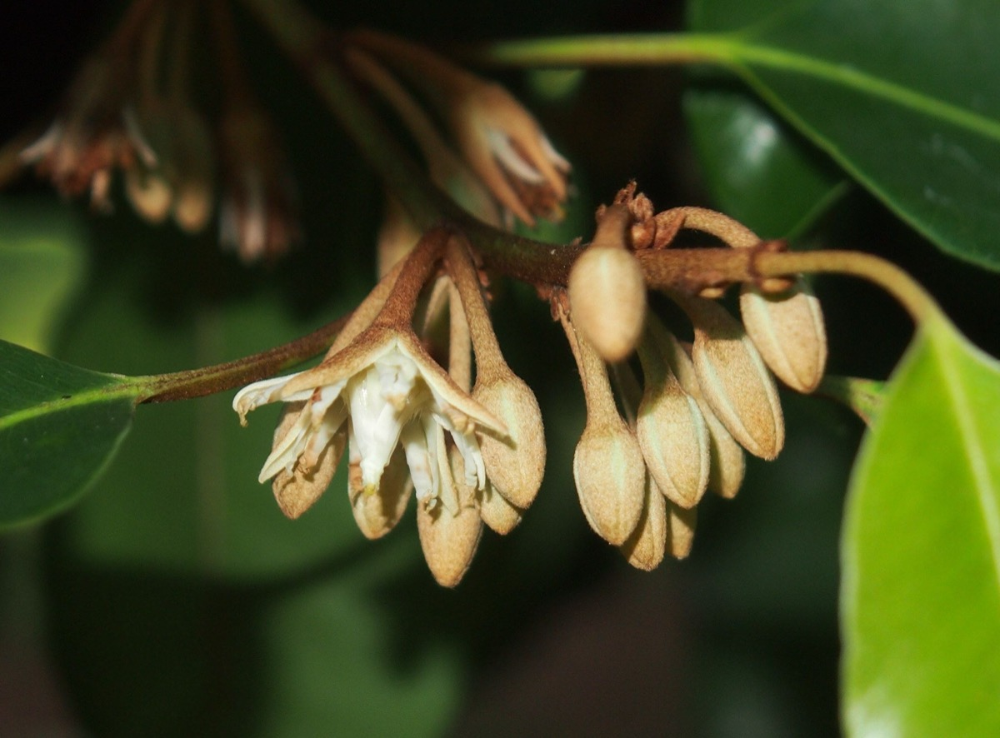

# Mimusops elengi - Bakula, Ranjal

[TOC]

**Mimusops elengi** is a medium-sized evergreen tree found in tropical forests in South Asia, Southeast Asia and northern Australia.
## Uses
Diarrhoea, Dysentery, Gum inflammation, Toothache, Gonorrhoea, Snakebites, Fever, Wounds, Sore throats.

### Food
Mimusops elengi can be used in Food. Ripe fruits are eaten raw.

## Parts Used
Dried folaige, Whole herb.

## Chemical Composition
DPPH1,1-diphenyl-2-picrylhydrazylABTS2,2′-azino-bis(3-ethylbenzthiazoline-6-sulphonic acid)MTT3-(4,5-dimethylthiazol-2-yl)-2,5-diphenyltetrazolium bromide

## Common names
| Language | Names |
| --- | --- |
| Kannada | Ranjal |
| Malayalam | Ilanni |
| Tamil | Magizhamboo |
| Hindi | Maulsari |
| English | Spanish cherry |

## Properties
Reference: Dravya - Substance, Rasa - Taste, Guna - Qualities, Veerya - Potency, Vipaka - Post-digesion effect, Karma - Pharmacological activity, Prabhava - Therepeutics.
### Dravya
### Rasa
Kashaya (Astringent), Katu (Pungent)
### Guna
Guru (heavy)
### Veerya
Sheeta (cold)
### Vipaka
Katu (Pungent)
### Karma
Kapha, Pitta
### Prabhava
### Nutritional components
Mimusops elengi Contains the Following nutritional components like - Vitamin-A, Thiamine (B1), Riboflavin (B2), Niacin (B3), Pantothenic acid (B5), B6 and C; Calcium, Iron, Magnesium, Manganese, Phosphorus, Potassium, Sodium, Zinc

## Habit
Evergreen tree

## Identification
### Leaf
Simple, Alternate, Petiole 1-2.5 cm long, glabrous, terete and canaliculate towards apex

### Flower
Unisexual, 2-4cm long, White, 5-20, Flowers white, in axillary fasicles

### Fruit
Berry, 7–10 mm, Berry, ellipsoid, reddish-brown when ripe, Single

### Other features
## List of Ayurvedic medicine in which the herb is used
* [Baladhatryadi Taila](Baladhatryadi_Taila.md)
* [Varishoshana rasa](Varishoshana_rasa.md)

## Where to get the saplings
## Mode of Propagation
Seeds, Cuttings.

## How to plant/cultivate
A plant of the hot tropical lowlands. It thrives in areas with perhumid or slightly seasonal rainfall types, but is most commonly found in seasonally dry habitats. Seed - best sown in individul containers in a shaded position, it usually germinates within 17 - 82 days, with a success rate of about 70 - 90%. Seedlings can be planted out when 20 - 30cm tall. Mimusops elengi is available through January to March.

## Commonly seen growing in areas
Tall grasslands, Meadows, Borders of forests and fields.

## Photo Gallery
_(3489103996).jpg)
_(3488289123).jpg)
_(1128081023).jpg)
.jpg)
_Fruits_collected_in_Visakhapatnam.jpg)

## References

## External Links
* [Mimusops elengi on flowers.net](http://www.flowersofindia.net/catalog/slides/Maulsari.html)
* [Actives.org Mimusops elengi on naturalactives.com](http://naturalactives.com/bakula-an-indian-plant-with-interesting-properties/natural)
* [Chemistry and medicinal properties of the Bakul](https://www.researchgate.net/publication/251628598_Chemistry_and_medicinal_properties_of_the_Bakul_Mimusops_elengi_Linn_A_review)

## References

1. [Chemistry](https://www.sciencedirect.com/science/article/pii/S096399691100086X)
2. [morphology](Plant)(https://indiabiodiversity.org/species/show/15876)
3. [preparations](Ayurvedic)(https://easyayurveda.com/2016/11/28/bakula-mimusops-elengi-bullet-wood-spanish-cherry/)
4. [details](Cultivation)(https://www.pfaf.org/user/Plant.aspx?LatinName=Mimusops+elengi)
5. Karnataka Aushadhiya Sasyagalu By Dr.Maagadi R Gurudeva, Page no:213
6. "Forest food for Northern region of Western Ghats" by Dr. Mandar N. Datar and Dr. Anuradha S. Upadhye, Page No.114, Published by Maharashtra Association for the Cultivation of Science (MACS) Agharkar Research Institute, Gopal Ganesh Agarkar Road, Pune
