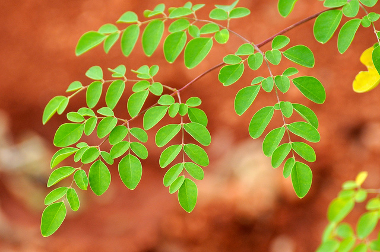

# Moringa oleifera - Drumstick, Nuggekayee, Sahjan, Murungai Maram, Munagachettu, Muringa

[TOC]

**Moringa oleifera** is the most widely cultivated species of the genus Moringa, which is the only genus in the family Moringaceae.  This plant is belongs Moringaceae family.
## Uses
Arthritis, Joint pain, Asthma, Cancer, Diabetes, Constipation, Epilepsy, Diarrhea, Stomachache, Cold, Urinary disorders, Liver enlargement, Spleen enlargement, Malaria, Kidney stones, Urinary tract infections, Obesity, Ear infections, Back pain, Skin conditions, Hydrocele, Bedwetting.

## Parts Used
Leaves, Flowers, Pods, Seeds.

## Chemical Composition
Investigation of the carotenoid contents from the leaves, flowers and fruits of eight M. oleifera cultivars from India yielded luteoxanthin, lutein, zeaxanthin, and β-carotene.

## Common names
| Language | Names |
| --- | --- |
| Kannada | Nuggekayee, Nuggekayi mara, Mochaka mara |
| Malayalam | Muringa |
| Sanskrit | Shigru, Koshandana, Teekshaagandha, Aksheeba, Mochaka |
| Tamil | Murungai Maram, Murangge |
| Telugu | Munagachettu, Sajana, Munaga |
| Hindi | Sahjan, Sonjan |
| English | Drumstick, Drum Stick Tree, Horse-Radish |

## Properties
Reference: Dravya - Substance, Rasa - Taste, Guna - Qualities, Veerya - Potency, Vipaka - Post-digesion effect, Karma - Pharmacological activity, Prabhava - Therepeutics.
### Dravya
### Rasa
Tikta (Bitter), Katu (Pungent)
### Guna
Laghu (Light), Ruksha (Dry), Tikshna (Sharp)
### Veerya
Ushna (Hot)
### Vipaka
Katu (Pungent)
### Karma
Kapha, Vata
### Prabhava
## Habit
Small tree

## Identification
### Leaf
Simple, Tri-pinnate, Leaf Arrangement is Alternate-spiral and Leaf Shape is Ovate or elliptic

### Flower
Unisexual, Flower borne on a false pedicel 7-15 mm, White to cream, 5, In axillary, divaricate panicles; white. Flowering throughout the year

### Fruit
Elongate, Torulose capsule, angled, longitudinally 3-valved; seeds many, 3 angled, 3 winged. Fruiting throughout the year, Bark corky grey, Many seeds

### Other features
## List of Ayurvedic medicine in which the herb is used
* [Aragwadhadi kashayam](Aragwadhadi_kashayam.md)
* [Shothaghna lepa](Shothaghna_lepa.md)

## Where to get the saplings
## Mode of Propagation
Seeds, Cuttings.

## How to plant/cultivate
Moringa seeds can be planted directly where intended to be grown. No pretreatment is required. Cuttings take root very easily and even large branches can be planted and they will sprout.

Medium-sized tree (10-15 m) suited for dry to semi-arid areas with all soil types. Sandy loam soils are most suitable; well-drained soils preferred. Propagated through **grafted seedlings** or **stem cuttings**. Apply 25 tonnes FYM per hectare. Plant at 3.25 x 5 m spacing. Grafted trees start fruiting at 8 months. Irrigate every 15 days in summer; fairly drought-tolerant when established. Weed 2-3 times in first year. Pests: sap-sucking lice, stem borers, pod borers. Diseases: root rot, leaf spot. Use neem-based sprays. Grafted varieties produce 200-250 pods per tree from second year. Each tree yields 40-50 kg leaves/year. Varieties: Jaffna, Chavakad Murungi, JKMK-1, Bhagya (KDM-01) -- 350-1000 pods/tree from second year. Economics: leaves Rs. 80-100/kg, pods Rs. 40-120/kg; net profit Rs. 1,00,000-2,00,000 per hectare.

## Commonly seen growing in areas
Tropical area, Subtropical area, Equatorial climate areas.

## Photo Gallery
_1.jpg)
_2.jpg)
_1.jpg)
_2.jpg)

## References

## External Links
* [Moringa oleifera on feedipedia.org](https://www.feedipedia.org/node/124)
* [Moringa oleifera on sciencedirect.com](https://www.sciencedirect.com/science/article/pii/S2213453016300362)
* [Moringa oleifera on pubmed.ncbi.in](https://pubmed.ncbi.nlm.nih.gov/17089328/)

## References

1. [Constituents](Chemical)(https://www.researchgate.net/publication/280575461_Chemical_Constituents_of_Moringa_oleifera_Lam_Leaves)
2. [of life](Encyclopedia)(http://eol.org/pages/486251/details)
3. [preparations](Ayurvedic)(https://easyayurveda.com/2012/12/06/moringa-benefits-medicinal-usage-complete-ayurveda-details/)
4. [details](Cultivation)(https://treesforlife.org/our-work/our-initiatives/moringa/how-to-grow)
5. **Gurudeva, Magadi R. *Karnatakada Aushadhiya Sasyagalu*. Divyachandra Prakashana, Bengaluru, 2017, p. 205.**
   1. Moringa leaves and drumstick pods cooked and consumed help improve eyesight, provide nutrition, and act as a general health tonic. 2. Moringa root consumed in small quantities helps cure various respiratory and digestive ailments (consuming in large amounts can be harmful, use cautiously). 3. Mor.
6. **Pandey, Gyanendra (translator). *Vrksayurveda of Surapala*. Chowkhamba Sanskrit Series Office, Varanasi, 2010, p. 33.**
   Classified as a Jangala-adapted (arid/xerophytic region) tree, suited for warmer and drier climatic conditions.
   > *As cited in: Vrksayurveda of Surapala, Section 5*

7. **[KAMPA - ಔಷಧಿ ಸಸ್ಯಗಳ ಕೃಷಿ ಕೈಪಿಡಿ (Medicinal Plants Cultivation Handbook)](../resources/books/KAMPA_Medicinal_Plants_Cultivation_Handbook.md)**. Karnataka Medicinal Plants Authority (KAMPA), Bengaluru, 2024, pp. 48-52.
   Cultivation details including soil requirements, propagation methods, planting, irrigation, harvest timing, yield estimates, and economics.
