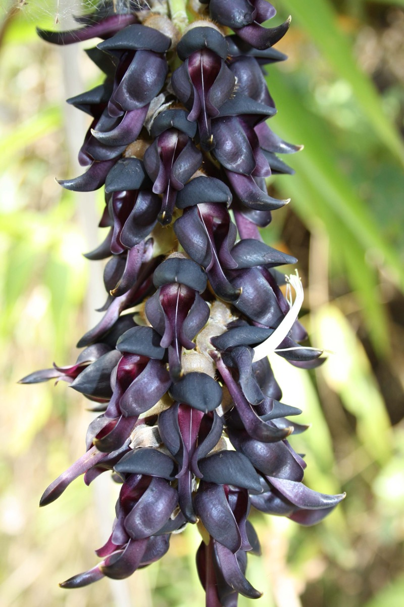

# Mucuna pruriens - Velvet bean, Nayisonanguballi, Kewanch, Punaippidukkan, Pilliadugu, Naicorna

[TOC]

**Kapikachuchu** is a tropical legume native to Africa and tropical Asia and widely naturalized and cultivated. The plant is notorious for the extreme itchiness it produces on contact, particularly with the young foliage and the seed pods.
## Uses
Nervous system problems, Stress, Parkinson’s disease, Brain disease, Prolactin levels, Male Infertility, Diarrhoea, Sore throats, Piles, Swelling, Worms.

### Food
Mucuna pruriens can be used in Food. Leaves and seeds are cooked as vegetable.

## Parts Used
Root, Leaf, Seed.

## Chemical Composition
There are many ingredients in mucuna pruriens, while L-dopa is the main content that we care about. Mature seeds contain typically 3.1-6.1% Levodopa, although up to 12.5% has been recorded. The leaves tend to contain around 0.5%.

## Common names
| Language | Names |
| --- | --- |
| Kannada | Nayisonanguballi, Kadavare, Nayisonku balli |
| Malayalam | Naicorna |
| Sanskrit | Atmagupta |
| Tamil | Punaippidukkan |
| Telugu | Pilliadugu |
| Hindi | Kewanch |
| English | Velvet bean, Cowitch |

## Properties
Reference: Dravya - Substance, Rasa - Taste, Guna - Qualities, Veerya - Potency, Vipaka - Post-digesion effect, Karma - Pharmacological activity, Prabhava - Therepeutics.
### Dravya
### Rasa
Tikta (Bitter), Kashaya (Astringent)
### Guna
Laghu (Light), Ruksha (Dry), Tikshna (Sharp)
### Veerya
Ushna (Hot)
### Vipaka
Katu (Pungent)
### Karma
Kapha, Vata
### Prabhava
### Nutritional components
Mucuna pruriens Contains the Following nutritional components like - Vitamin- A, Thiamine (B1), Riboflavin (B2), Niacin (B3), Pantothenic acid (B5), B6 and C; Calcium, Iron, Magnesium, Manganese, Phosphorus, Potassium, Sodium, Zinc

## Habit
Herb

## Identification
### Leaf
Simple, Trifoliate, Lateral leaflets conspicuously asymmetrical, 7–15 cm long, 5–12 cm wide, terminal leaflet symmetrical, somewhat smaller

### Flower
Unisexual, 4–13 cm long, Purple or white, 5, Usually more or less S-shaped, finely pubescent with white to light brown hairs. Flowering from September to November

### Fruit
Simple, 7–10 mm, Clearly grooved lengthwise, Lowest hooked hairs aligned towards crown, 100-seed

### Other features
## List of Ayurvedic medicine in which the herb is used
[Mushalyadi churna](Mushalyadi_churna.md), [Iksurahdi lehyam](Iksurahdi_lehyam.md), [Mashabaladi kashaya](Mashabaladi_kashaya.md), [Amritaprasha ghrita](Amritaprasha_ghrita.md), [Confido](Confido.md), [Jariforte](../medicines/Jariforte.md), [Tentex Forte](../medicines/Tentex_Forte.md), [Mentat](../medicines/Mentat.md), [Vigorex](../medicines/Vigorex.md)

## Where to get the saplings
## Mode of Propagation
Seeds, Cuttings.

## How to plant/cultivate
Mucuna is a popular kharif crop in India. Seeds are sown at rate of 50 kg/ha between 15 June to 15th July with plant spacing of 60 × 60 cm. Delayed sowing may result in infestation of aphids (Aphis craccivora) (Oudhia 2001a ). Mucuna pruriens is available through August to January.

Annual climbing legume suited for humid tropical and coastal areas. Grows in sandy loam to clay loam soils at 28-32°C with 60-65% humidity. Propagated through **seeds** (12 kg per acre). Sow directly in June-July at 30 x 30 cm spacing. Apply 10 tonnes FYM per hectare. Good drainage essential; no waterlogging. Irrigate every 15-20 days in November-December. Weed 2-3 times during growing season. Pests: grasshoppers and leaf-eating caterpillars; use neem oil spray. Harvest pods at **3-4 months** when mature but before opening. Handle carefully (pod hairs cause irritation). Yield: 1,500-1,750 kg dried seeds per hectare. Store at 10°C with <10% moisture. Economics: Rs. 60-80/kg; net profit Rs. 80,000-1,00,000 per hectare.

## Commonly seen growing in areas
Tall grasslands, Meadows, Borders of forests and fields.

## Photo Gallery

.jpg)

.jpg)
.jpg)

## References

## External Links
* [Mucuna pruriens on www.zdbiological.com](http://www.zdbiological.com/herbarl/42.html)
* [Mucuna pruriens on pubmed.ncbi.in](https://pubmed.ncbi.nlm.nih.gov/28922612/)
* [Mucuna pruriens on shivshaktiherbal.in](http://shivshaktiherbal.in/Mucuna_pruriens_Extract.html)

## References

1. [Constituents](Chemical)(http://www.nutragreenbio.com/product/mucuna-pruriens-extract)
2. [Morphology](http://www.tropicalforages.info/key/forages/Media/Html/entities/mucuna_pruriens.htm)
3. [preparations](Ayurvedic)(https://easyayurveda.com/2012/12/26/kapikacchu-mucuna-pruriens-benefits-dose-side-effects-ayurveda/)
4. [Cultivation](https://hort.purdue.edu/newcrop/CropFactSheets/mucuna.html)
5. "Forest food for Northern region of Western Ghats" by Dr. Mandar N. Datar and Dr. Anuradha S. Upadhye, Page No.91, Published by Maharashtra Association for the Cultivation of Science (MACS) Agharkar Research Institute, Gopal Ganesh Agarkar Road, Pune
6. ”Karnataka Medicinal Plants Volume-3” by Dr.M. R. Gurudeva, Page No.629, Published by Divyachandra Prakashana, #6/7, Kaalika Soudha, Balepete cross, Bengaluru

7. **[KAMPA - ಔಷಧಿ ಸಸ್ಯಗಳ ಕೃಷಿ ಕೈಪಿಡಿ (Medicinal Plants Cultivation Handbook)](../resources/books/KAMPA_Medicinal_Plants_Cultivation_Handbook.md)**. Karnataka Medicinal Plants Authority (KAMPA), Bengaluru, 2024, pp. 40-43.
   Cultivation details including soil requirements, propagation methods, planting, irrigation, harvest timing, yield estimates, and economics.
