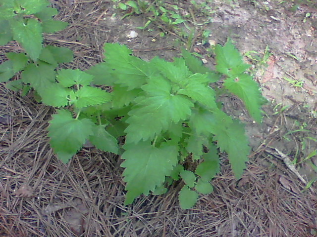

# Nepeta cataria - Catmint

[TOC]

**Catmint** officially called **Nepeta cataria** is an herbacious perennial herb that is native to Europe, Asia and Africa.

## Uses
Wounds, Cuts, Snakebites, Liver disorders, Skin eruptions, Blotches, Pimples, Diarrhea, Sore throats.

## Parts Used
Dried folaige, Whole herb.

## Chemical Composition
Contains volatile oils, flavonoids, apigenin, luteolin, quercetin, kaempferol, tiliroside, triterpene glycosides including euscapic acid and tormentic acid, phenolic acids, and 3%–21% tannins

## Common names
| Language | Names |
| --- | --- |
| English | Catmint |

## Properties
Reference: Dravya - Substance, Rasa - Taste, Guna - Qualities, Veerya - Potency, Vipaka - Post-digesion effect, Karma - Pharmacological activity, Prabhava - Therepeutics.
### Dravya
### Rasa
Tikta (Bitter), Kashaya (Astringent)
### Guna
Laghu (Light), Ruksha (Dry), Tikshna (Sharp)
### Veerya
Ushna (Hot)
### Vipaka
Katu (Pungent)
### Karma
Kapha, Vata
### Prabhava
## Habit
Herb

## Identification
### Leaf
Simple, The leaves are divided into 3-6 toothed leaflets, with smaller leaflets in between

### Flower
Unisexual, 2-4cm long, Yellow, 5-20, Flowers Season is June - August

### Fruit
7–10 mm (0.28–0.4 in.) long pome, Clearly grooved lengthwise, Lowest hooked hairs aligned towards crown, With hooked hairs

### Other features
## List of Ayurvedic medicine in which the herb is used
## Where to get the saplings
## Mode of Propagation
Seeds, Cuttings.

## How to plant/cultivate
Easily grown in most soils, preferring a calcareous soil. Thrives in a dry lightly shaded position, though it prefers full sun.Plants usually self-sow quite freely when growing in a suitable position. The seeds are contained in burrs that can easily attach themselves to clothing or animal's fur, thus transporting them to a new area where they can germinate and grow.The cultivar 'Sweet scented' is popular in France for making tea because the whole plant is sweet scented and the flowers have a spicy apricot-like fragrance

## Commonly seen growing in areas
Tall grasslands, Meadows, Borders of forests and fields.

## Photo Gallery

## References

## External Links

## References

1. [Sciencedirect](https://www.sciencedirect.com/science/article/pii/S0378874112006393?via%3Dihub)
2. [machine](Wayback)(https://web.archive.org/web/20131226161459/http://www.wildflowers-guide.com/39-agrimony.html)
3. [palnts](Practical)(http://practicalplants.org/wiki/Agrimonia_eupatoria)
