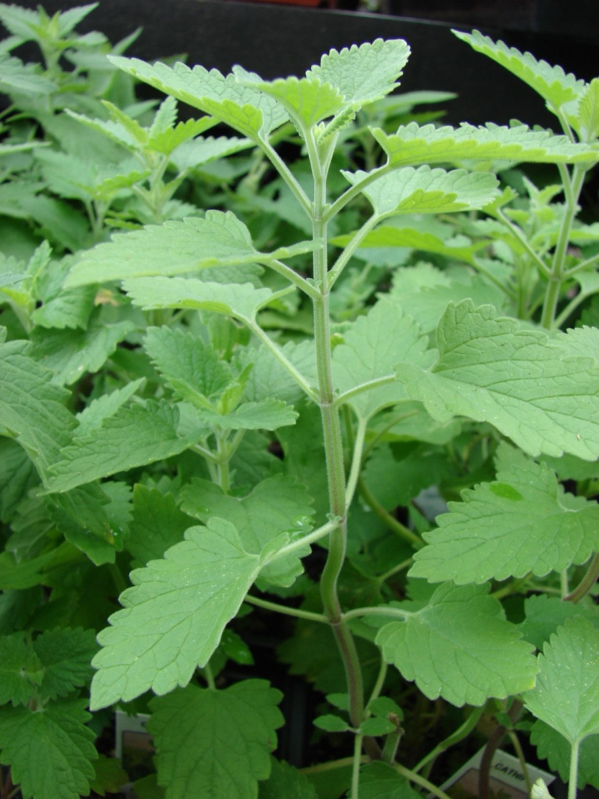

# Nepeta cataria - Catnip

[TOC]

**Nepeta cataria**, commonly known as catnip, catswort, or catmint, is a species of the genus Nepeta in the family Lamiaceae, native to southern and eastern Europe, the Middle East, central Asia, and parts of China.

## Uses
Motion sickness, Fever, Cold, Headache, Migraine, Anxiety, Stress, Diarrhea, Hysteria

## Parts Used
Leaves.

## Chemical Composition
Nepetalactones 4aα, 7α, 7aα-nepetalactone; 3,4β-dihydro-4aα, 7α, 7aα-nepetalactone; 4aα, 7α, 7aβ-nepetalactone and β-caryophyllene, five new constituents were identified: dimethyl-3,7 oxa-1 bicyclo [3,3,0] oct-2-ene, piperitone, thymol methyl ether, hexenyl benzoate and humulene oxide

## Common names
| Language | Names |
| --- | --- |
| English | Catnip, Catmint |

## Properties
Reference: Dravya - Substance, Rasa - Taste, Guna - Qualities, Veerya - Potency, Vipaka - Post-digesion effect, Karma - Pharmacological activity, Prabhava - Therepeutics.
### Dravya
### Rasa
### Guna
### Veerya
### Vipaka
### Karma
### Prabhava
## Habit
Perennial herb

## Identification
### Leaf
Simple, long-stemmed, Opposite, long-stemmed. Blade cordate–ovate, with tapering tips, hairy, large-toothed. inflorescence’s lowest subtending bracts similar to stem leaves, upper ones small, narrow

### Flower
Unisexual, white with red spots, Stamens 4, Flowering time is July–August and these are Corolla irregular

### Fruit
schizocarp, Flowering time is september to december, With hooked hairs

### Other features
## List of Ayurvedic medicine in which the herb is used
## Where to get the saplings
## Mode of Propagation
Seeds.

## How to plant/cultivate
Nepeta cataria is cultivated as an ornamental plant for use in gardens. It is also grown for its attractant qualities to house cats and butterflies. The plant is drought-tolerant and deer-resistant. It can be a repellent for certain insects, including aphids and squash bugs. Catnip is cultivated in drained soils, enriched with peat and manure

## Commonly seen growing in areas
Yards, Waste ground, Roadsides, Ruins.

## Photo Gallery

_Plate_500.jpg)

## References

## External Links
* [Nepeta cataria on missouribotanicalgarden](http://www.missouribotanicalgarden.org/PlantFinder/PlantFinderDetails.aspx?kempercode=e433)
* [Nepeta cataria on encyclopedea of life](http://eol.org/pages/595653/overview)
* [Nepeta cataria as a future plant](https://www.pfaf.org/user/Plant.aspx?LatinName=Nepeta+cataria)
* [Nepeta Cataria Effects on Humans](http://nepetacataria.org/nepeta-cataria-effects-on-humans/)

## References

1. [Constituents"]("Chemical)(https://www.tandfonline.com/doi/abs/10.1080/10412905.1993.9698195)
2. [description"]("leaves)(http://www.flowersofindia.net/catalog/slides/Catnip.html)
3. [and Description"]("History)(http://nepetacataria.org/)
4. [Health Benefits"]("Catnip)(http://www.medicalhealthguide.com/herb/catnip.htm)
