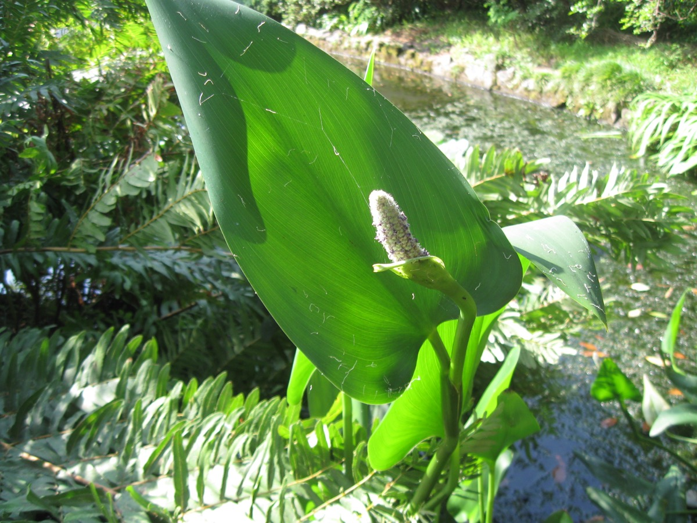
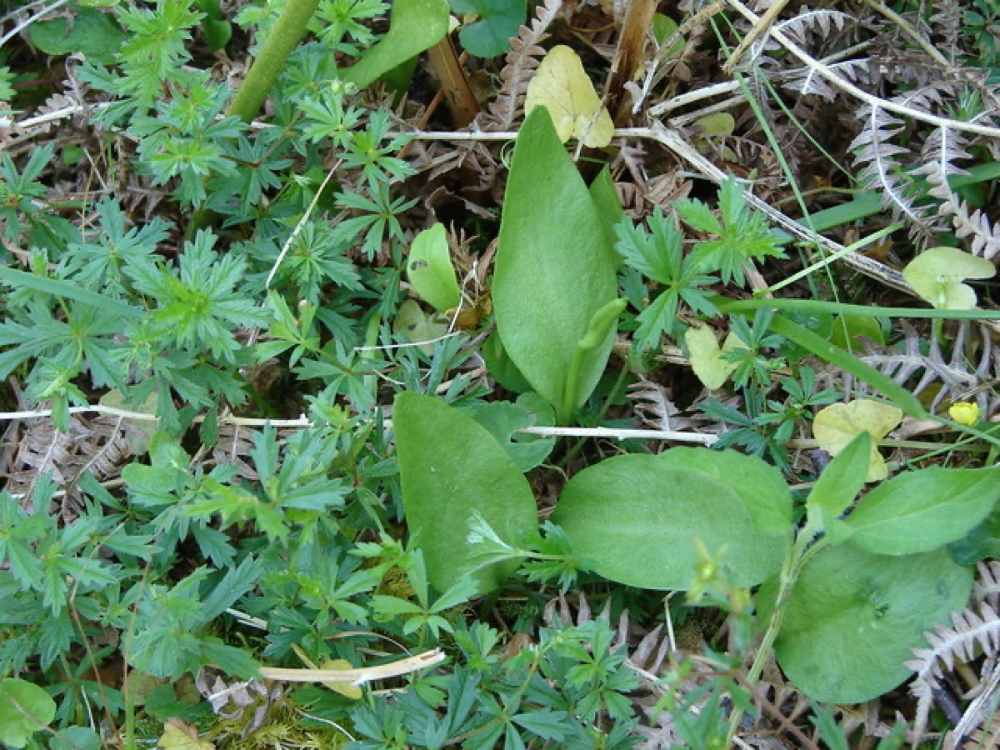
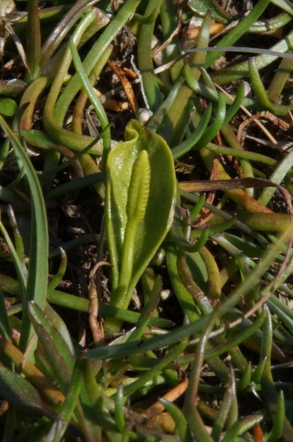

# Ophioglossum engelmanni - Limestone adders tongue

[TOC]

**Ophioglossum vulgatum** commonly known as adder's-tongue is a species of fern in the family Ophioglossaceae.
## Uses
Wounds, Internal bleeding, Vomiting, Skin ulcers.

## Parts Used
Bulb, Roots, Leaves.

## Chemical Composition
Emetic, anti-scrofulous, expectorant, antscorbutic, emollient and nutritive when dry.

## Common names
| Language | Names |
| --- | --- |
| English | Adderstongue |

## Habit
Ferns.

## Identification
### Leaf
Lanceolate, Ovel, Leafs irregularly mottled (usually with reddish-brown), are basal, about 6 inches long and 2 inches across..

### Flower
Unisexual, 1-1/2inches long,2-7inches high, Green,yellow, April-may months are the flowering season

### Fruit
Syncarp (sorosis), subglobose or ellipsoid with long echinate processes, orange when ripe, Seeds many, ovoid

### Other features
## List of Ayurvedic medicine in which the herb is used
* [Vishatinduka Taila](../medicines/Vishatinduka_Taila.md) as *root juice extract*

## Where to get the saplings
## Mode of Propagation
Spores, Rhizomes, Plant.

## How to plant/cultivate
Damp grassland, fens and scrub.

## Commonly seen growing in areas
Moist woods or open areas, Moist meadows.

## Photo Gallery

## References

## External Links
* [Ophioglossum engelmanni on www.pfaf.org](https://www.pfaf.org/USER/Plant.aspx?LatinName=Ophioglossum+reticulatum)
* [Ophioglossum engelmanni on florafauna web](https://florafaunaweb.nparks.gov.sg/special-pages/plant-detail.aspx?id=1558)
* [Ophioglossum engelmanni on www.mass.gov](http://www.mass.gov/eea/docs/dfg/nhesp/species-and-conservation/nhfacts/ophioglossum-pusillum.pdf)
* [Ophioglossum engelmanni on citeseerx.ist.psu.edu](http://citeseerx.ist.psu.edu/viewdoc/download?doi=10.1.1.602.3230&rep=rep1&type=pdf)

## References

1. [method](Cultivation)(http://www.naturalmedicinalherbs.net/include/searchherb.php?herbsearch=Ophioglossum+vulgatum&x=0&y=0)
2. [Chemicals](http://medicinalherbinfo.org/000Herbs2016/1herbs/adders-tongue/)
3. [arrangements](Leaf)(http://www.friendsofthewildflowergarden.org/pages/plants/yellowtroutlily.html)
