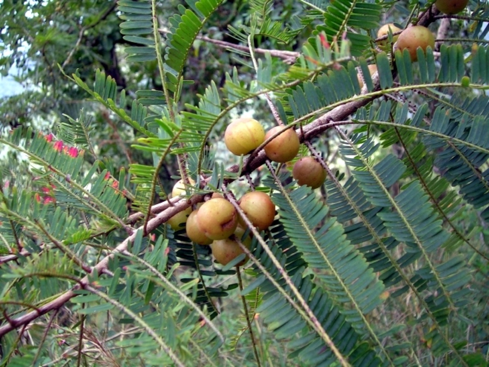

# Phyllanthus emblica - Indian Gooseberry, Betta Nelli, Aonla, Konkam, Amalakamu, Nellikka

[TOC]

**Amalaki** is an Ayurvedic herbal rasayana formula consisting of equal parts of three myrobalans taken without seed.
## Uses
Diabetes, Jaundice, Stomachache, Gynaecological disorder, Cough, Mouth ulcer, Heart problems, Diarrhea, Asthma, Cold, Acidity

## Parts Used
Leaves, Fruit.

## Chemical Composition
Triacontanol (1), Triacontanoic acid (2), β-Amyrin ke- tone (3), Betulonic acid (4), Daucosterol (5), Lupeol acetate (6), β-Amyrin-3-palmitate (7), Gallic acid (8), Betulinic acid (9), Ursolic acid (10), Oleanolic acid (11), Quercetin (12) and Rutin etc

## Common names
| Language | Names |
| --- | --- |
| Kannada | Betta Nelli |
| Malayalam | Nellikka, Amalakam |
| Sanskrit | Amalakah |
| Tamil | Konkam |
| Telugu | Amalakamu |
| Hindi | Aonla, Amla |
| English | Indian Gooseberry |

## Properties
Reference: Dravya - Substance, Rasa - Taste, Guna - Qualities, Veerya - Potency, Vipaka - Post-digesion effect, Karma - Pharmacological activity, Prabhava - Therepeutics.
### Dravya
### Rasa
Tikta (Bitter), Kashaya (Astringent)
### Guna
Laghu (Light), Ruksha (Dry), Tikshna (Sharp)
### Veerya
Ushna (Hot)
### Vipaka
Katu (Pungent)
### Karma
Kapha, Vata
### Prabhava
## Habit
Herb

## Identification
### Leaf
Simple, Alternate, Bark light grey and exfoliating. Leaf feathery, smaller towareds the apex and the base, tip reddish

### Flower
Unisexual, 2-4cm long, Reddish, 5, Flowering from March-April

### Fruit
7–10 mm long pome, Fruiting May onwards, A depressed-globose drupe, Many

### Other features
## List of Ayurvedic medicine in which the herb is used
* [Vishatinduka Taila](../medicines/Vishatinduka_Taila.md) as *root juice extract*

## Where to get the saplings
## Mode of Propagation
Seeds, Cuttings.

## How to plant/cultivate
A plant mainly of the hot, tropical lowlands, succeeding in both humid and semi-arid areas.

Small to medium deciduous tree (8-10 m) grown in forests and orchards. Fruit contains 200 mg Vitamin C per 100 g, one of the richest natural sources. Sandy loam to medium black soils with good drainage; pH 6.5-9.5; 250-1500 mm rainfall. Propagated through **seeds** and **budding** (shield budding at 60° angle). Prepare pits of 2.5 x 1.8 m at 0.5 m depth in March-April. Plant during June-July. About 900 plants per acre. Irrigate every 3-6 days during dry season and flowering. Weed in initial years; apply mulch around base. Pests: bark borers, shootfly, fruit borers. Diseases: leaf blight, leaf spot. Use Bordeaux mixture and neem sprays. Trees bear fruit after **4-5 years**. Fruits mature in November, harvested by hand. Yield: 50-70 kg fruit per tree per year; 10,000-15,000 kg green fruit per hectare. Trees produce 20+ years. Varieties: Banarasi, Krishna, Chakaiya, Kanchan, Narendra Amla-6, 7, 9, 10. Economics: fruit Rs. 20-30/kg, powder Rs. 80-120/kg.

## Commonly seen growing in areas
Mixed forests, Drier forests, Dry open sparse forests or scrub.

## Photo Gallery

## References

## External Links
* [Phyllanthus emblica on useful trophical plants](http://tropical.theferns.info/viewtropical.php?id=Phyllanthus+emblica)
* [Phyllanthus emblica on Species for home garden](http://www.fao.org/docrep/004/ab777e/ab777e05.htm)
* [Phyllanthus emblica on prota4u.org](https://www.prota4u.org/database/protav8.asp?g=pe&p=Phyllanthus+emblica+L.)

## References

1. [constituents](Chemical)(https://www.ncbi.nlm.nih.gov/pubmed/26415402)
2. [Morphology](https://indiabiodiversity.org/species/show/31625)
3. [details](Cultivation)(https://www.pfaf.org/user/Plant.aspx?LatinName=Phyllanthus+emblica)

4. **[KAMPA - ಔಷಧಿ ಸಸ್ಯಗಳ ಕೃಷಿ ಕೈಪಿಡಿ (Medicinal Plants Cultivation Handbook)](../resources/books/KAMPA_Medicinal_Plants_Cultivation_Handbook.md)**. Karnataka Medicinal Plants Authority (KAMPA), Bengaluru, 2024, pp. 65-69.
   Cultivation details including soil requirements, propagation methods, planting, irrigation, harvest timing, yield estimates, and economics.
