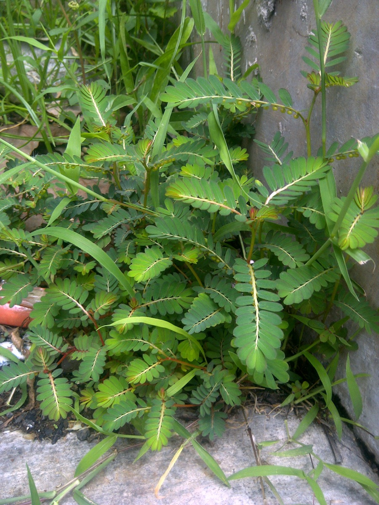

# Phyllanthus urinaria - Bhumyamalaki

[TOC]

**Phyllanthus-urinaria** is a small annual herb growing up to 2 ft tall. Leaves are alternately arranged along the erect. flowers are greenish white, minute and appear at axiles of the leaves, as well as the seed capsules. Numerous small green-red fruits, round and smooth, are found along the underside of the stems.
## Uses
Kidney stones, Urinary tract infection, Bladder inflammation, Liver problems, Hepatitis B, Urinaria.

## Parts Used
Whole plant.

## Chemical Composition
Lignans Phyllanthin, hypophyllanthin, Flavonoids Astragalin, rutin, quercetin, Triterpenes Lupeol, sitosterol, Alkaloids, Tannin.

## Common names
| Language | Names |
| --- | --- |
| Kannada | Kempu kirunelli |
| Malayalam | Chirukizhukanelli |
| Sanskrit | Bhumi amalaki |
| Tamil | Civappu kilanelli |
| Telugu | Erra usirika |
| Hindi | Thajarmani |
| English | Chamber bitter |
.

## Properties
Reference: Dravya - Substance, Rasa - Taste, Guna - Qualities, Veerya - Potency, Vipaka - Post-digesion effect, Karma - Pharmacological activity, Prabhava - Therepeutics.
### Dravya
### Rasa
Tikta (Bitter), Kashaya (Astringent), Madhura (Sweet)
### Guna
Laghu (Light), Ruksha (Dry)
### Veerya
Sheet (Cold)
### Vipaka
Madhura (Sweet)
### Karma
kapha, Pitta, Shamaka
### Prabhava
## Habit
Small herb

## Identification
### Leaf
Simple, Oblong-obovate, Leaves are alternately arranged along the erect, red stem, resembling those of the mimosa tree, disposed in two ranges. However, the leaves are not compound, but simple..

### Flower
Unisexual, 2.5 cm long, Greenish white, Flowers are greenish white, minute and appear at axiles of the leaves, as well as the seed capsules

### Fruit
Small, Numerous small green-red fruits, round and smooth, are found along the underside of the stems., 12-20 seeds

### Other features
## List of Ayurvedic medicine in which the herb is used
## Where to get the saplings
## Mode of Propagation
Seeds.

## How to plant/cultivate
It is well adapted to variety of soils at pH ranging from alkaline to neutral and acidic. Plant shows preference for calcareous well drained and light textured soils.

## Commonly seen growing in areas
Semi-temperate to tropical conditions, High rainfall.

## Photo Gallery
_(2951961868).jpg)

_(6185908631).jpg)

_(6186426322).jpg)

## References

## External Links
* [Bhumyamalaki - uses, benefits, side effects, remedies](https://easyayurveda.com/2017/05/09/bhumyamalaki-phyllanthus-niruri/)
* [Bhumyamalaki on herbpathy-make life healthy](https://herbpathy.com/Uses-and-Benefits-of-Stonebreaker-Cid3662)
* [Bhumyamalaki on herbalcure india](http://www.herbalcureindia.com/herbs/bhumyamalaki.htm)
* [Bhumyamalaki on india mart](https://www.indiamart.com/proddetail/bhumi-amla-phyllanthus-niruri-extract-11763059348.html)

## References

1. [Pharmacology](http://citeseerx.ist.psu.edu/viewdoc/download?doi=10.1.1.679.2571&rep=rep1&type=pdf)
2. [Morphology](http://www.flowersofindia.net/catalog/slides/Chamber%20Bitter.html)
3. [Agritechnology](http://www.techno-preneur.net/technology/project-profiles/food/bhumy.html)
