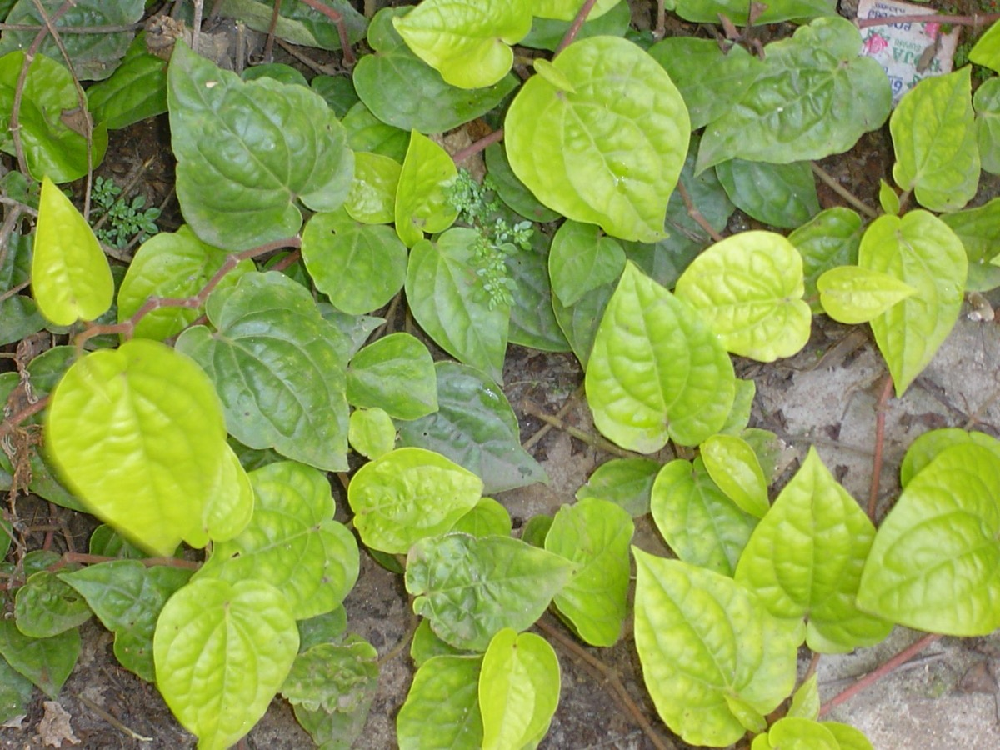

# Piper betle - Nagavallari

[TOC]

**Piper betle** is eulogized by ayurveda acharyas for their immense medicinal properties. Piper betle is a vine which belongs to Piperacea family. This vine has heart shaped leaves and is mostly grown in South East Asia.
## Uses
Wounds, Joint pains, Stomach colicky, Indigestion, Bad breath, Weight loss, Erectile disfunction, Diarrhea, Sore throats.

## Parts Used
Vines, Leaves, Roots, Fruits.

## Chemical Composition
Leaf contains Water (85-90%), Proteins (3-3.5%), Carbohydrates (0.5-6.1%), Minerals (2.3-3.3%), Fat (0.4-1%), Fibre (2.3%), Essential oil (0.08-0.2%), Tannin (0.1-1.3%), Alkaloid.

## Common names
| Language | Names |
| --- | --- |
| Kannada | Veelyade Ele |
| Tamil | Vettilai |
| Telugu | Tamalapaku |
| English | Betel pepper |

## Properties
Reference: Dravya - Substance, Rasa - Taste, Guna - Qualities, Veerya - Potency, Vipaka - Post-digesion effect, Karma - Pharmacological activity, Prabhava - Therepeutics.
### Dravya
### Rasa
Tikta (Bitter), Kashaya (Astringent)
### Guna
Laghu (Light), Ruksha (Dry), Tikshna (Sharp)
### Veerya
Ushna (Hot)
### Vipaka
Katu (Pungent)
### Karma
Kapha, Vata
### Prabhava
## Habit
Evergreen climbing shrub

## Identification
### Leaf
Simple, Ovate-oblong, Those at apex of stem sometimes elliptic, 7-15 × 5-11 cm

### Flower
Unisexual, 2-4cm long, Yellow, 2, Flowers Season is May-Jul

### Fruit
General, 7–10 mm, Clearly grooved lengthwise, Lowest hooked hairs aligned towards crown, Many

### Other features
## List of Ayurvedic medicine in which the herb is used
* [Nagavallabha rasa](Nagavallabha_rasa.md)
* [Brihat Vishama Jwarantak lauh](Brihat_Vishama_Jwarantak_lauh.md)

## Where to get the saplings
## Mode of Propagation
Cuttings.

## How to plant/cultivate
Cuttings 30 - 45cm long, taken from the tips of vertical shoots.

## Commonly seen growing in areas
Trophical area, Coastal areas.

## Photo Gallery

## References

## External Links
* [Piper betle on science direct](https://www.sciencedirect.com/science/article/pii/S0308814604001050)
* [Piper betle on encyclopedea of life](http://eol.org/pages/491360/overview)
* [Piper betle on philippine medicinal plants](http://www.stuartxchange.com/Ikmo.html)

## References

1. [Constituents](https://www.bimbima.com/ayurveda/medicinal-uses-of-betel-leafpaan/302/)
2. [Morphology](http://eol.org/pages/491360/details)
3. [preparations](Ayurvedic)(https://easyayurveda.com/2019/05/23/betel-benefits-uses-side-effects-dose-research/)
4. [details](Cultivation)(http://tropical.theferns.info/viewtropical.php?id=Piper+betle)
