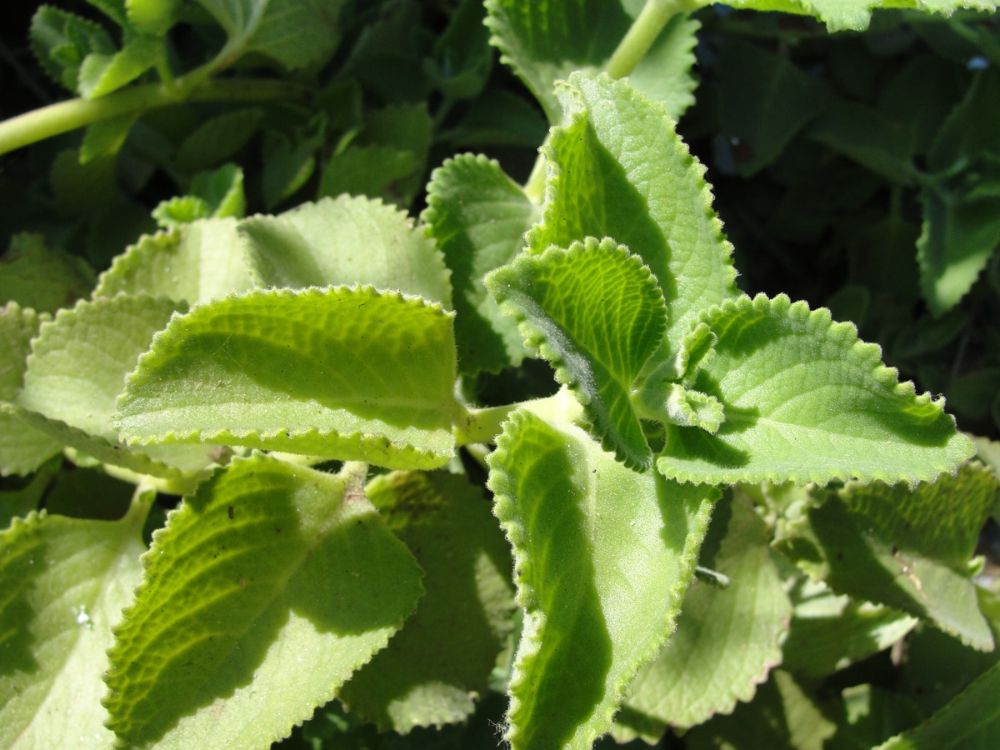

# Plectranthus amboinicus - Karpuravalli, Doddapatre

[TOC]

**Plectranthus amboinicus** once identified as Coleus amboinicus is a tender fleshy perennial plant in the family Lamiaceae with an oregano-like flavor and odor and native to Southern and Eastern Africa.
## Uses
Respiratory problem, Cancer, Stress, Anxiety, Skin eruptions, Kidney problems, Fever, Irritable bowel syndrome, Sore throats

## Parts Used
Leaves.

## Chemical Composition
Hymoquinone (5) was further identified as a nonpolar ingredient from the hexane extract of P. amboinicus to suppress the expression of lipopolysaccharide-induced tumor necrosis factor-alpha (TNF-α). We then synthesized 2-alkylidenyl-4-cyclopentene-1,3-diones as the designed biomimetics of thymoquinone, and found that compounds 8a, 8b and 8d were more potent TNF-α inhibitors

## Common names
| Language | Names |
| --- | --- |
| Kannada | Dodda pathre soppu, Karpoora valli |
| Malayalam | Panikkurkka |
| Sanskrit | Karpuravalli |
| Tamil | Karpuravalli |
| Telugu | Sugandhavalkam |
| Hindi | Patta ajwain |
| English | Cuban Oregano, Indian borage |

## Properties
Reference: Dravya - Substance, Rasa - Taste, Guna - Qualities, Veerya - Potency, Vipaka - Post-digesion effect, Karma - Pharmacological activity, Prabhava - Therepeutics.
### Dravya
### Rasa
Tikta (Bitter), Katu (Pungent)
### Guna
Laghu (Light), Ruksha (Dry), Tikshna (Sharp)
### Veerya
Ushna (Hot)
### Vipaka
Katu (Pungent)
### Karma
Kapha, Vata
### Prabhava
## Habit
Perennial plant

## Identification
### Leaf
Simple, Evergreen, Foliage Color is White, Light Green, Gray Green

### Flower
Unisexual, 2-4cm long, White, Pink, Lavender, Single, Flower Interest is Showy

### Fruit
General, 7–10 mm, Fragrant Fruit is present, Fruit Color is Sandy Brown

### Other features
## List of Ayurvedic medicine in which the herb is used
* [Grahanimihira Taila](Grahanimihira_Taila.md)

## Where to get the saplings
## Mode of Propagation
Seeds, Cuttings.

## How to plant/cultivate
Plectranthus amboinicus is a plant that ranges from warm temperate areas with dry, mild winters to tropical areas with dry to wet climates

## Commonly seen growing in areas
Tall grasslands, At meadows, Borders of forests and fields.

## Photo Gallery
.JPG)

## References

## External Links
* [Plectranthus amboinicus on home guides.sfgate.com](http://homeguides.sfgate.com/grow-plectranthus-amboinicus-84959.html)
* [Plectranthus amboinicus on flowers of india](http://www.flowersofindia.net/catalog/slides/Cuban%20Oregano.html)
* [Plectranthus amboinicus on IPFS.org](https://ipfs.io/ipfs/QmXoypizjW3WknFiJnKLwHCnL72vedxjQkDDP1mXWo6uco/wiki/Plectranthus_amboinicus.html)

## References

1. [constituents](Chemical)(https://www.ncbi.nlm.nih.gov/pubmed/24491635)
2. [Features](Ornamental)(http://www.learn2grow.com/plants/plectranthus-amboinicus-variegatus/)
3. [Details](Cultivation)(http://tropical.theferns.info/viewtropical.php?id=Plectranthus%20amboinicus)
