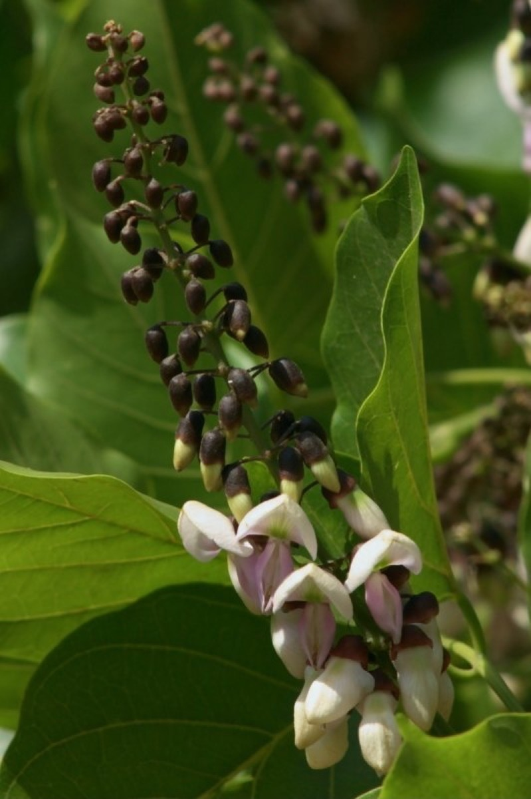

# Pongamia pinnata - Naktamala

[TOC]

**Naktamala** is a species of tree in the pea family, Fabaceae, native in tropical and temperate Asia including parts of Indian subcontinent, China, Japan, Malesia, Australia and Pacific islands.

## Uses
Cough, Cuts, Fever, Wounds, Skin eruptions, Wound, Infectious diarrhea, Sore throats

## Parts Used
Tender shoots, Leaves, Roots, Flowers, Seeds.

## Chemical Composition
Indian beech tree is reported to contain alkaloids demethoxy-kanugin, gamatay, glabrin, glabrosaponin, kaempferol, kanjone, kanugin, karangin, neoglabrin, pinnatin, pongamol, pongapin, quercitin, saponin, b-sitosterol, and tannin.

## Common names
| Language | Names |
| --- | --- |
| Kannada | Honge |
| Malayalam | Ponnu, Unnu |
| Sanskrit | Karanjah |
| Tamil | Pungai |
| Telugu | Pungu |
| Hindi | Aranj |
| English | Pongam Tree, Indian Beech Tree |

## Properties
Reference: Dravya - Substance, Rasa - Taste, Guna - Qualities, Veerya - Potency, Vipaka - Post-digesion effect, Karma - Pharmacological activity, Prabhava - Therepeutics.
### Dravya
### Rasa
Tikta (Bitter), Kashaya (Astringent)
### Guna
Laghu (Light), Ruksha (Dry), Tikshna (Sharp)
### Veerya
Ushna (Hot)
### Vipaka
Katu (Pungent)
### Karma
Kapha, Vata
### Prabhava
## Habit
Tree

## Identification
### Leaf
Simple, Alternate, Leaves alternate, imparipinnate with long slender leafstalk, hairless

### Flower
Unisexual, 4-5 mm long, Yellow, 5-20, Inflorescence raceme-like, axillary, 6-27 cm long, bearing pairs of strongly
fragrant flowers

### Fruit
7–10 mm, Plattened but slightly swollen, slightly curved with short, curved, With hooked hairs, Many

## Where to get the saplings
## Mode of Propagation
Seeds, Cuttings.

## How to plant/cultivate
Native to humid tropical and subtropical environments, it is found at elevations from sea level to 1,200 metres

## Commonly seen growing in areas
Lowland forest, Rocky coral outcrops on the coast, Along the edges.

## Photo Gallery
_trunk_in_Hyderabad,_AP_W_IMG_6660.jpg)

_(7211125188).jpg)

## References

## External Links
* [Pongamia pinnata plants home remedies](https://easyayurveda.com/2017/05/01/indian-beech-home-remedies/)
* [Pongamia pinnata on medicinal plants india.com](http://www.medicinalplantsindia.com/indian-beech.html)
* [Pongamia pinnata on meidicnal plants](https://sites.google.com/site/medicinalplantshealing/list-of-plants/indian-beech)

## References

1. [Constituents](http://www.spicesmedicinalherbs.com/pongamia-pinnata.html)
2. [characterristics](Plants)(https://web.archhttp://www.worldagroforestry.org/treedb2/AFTPDFS/Pongamia_pinnata.PDF)
3. [details](Cultivation)(https://www.pfaf.org/user/Plant.aspx?LatinName=Pongamia+pinnata)
