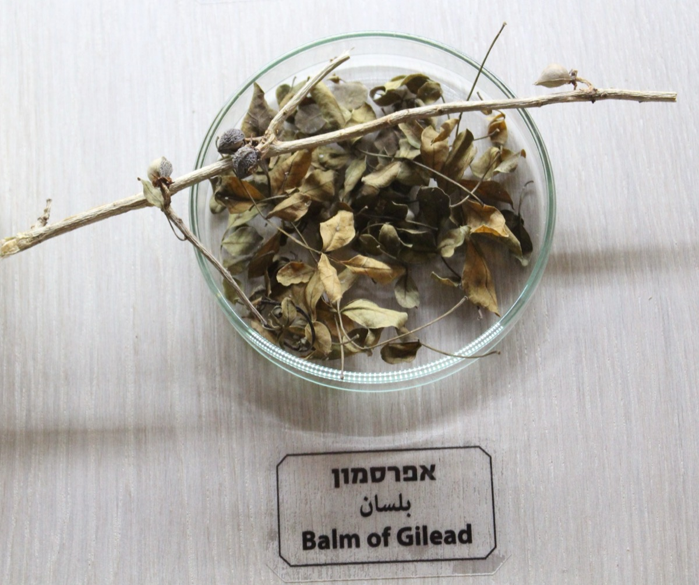

# Populus balsamifera - Balsam Poplar

[TOC]

**Balm of Gilead** was a rare perfume used medicinally, that was mentioned in the Bible, and named for the region of Gilead where it was produced. The expression stems from William Tyndale's language in the King James Bible of 1611, and has come to signify a universal cure in figurative speech.
## Uses
Fever, Emaciation, Debility, Impaired digestion, Diarrhea, Urinary infections.

## Parts Used
Bark.

## Chemical Composition
## Common names
| Language | Names |
| --- | --- |
| English | Balsam Poplar, Balm of Gilead |

## Properties
Reference: Dravya - Substance, Rasa - Taste, Guna - Qualities, Veerya - Potency, Vipaka - Post-digesion effect, Karma - Pharmacological activity, Prabhava - Therepeutics.
### Dravya
### Rasa
### Guna
### Veerya
### Vipaka
### Karma
### Prabhava
## Habit
Tree

## Identification
### Leaf
Simple, Alternate, Leaves are ovate or broadly lanceolate, 2.25 to 4.5 inches long (6-11 cm) and 1.5 to 3 inches wide (4-7.5 cm).

### Flower
Unisexual, Pistillate and staminate catkins, Winter buds are 1 inch long (2.5 cm) with sticky resin and a pungent balsam odor in the spring.

### Fruit
Capsules, Ripe capsules split into 2 parts. Tiny seeds have a tuft of soft, white hairs at the tip and are often dispersed in large, fluffy masses, Fruiting occurs in late May to early or mid-July and when rivers are most often in the flood stage

### Other features
## List of Ayurvedic medicine in which the herb is used
## Where to get the saplings
## Mode of Propagation
Seeds, Cuttings.

## How to plant/cultivate
Seed - must be sown as soon as it is ripe in spring. Poplar seed has an extremely short period of viability and needs to be sown within a few days of ripening.  Cuttings of mature wood of the current season's growth, 20 - 40cm long, November/December in a sheltered outdoor bed or direct into their permanent positions.

## Commonly seen growing in areas
Temperate area.

## Photo Gallery

## References

## External Links
* [Populus balsamifera on Natural medicinal herbs.net](http://www.naturalmedicinalherbs.net/herbs/p/populus-balsamifera=balsam-poplar.php)
* [Populus balsamifera on Usda.gov](https://www.srs.fs.usda.gov/pubs/misc/ag_654/volume_2/populus/balsamifera.htm)

## References

1. [Uses](https://www.henriettes-herb.com/eclectic/kings/populus.html)
2. [description](Fruit)(https://budburst.org/plants/balsam-poplar)
3. [description](Botanic)(https://www.fs.fed.us/database/feis/plants/tree/popbalb/all.html)
4. [details](Cultivation)(https://pfaf.org/user/Plant.aspxLatinName=Populus+balsamifera)
