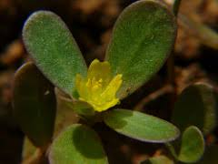
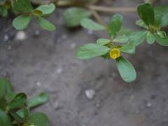
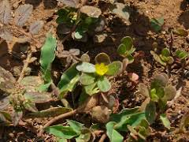
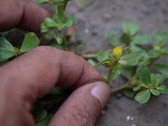
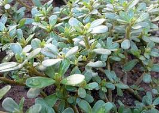

# Portulaca oleracea - Purslane

[TOC]

**Portulaca oleracea** is an annual succulent in the family Portulacaceae, which may reach 40 centimetres (16 in) in height.Approximately forty cultivars are currently grown.
## Uses
Snake bites, Boils, Snakebites, Sores, Skin eruptions, Pain from bee stings, Bacillary dysentery, Diarrhea, Hemorrhoids, Postpartum bleeding, Intestinal bleeding, Cold, Weak digestion.

### Food
Portulaca oleracea can be used in Food. Entire shoot is cooked as vegetable. Young shoots are consumed as salad. Leaves dried and stored for use in times of scarcity.

## Parts Used
Stem, Leaves, Flowers

## Chemical Composition
Alpha-linolenic,  0.01 mg/g of eicosapentaenoic acid, vitamin A, vitamin C, Vitamin E (alpha-tocopherol) and some vitamin B and carotenoids.

## Common names
| Language | Names |
| --- | --- |
| Kannada | ದೊಡ್ಡ ಗೋಣಿ ಸೊಪ್ಪು Dodda goni soppu |
| Malayalam | Koluppa |
| Sanskrit | Loni, Lonika |
| Tamil | Koli-k-kirai |
| Telugu | Boddupavilikoora, Boddupavilikura |
| Hindi | Khursa, Kulfa |
| English | Common Indian Parselane |
| Punjabi | Dhamni |

## Properties
Reference: Dravya - Substance, Rasa - Taste, Guna - Qualities, Veerya - Potency, Vipaka - Post-digesion effect, Karma - Pharmacological activity, Prabhava - Therepeutics.
### Dravya
### Rasa
Amla
### Guna
Guru (Heavy), Ruksha (Dry)
### Veerya
Ushna (Hot)
### Vipaka
Kaphahar and Vatahar, Pittakara, Chakshuya, Vanidoshhar
### Karma
### Prabhava
### Nutritional components
Portulaca oleracea Contains the Following nutritional components like - Vitamin A, B1, B2, B3, B6, C and E; Oleracein A, Oleracein BZ, Oleracein E, Hesperidin; Calcium, Iron, Magnesium, Manganese, Phosphorus, Potassium, Sodium, Zinc.

## Habit
Annual herb

## Identification
### Leaf
Simple, Lobed or unlobed but not separated into leaflets, Leaf arrangement is alternate there is one leaf per node along the stem and the edge of the leaf blade is entire (has no teeth or lobes)

### Flower
Unisexual, 2-4cm long, Yellow, 10, There are two or more ways to evenly divide the flower (the flower is radially symmetrical)

### Fruit
General, 4–7 mm, The fruit is dry and splits open when ripe, Many

### Other features
## List of Ayurvedic medicine in which the herb is used
## Where to get the saplings
## Mode of Propagation
Seeds, Cuttings.

## How to plant/cultivate
Requires a moist light rich well-drained soil in a sunny position. Portulaca oleracea is available throughout the year.

## Commonly seen growing in areas
At meadows, Borders of forests and fields.

## Photo Gallery

## References

## External Links
* [Purslane nutrition facts](https://www.nutrition-and-you.com/purslane.html)
* [Purslane Weed (Portulaca oleracea): A Prospective Plant Source of Nutrition](https://www.hindawi.com/journals/tswj/2014/951019/)
* [Portulaca oleracea L on useful trophical plants](http://tropical.theferns.info/viewtropical.php?id=Portulaca+oleracea+sativa)
* [Portulaca oleracea L on wimastergarden.org](https://wimastergardener.org/article/common-purslane-portulaca-oleracea/)
* [Portulaca oleracea L on floridata.com/](https://floridata.com/Plants/Portulacaceae/Portulaca+oleracea/1220)

## References

1. [oleracea L on science direct](Portulaca)(https://www.sciencedirect.com/science/article/pii/S0378874112006393?via%3Dihub)
2. [Characteristics](https://gobotany.newenglandwild.org/species/portulaca/oleracea/)
3. [names](Common)(https://sites.google.com/site/indiannamesofplants/via-species/p/portulaca-oleracea)
4. [details](Cultivation)(https://www.pfaf.org/user/plant.aspx?LatinName=Portulaca+oleracea)
5. "Forest food for Northern region of Western Ghats" by Dr. Mandar N. Datar and Dr. Anuradha S. Upadhye, Page No.127, Published by Maharashtra Association for the Cultivation of Science (MACS) Agharkar Research Institute, Gopal Ganesh Agarkar Road, Pune
