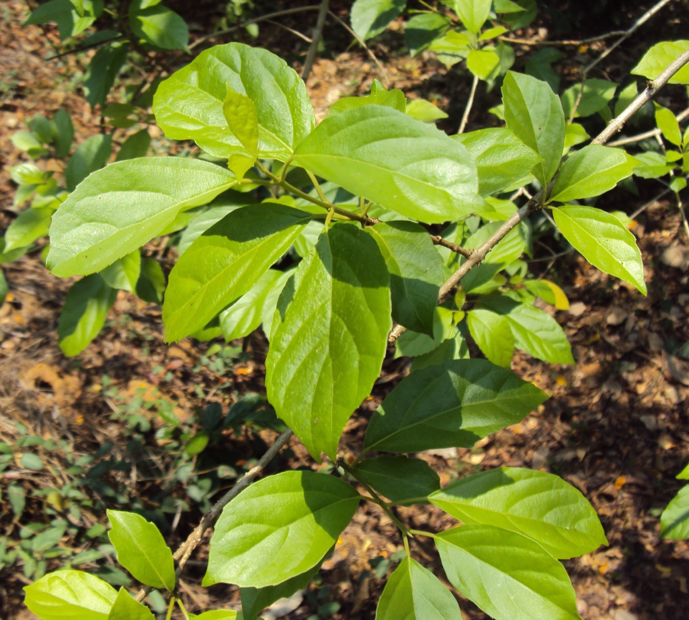

# Premna serratifolia - Ganakasika

[TOC]

**Premna serratifolia**  is a small shrub in the Verbenaceae family. It flowers and fruits between May and November. During flowering season, it attracts a large number of butterflies and bees.

## Uses
Fever, Arthritis, Colic, Flatulence, Cough, Headaches, Backaches, Neuralgi, Sore throats

## Parts Used
Leaves, Seeds, Ripe fruits.

## Chemical Composition
P-methoxy cinnamic acid, linalool, linoleic acid, β-sitosterol and flavone luteolin, iridoid glycoside, premnine, ganiarine and ganikarine, premnazole, aphelandrine, pentacyclic terpene betulin, caryophellen, premnenol, premna spirodiene, clerodendrin-A, etc., phytoconstituents in its various parts

## Common names
| Language | Names |
| --- | --- |
| Kannada | ಅಗ್ನಿಮನ್ಥ Agnimantha |
| Malayalam | Appa |
| Sanskrit | Agni-mantha, Arani |
| Tamil | Pacu-munnai, Munnai |
| Telugu | Bhairavi |
| Hindi | Arani |
| English | Headache tree, Spinous fire brand teak |
| Marathi | Arani,  Ranatakali |

## Properties
Reference: Dravya - Substance, Rasa - Taste, Guna - Qualities, Veerya - Potency, Vipaka - Post-digesion effect, Karma - Pharmacological activity, Prabhava - Therepeutics.
### Dravya
### Rasa
Tikta (Bitter), Kashaya (Astringent)
### Guna
Laghu (Light), Ruksha (Dry), Tikshna (Sharp)
### Veerya
Ushna (Hot)
### Vipaka
Katu (Pungent)
### Karma
Kapha, Vata
### Prabhava
## Habit
Shrub

## Identification
### Leaf
Simple, Opposite, Petiole 4-14 mm, slender, pubescent, grooved above

### Flower
Bisexual, 2-4cm long, Greenish-white, 4, Flowers Season is June - August

### Fruit
General, 7–10 mm, Fruit a drupe, seated on the calyx, globose, purple, Seeds oblong

### Other features
## List of Ayurvedic medicine in which the herb is used
## Where to get the saplings
## Mode of Propagation
Seeds, Cuttings.

## How to plant/cultivate
Found in the wild on sandy soils and limestone

## Commonly seen growing in areas
Forest regrowth, At brushwood and hedges, Near to sea area.

## Photo Gallery
_(5928858017).jpg)
_(5928846965).jpg)
_(5929406812).jpg)
_(5928849321).jpg)
_1.jpg)
_2.jpg)
.jpg)

## References

## External Links
* [Study on the chemical constituents of Premna integrifolia L](https://www.researchgate.net/publication/277598004_Study_on_the_chemical_constituents_of_Premna_integrifolia_L)
* [Premna serratifolia on ayurtimes.com](https://www.ayurtimes.com/agnimantha-premna-integrifolia/)
* [Premna serratifolia on Ethnomedicinal uses, phytochemistry and pharmacological aspects of the genus Premna](https://www.tandfonline.com/doi/full/10.1080/13880209.2017.1323225)
* [Premna serratifolia on Powo.science.kew.org](http://powo.science.kew.org/taxon/urn:lsid:ipni.org:names:864424-1)

## References

1. [Phytochemistry](https://www.ncbi.nlm.nih.gov/pmc/articles/PMC4623632/)
2. [description](Diagnostic)(https://indiabiodiversity.org/species/show/230814)
3. [Details](Cultivation)(http://tropical.theferns.info/viewtropical.php?id=Premna+serratifolia)
