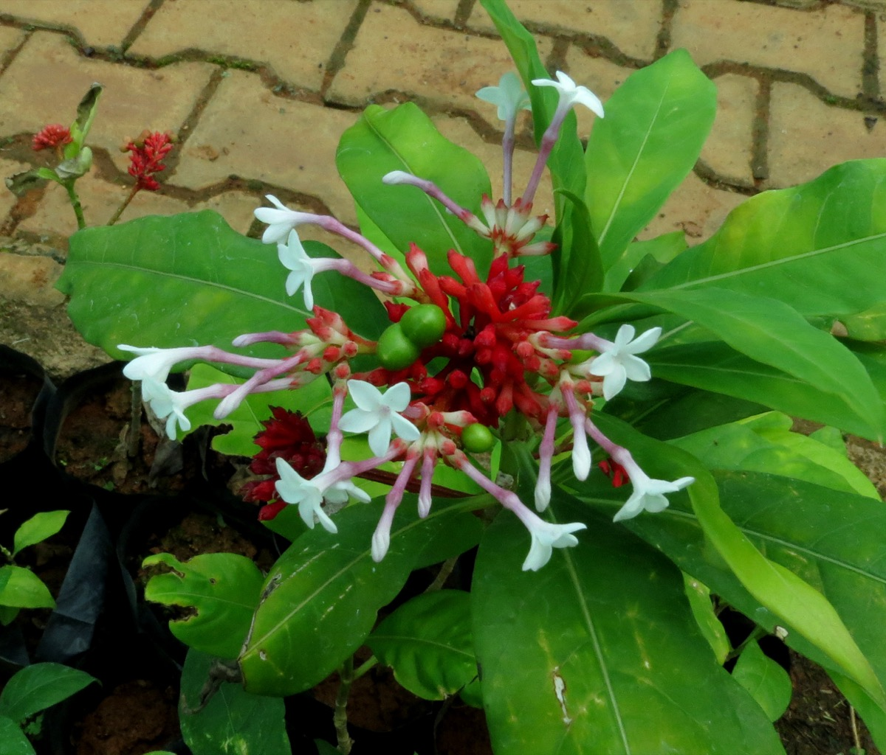

# Rauvolfia serpentina - Snake-root, Sarpagandha, Chivan amelpodi, Paataala goni, Suvapavalforiyan

[TOC]

**Rauvolfia serpentina** is a species of flower in the family Apocynaceae. It is native to the Indian subcontinent and East Asia from India to Indonesia.
## Uses
High blood sugar, Lowering blood pressure, Cataract, Plague, Schizophrenia, Anxiety, Psychosis, Epilepsy, Colic, Cholera, Snake bite , Hypochondria, Mental disorders, Intractable skin disorder, Psoriasis.

## Parts Used
Roots.

## Chemical Composition
Ajmaline, ajmalinine and ajmalicine, serpentine, serpentinine, alkaloids, reserpine, rescinnamine and yohimbine.

## Common names
| Language | Names |
| --- | --- |
| Kannada | Sarpagandha |
| Malayalam | Suvapavalforiyan |
| Sanskrit | Sarpagandha |
| Tamil | Chivan amelpodi |
| Telugu | Paataala goni |
| Hindi | Sarpagandha |
| English | Snake-root |

## Properties
Reference: Dravya - Substance, Rasa - Taste, Guna - Qualities, Veerya - Potency, Vipaka - Post-digesion effect, Karma - Pharmacological activity, Prabhava - Therepeutics.
### Dravya
### Rasa
Tikta (Bitter), Kashaya (Astringent)
### Guna
Laghu (Light), Ruksha (Dry), Tikshna (Sharp)
### Veerya
Ushna (Hot)
### Vipaka
Katu (Pungent)
### Karma
Kapha, Vata
### Prabhava
## Habit
Herb

## Identification
### Leaf
Simple, In whorls of 3, thin, lanceolate, acute, bright green above and pale beneath

### Flower
Unisexual, 2-4cm long, Violet, 5, Flowers are in irregular corymbose cymes, white, often tinged with violet. Flowering season is May-January

### Fruit
Simple, 7–10 mm, Clearly grooved lengthwise, Lowest hooked hairs aligned towards crown, Many, Fruiting season is May-January

### Other features
## List of Ayurvedic medicine in which the herb is used
* [Vishatinduka Taila](../medicines/Vishatinduka_Taila.md) as *root juice extract*

## Where to get the saplings
## Mode of Propagation
Seeds, Cuttings.

## How to plant/cultivate
Its grows spontaneous in tropical forests (temp,10°C to 40°C) which are humid in summer at an altitude up to about 1200 metres.

Important endangered perennial shrub (15-45 cm tall) with thick tuberous roots. Well-drained loamy to sandy loam soil, pH 4.6-6.5. Temperature 10-30°C. Prefers partial shade. Propagated through **seeds**, **root cuttings**, and **stem cuttings** (10-12 cm with nodes). Sow seeds in December-January in nursery bags at 25 x 20 cm spacing. Seeds germinate in ~15 days. Transplant after 3 months. Main field spacing 3 x 6 m; about 550 plants per hectare. Maintain moist conditions; irrigate during dry periods. Weed monthly. Naturally pest-resistant; no major diseases. Harvest roots after plant matures. Contains reserpine and serpentine alkaloids for treating hypertension. Economics: bark Rs. 150/kg.

## Commonly seen growing in areas
Trophical region, Borders of forests and fields.

## Photo Gallery

_(6928674411).jpg)
.jpg)
.jpg)
_WLB_DSC_0237.jpg)

## References

## External Links
* [Rauvolfia serpentina on science direct](https://www.sciencedirect.com/topics/medicine-and-dentistry/rauvolfia-serpentina)
* [Rauvolfia serpentina on MEDICINAL PLANTS OF BANGLADESH](http://www.mpbd.info/plants/rauvolfia-serpentina.php)
* [Rauvolfia serpentina on agriculture information.in](http://agriinfo.in/default.aspx?page=topic&superid=2&topicid=1411)
* [Rauvolfia serpentina on biotech articles.com](https://www.biotecharticles.com/Agriculture-Article/Rauwolfia-Cultivation-and-Collection-892.html)

## References

1. [Constituents](Chemical)(http://www.biologydiscussion.com/medicinal-plants/rauvolfia-serpentina-habitat-history-and-constituents/51900)
2. [description](Plant)(https://hort.purdue.edu/newcrop/CropFactSheets/rauvolfia.html)
3. [Cultivation](http://www.yourarticlelibrary.com/biology/alkaloid/rauwolfia-sources-cultivation-and-uses-with-diagram/49643)
4. **Ningombam, Sanjeev Kumar and Hazarika, Rituparna. "Ancient Remedies: Exploring the Traditional Medicine Systems of Northeast Indian Tribes." *The International Journal of Bharatiya Knowledge System, Vol. 1, pp. 67-78*, 2024, p. 72.**
   Known in Northeast Indian tribal medicine for antihypertensive and sedative properties. Used to treat high blood pressure, anxiety, and insomnia.

5. **[KAMPA - ಔಷಧಿ ಸಸ್ಯಗಳ ಕೃಷಿ ಕೈಪಿಡಿ (Medicinal Plants Cultivation Handbook)](../resources/books/KAMPA_Medicinal_Plants_Cultivation_Handbook.md)**. Karnataka Medicinal Plants Authority (KAMPA), Bengaluru, 2024, pp. 81-84.
   Cultivation details including soil requirements, propagation methods, planting, irrigation, harvest timing, yield estimates, and economics.
