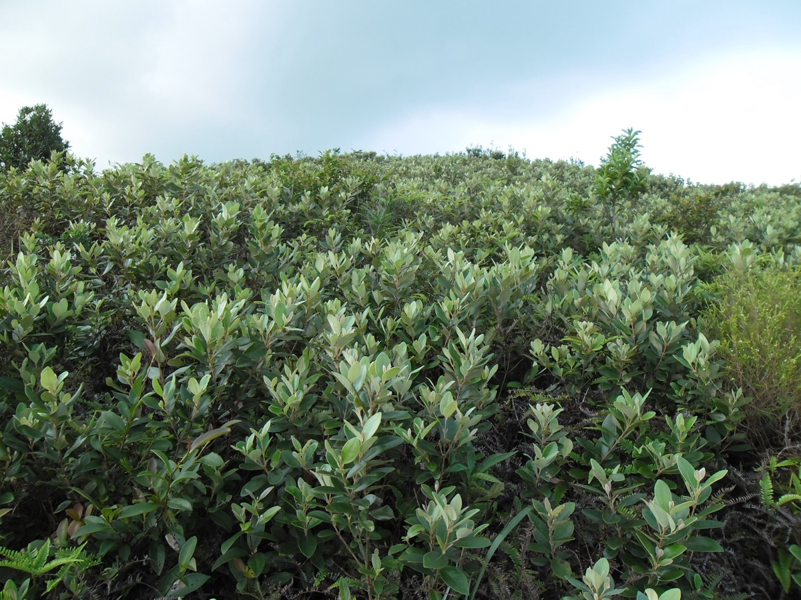

# Rhodomyrtus tomentosa - Rose myrtle

[TOC]

**Rhodomyrtus tomentosa** is also known as rose myrtle. It is a flowering plant in the family Myrtaceae. It is native to southern and southeastern Asia, from India, east to southern China, Hong Kong, Taiwan and the Philippines, and south to Malaysia and Sulawesi.
## Uses
Diabetes, HIV, Skin damage, Kidney failure, Cancer, Respiratory problems, Burns, Sore throats

## Parts Used
Leaves, Fruits.

## Chemical Composition
The 80% ethanol extract from rose myrtle fruit with piceatannol exhibited protection of UVB‑induced cytotoxicity in NHEK; however, piceatannol‑4'‑O‑β‑D‑glucopyranoside exhibited no protection, as determined by a 3‑(4,5‑dimethylthiazol‑2‑yl)‑2,5‑diphenyltetrazolium bromide assay.

## Common names
| Language | Names |
| --- | --- |
| Kannada | ತವುಟೆಗಿಡ Tavutegida |
| Malayalam | Cerukottilampalam |
| Tamil | Malai-k-koyya |
| English | Ceylon hill gooseberry, Hill guava |

## Properties
Reference: Dravya - Substance, Rasa - Taste, Guna - Qualities, Veerya - Potency, Vipaka - Post-digesion effect, Karma - Pharmacological activity, Prabhava - Therepeutics.
### Dravya
### Rasa
Tikta (Bitter), Kashaya (Astringent)
### Guna
Laghu (Light), Ruksha (Dry), Tikshna (Sharp)
### Veerya
Ushna (Hot)
### Vipaka
Katu (Pungent)
### Karma
Kapha, Vata
### Prabhava
## Habit
Evergreen shrub

## Identification
### Leaf
Simple, Alternate, Mature Foliage is Green, Silver

### Flower
Unisexual, 2-4cm long, Yellow, 5, Flowers Season is June - August

### Fruit
Berry, 7–10 mm, Mature Fruit Texture is Velvety, Single

### Other features
## List of Ayurvedic medicine in which the herb is used
## Where to get the saplings
## Mode of Propagation
Seeds, Cuttings.

## How to plant/cultivate
Plants can succeed in tropical and subtropical climates at altitudes up to 2,440 metres.

## Commonly seen growing in areas
Often degraded sandy sites, River banks, Riparian zones, At wet forests, Bog margins

## Photo Gallery
.jpg)
_3.jpg)
_6.jpg)
_1.jpg)

## References

## External Links
* [Rhodomyrtus tomentosa on agriculture.information](http://vro.agriculture.vic.gov.au/dpi/vro/vrosite.nsf/pages/weeds_downy-rose-myrtle)
* [Rhodomyrtus tomentosa on spandidos-publications.net](https://www.spandidos-publications.com/mmr/12/4/5857)
* [Rhodomyrtus tomentosa on doctor steve able medicinal plants](https://www.doctorabel.us/medicinal-plants/rose-myrtle.html)

## References

1. [constitunets](Chemical)(https://www.ncbi.nlm.nih.gov/pubmed/26239705)
2. [Morphology](Plant)(https://florafaunaweb.nparks.gov.sg/Special-Pages/plant-detail.aspx?id=2388)
3. [names](Common)(https://sites.google.com/site/indiannamesofplants/via-species/r/rhodomyrtus-tomentosa)
4. [Details](Cultivation)(http://tropical.theferns.info/viewtropical.php?id=Rhodomyrtus+tomentosa)
