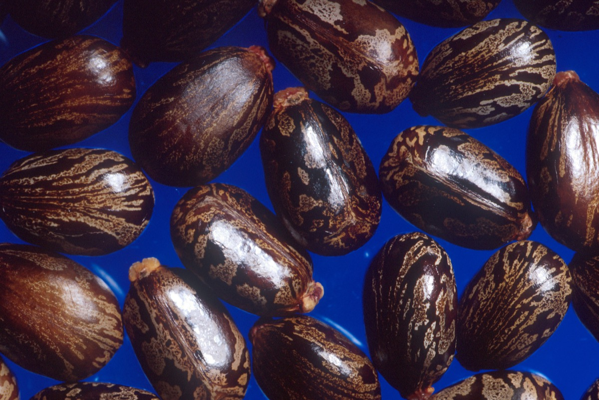

# Ricinus communis - Gandharvataila

[TOC]

**Ricinus communis** is a vegetable oil obtained by pressing the seeds of the castor oil plant. Castor oil is a colorless to very pale yellow liquid with a distinct taste and odor once first ingested.

## Uses
Wounds, Cuts, Snakebites, Curing liver disorders, Skin eruptions, Blotches, Pimples, Diarrhea, Sore throats.

## Parts Used
Root, Leaf, Seed, Extracted Oil.

## Chemical Composition
Contains volatile oils, flavonoids, apigenin, luteolin, quercetin, kaempferol, tiliroside, triterpene glycosides including euscapic acid and tormentic acid, phenolic acids, and 3%–21% tannins

## Common names
| Language | Names |
| --- | --- |
| Sanskrit | Yeranda |
| Kannada | Oudla |
| Malayalam | Chittamankku |
| Tamil | Amanakku |
| Telugu | Amuda |
| Hindi | Arandi |
| English | Castor bean |

## Properties
Reference: Dravya - Substance, Rasa - Taste, Guna - Qualities, Veerya - Potency, Vipaka - Post-digesion effect, Karma - Pharmacological activity, Prabhava - Therepeutics.
### Dravya
### Rasa
Tikta (Bitter), Kashaya (Astringent)
### Guna
Laghu (Light), Ruksha (Dry), Tikshna (Sharp)
### Veerya
Ushna (Hot)
### Vipaka
Katu (Pungent)
### Karma
Kapha, Vata
### Prabhava
## Habit
Herb

## Identification
### Leaf
Simple, Alternate, Palmately 6-8-lobed, peltate, to 20 x 24 cm; lobes 9-15 x 3-6 cm, lanceolate, margin coarsely serrate, apex acuminate; petiole to 18 cm  long.

### Flower
Unisexual, Terminal paniculate racemes, Yellow, Many, Male flowers below, female ones above.  Male flowers: perianth cupular, 3-5-lobed, c. 4 mm long, lanceolate; stamens many, filaments connate, repeatedly branched. Flowering season is December to March

### Fruit
Capsule, 1.6-2 cm across, 3-lobed, Prickly, Seeds oblong, Smooth, Marbled, Carunculate, Fruiting season is December to March

### Other features
## List of Ayurvedic medicine in which the herb is used
[Vishatinduka Taila](../medicines/Vishatinduka_Taila.md), [Maharasnadi kashayam](../medicines/Maharasnadi_kashayam.md), [Chaturmukha ras](../medicines/Chaturmukha_ras.md), [Eranda pak](../medicines/Eranda_pak.md), [Gandharvahastadi kashayam](../medicines/Gandharvahastadi_kashayam.md), [Lohaasava](Lohaasava.md)

## Where to get the saplings
## Mode of Propagation
Seeds

## How to plant/cultivate
Can be easily grown from seed. The seeds are explosively released when the fruit are mature, thereby aiding their spread. They are also often dispersed by floodwaters and animals (e.g. rodents and birds). Humans also spread the seeds in dumped garden waste, mud, soil and on vehicles and machinery.

## Commonly seen growing in areas
Roadsides, Vacant plots, Wastelands.

## Photo Gallery

## References

## External Links
* [Ricinus communis on krishisewa.com](http://www.krishisewa.com/articles/production-technology/85-castor-cultivation.html)
* [Ricinus communis on agrifarming.in](http://www.agrifarming.in/castor-cultivation-information-guide/)
* [Ricinus communis on http://balconygardenweb.com](http://balconygardenweb.com/how-to-grow-castor-oil-plant-care-and-growing-castor-beans/)
* [Ricinus communis on science direct](https://www.sciencedirect.com/science/article/pii/S0925857413001729)

## References

1. [Sciencedirect](https://www.sciencedirect.com/science/article/pii/S0378874112006393?via%3Dihub)
2. [details](Cultivation)(https://indiabiodiversity.org/species/show/230990)
3. [preparations](Ayurvedic)(https://easyayurveda.com/2014/12/12/castor-benefits-use-research-side-effects/)
4. [details](Cultivation)(https://keyserver.lucidcentral.org/weeds/data/media/Html/ricinus_communis.htm)
5. Karnataka Medicinal Plants Volume - 2 by Dr.M. R. Gurudeva, Page No. 746
