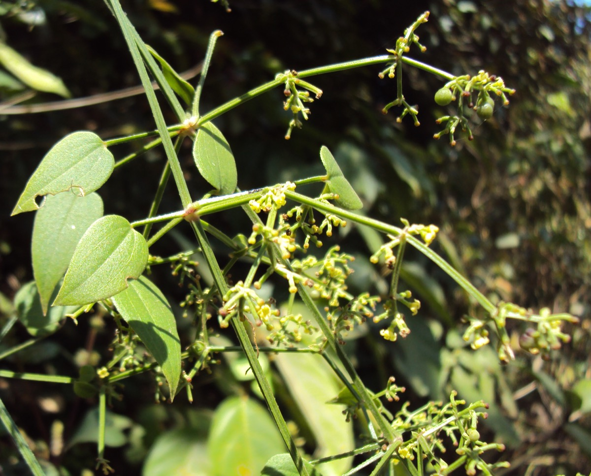

# Rubia cordifolia - Manjishtha

[TOC]

**Manjishtha** is a species of flowering plant in the coffee family. It has been cultivated for a red pigment derived from roots.
## Uses
Uterine bleeding, Internal and external haemorrhage, Bronchitis, Rheumatism, Stones in the kidney, Blotches, Bladder and gall, Dysentery, Febrifuge

## Parts Used
Root, Stem, Whole plant.

## Chemical Composition
Hydroxy-3-ethyl, anthraquinone, dihydroxy, pentyl-naphthaquinonyl, phenanthrene.

## Common names
| Language | Names |
| --- | --- |
| Kannada | ಮಂಜಿಷ್ಠ Manjishta, ಸಿರಗತ್ತಿ Siragatthi |
| Malayalam | Chovvallikkoti, Man-chetti |
| Sanskrit | Aruna, Asra |
| Tamil | Manjitti, Sevvelli |
| Telugu | Chiranji, Manjishta |
| Marathi | Manjishta |
| Punjabi | Kattha |
| KS | Dandu, Mazait |
| Hindi | Majith |
| English | Indian Madder, Common Madder |

## Properties
Reference: Dravya - Substance, Rasa - Taste, Guna - Qualities, Veerya - Potency, Vipaka - Post-digesion effect, Karma - Pharmacological activity, Prabhava - Therepeutics.
### Dravya
### Rasa
Tikta (Bitter), Kashaya (Astringent)
### Guna
Laghu (Light), Ruksha (Dry), Tikshna (Sharp)
### Veerya
Ushna (Hot)
### Vipaka
Katu (Pungent)
### Karma
Kapha, Vata
### Prabhava
## Habit
Perennial plant

## Identification
### Leaf
Simple, Ovate, The evergreen leaves are 5-10 cm long and 2-3 cm broad, produced in whorls of 4-7 starlike around the central stem

### Flower
Unisexual, 3-5 mm, Yellow, 5-20, The flowers are small, with five greenish yellow or pale yellow petals, in dense racemes. Flowering from September to November

### Fruit
Black berry, 4-6 mm, Clearly grooved lengthwise, Lowest hooked hairs aligned towards crown, With hooked hairs, Many, Fruiting from September to November

### Other features
## List of Ayurvedic medicine in which the herb is used
[Maha Manjishtadi kashaya](../medicines/Maha_Manjishtadi_kashaya.md), [Kumkumadi tail](../medicines/Kumkumadi_tail.md), [Maharaja prasarini tailam](../medicines/Maharaja_prasarini_tailam.md), [Panchatikta guggulu ghrita](../medicines/Panchatikta_guggulu_ghrita.md), [Arimedaadi taila](Arimedaadi_taila.md), [Ashwgandharishta](../medicines/Ashwgandharishta.md), [Ushiraasava](Ushiraasava.md), [Kalyana grita](../medicines/Kalyana_grita.md), [Kantakaari avaleha](../medicines/Kantakaari_avaleha.md), [Kunkumaadi taila](../medicines/Kunkumaadi_taila.md), [Chopa chiniyadi churna](../medicines/Chopa_chiniyadi_churna.md), [Chandanaadi taila](../medicines/Chandanaadi_taila.md), [Chandanaasava](Chandanaasava.md), [Jatyadi Taila](../medicines/Jatyadi_Taila.md), [Jatyadigritha](../medicines/Jatyadigritha.md), [Dashamulaarishta](Dashamulaarishta.md), [Dhanvantari taila](../medicines/Dhanvantari_taila.md), [Pindataila](../medicines/Pindataila.md), [Punarnavaadi taila](../medicines/Punarnavaadi_taila.md), [Manjishtaadi kvata](../medicines/Manjishtaadi_kvata.md), [Manjishtaadi taila](../medicines/Manjishtaadi_taila.md), [Raktashodhaka Tab](../medicines/Raktashodhaka_Tab.md), [Cystone Tablets](../medicines/Cystone_Tablets.md), [Surakta](../medicines/Surakta.md), [Sundari kalpa](../medicines/Sundari_kalpa.md)

## Where to get the saplings
## Mode of Propagation
Seeds, Two node root cuttings.

## How to plant/cultivate
The plant is propagated through seeds and two-node root cuttings. The seeds are collected during December and January. The seeds obtained from dried ripe black fruits are sown in nursery beds either in rows or randomly by broadcasting. A thin layer of soil and organic manure is spread over the seeds, and the beds are regularly watered.

## Commonly seen growing in areas
Forest edges, Evergreen forest, Rocky areas.

## Photo Gallery
_(4846178555).jpg)
_(6331765104).jpg)
_(6331763392).jpg)

## References

## External Links
* [Rubia cordifolia on planet ayurveda](http://www.planetayurveda.com/library/manjistha-rubia-cordifolia)
* [Rubia cordifolia on Rubia cordifolia Plant Descriptions and Source.](https://www.mdidea.com/products/proper/proper09702.html)
* [Rubia cordifolia on india biodiversity portal](https://indiabiodiversity.org/species/show/231021)
* [Rubia cordifolia on port4.org](https://www.prota4u.org/database/protav8.asp?g=pe&p=Rubia+cordifolia+L.)

## References

1. [Studies](Phytochemical)(http://ijpsr.com/bft-article/rubia-cordifolia-a-review-on-pharmaconosy-and-phytochemistry/?view=fulltext)
2. [decsripiton](Plant)(https://www.flowersofindia.net/catalog/slides/Indian%20Madder.html)
3. [names](Common)(https://sites.google.com/site/indiannamesofplants/via-species/r/rubia-cordifolia)
4. Karnataka Medicinal Plants Volume-3 by Dr.M. R. Gurudeva, Page No. 1010, Published by Divyachandra Prakashana, #6/7, Kaalika Soudha, Balepete cross, Bengaluru
5. [Details](Cultivation)(http://vikaspedia.in/agriculture/crop-production/package-of-practices/medicinal-and-aromatic-plants/rubia-cordifoli)
