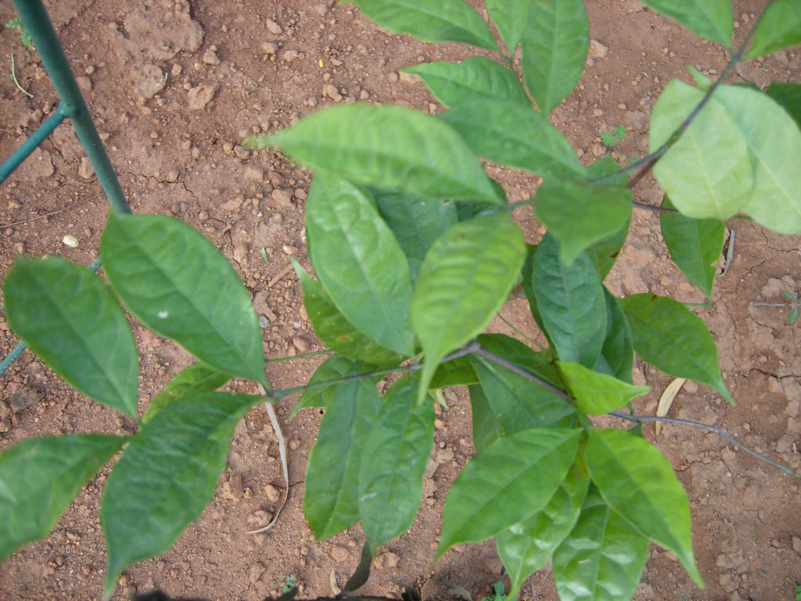

# Salacia reticulata - Meharimula

[TOC]

**Meharimula** is an indigenous flowering plant of the genus Salacia grown in dry zone forests in Sri Lanka. Meharimula or Kothala Himbutu is an indigenous Sri Lankan medicinal plant,  but also  grown  in some parts of Southern India.
## Uses
Diabetes, Salacia, Gonorrhea, Asthma, Itchiness, Joint pain, Obesity, Excess thirst, Menstrual problems

## Parts Used
Roots.

## Chemical Composition
3-oxofriedelane, 3β-hydroxyfriedelane, β-sitosterol, 28-hydroxy-3-oxofriedelane and dulcitol were isolated from extracts of leaves as well as branches of S. elliptica.  β-stearyloxy-olean-12-en, gutta-percha, 3,4-seco-friedelan-3-oic acid, palmitic acid, β-sistosterol glucoside, ethyl glucopyranoside.

## Common names
| Language | Names |
| --- | --- |
| Tamil | kadalainjil, ponkoranti |
| English | Oblong Leaf Salacia |

## Properties
Reference: Dravya - Substance, Rasa - Taste, Guna - Qualities, Veerya - Potency, Vipaka - Post-digesion effect, Karma - Pharmacological activity, Prabhava - Therepeutics.
### Dravya
### Rasa
Tikta (Bitter), Kashaya (Astringent)
### Guna
Laghu (Light), Ruksha (Dry), Tikshna (Sharp)
### Veerya
Ushna (Hot)
### Vipaka
Katu (Pungent)
### Karma
Kapha, Pitta
### Prabhava
## Habit
Herb

## Identification
### Leaf
Simple, Elliptic – oblong, Leaves opposite, 6-12 x 3-6 cm, base acute, apex abruptly acuminate

### Flower
Bisexual, 3-6 cm across, Greenish white or greenish yellow, 5-20, Flowers Season is June - August

### Fruit
General, 7–10 mm, Clearly grooved lengthwise, Lowest hooked hairs aligned towards crown, 1-4

### Other features
## List of Ayurvedic medicine in which the herb is used
## Where to get the saplings
## Mode of Propagation
Seeds, Cuttings.

## How to plant/cultivate

## Commonly seen growing in areas
Wet zone, Dry zone forests.

## Photo Gallery

## References

## External Links
* [Anti‐diabetic and Anti‐hyperlipidemic Effects and Safety of Salacia reticulata and Related Species](https://www.ncbi.nlm.nih.gov/pmc/articles/PMC5033029/)
* [Salacia reticulata on science direct](https://www.sciencedirect.com/science/article/pii/S0102695X13700978)
* [Salacia reticulata on easy ayurveda.com](https://easyayurveda.com/2016/08/09/saptachakra-qualities-uses-research-medicines/)
* [Salacia reticulata on frlhtenvis.nic.in](http://frlhtenvis.nic.in/KidsCentre/Plant_1769.aspx)

## References

1. [constitunets](Chemical)(http://www.scielo.br/scielo.php?script=sci_arttext&pid=S0100-40422010000400026)
2. [Morphology](http://www.gbpuat-cbsh.ac.in/departments/bi/database/phytodiabcare/phytodiab%20db/135.html)
3. [details](Cultivation)
