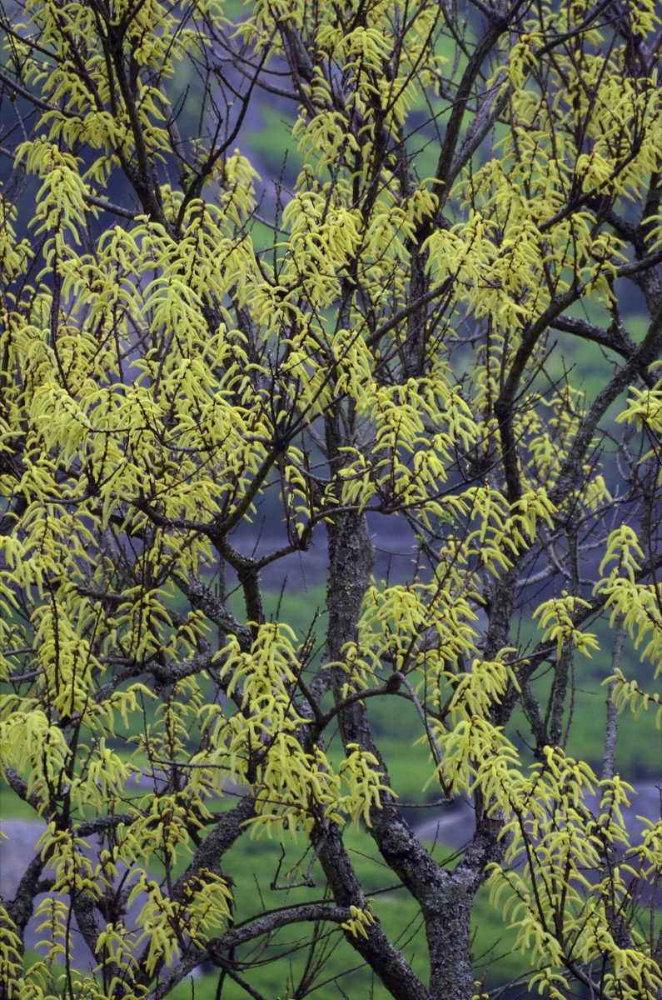

# Salix tetrasperma - Jalavetasa

[TOC]

**Jalavetasa** is a medium-sized tree of wet and swampy places, shedding its leaves at the end of monsoon season. It flowers after leafing. The bark is rough, with deep, vertical fissures and the young shoots leaves are silky.

## Uses
Headache, Piles, Astringent, Febrifuge, Cardioprotective, Bradycardia, Influenza, Sinus Infection, Cough

## Parts Used
Stem, Leaves, Twigs.

## Chemical Composition
vitamins A, B1, B2, C, E, Mg, P, Ca, Fe, and folic acid. Other primary chemical constituents of Asparagus are essential oils, asparagine, arginine, tyrosine, flavonoids (kaempferol, quercetin, and rutin), resin, and tannin.

## Common names
| Language | Names |
| --- | --- |
| Kannada | Niranji |
| Malayalam | Arali, Atrupala |
| Sanskrit | Jalavetasa, Naadeya |
| Tamil | Atrupalai |
| Telugu | etipaala |
| Hindi | Bod, Bains |
| English | Sallow, Goat Willow |

## Properties
Reference: Dravya - Substance, Rasa - Taste, Guna - Qualities, Veerya - Potency, Vipaka - Post-digesion effect, Karma - Pharmacological activity, Prabhava - Therepeutics.
### Dravya
### Rasa
Tikta (Bitter), Kashaya (Astringent)
### Guna
Laghu (Light), Ruksha (Dry), Tikshna (Sharp)
### Veerya
Ushna (Hot)
### Vipaka
Katu (Pungent)
### Karma
Kapha, Vata
### Prabhava
## Habit
Herb

## Identification
### Leaf
Simple, Alternate, The leaves are stipules lateral, ovate, cauducous; petiole 10-25 mm, slender, glabrous, grooved above

### Flower
Unisexual, 6 cm long, Yellow, 5-12, Flowers Season is June - August and Flowers are like bracts ovate, 2 x 2 mm, densely woolly, perianth absent

### Fruit
Capsule, 4 mm, Clearly grooved lengthwise, Lowest hooked hairs aligned towards crown, With long deciduous hairs, 1-4

### Other features
## List of Ayurvedic medicine in which the herb is used
## Where to get the saplings
## Mode of Propagation
Seeds.

## How to plant/cultivate
Three strategies are currently available for the rapid multiplication of planting material. The first is to use a minisett technique analogous to the same technique used for yams. Essentially, small corm pieces 30-50g in weight are protected with seed dressing. They are sprouted in a nursery, and then planted in the field

## Commonly seen growing in areas
Tropical area, Subtropical area.

## Photo Gallery
_(21957331626).jpg)

## References

## External Links
* [Jalavetasa on indianspices.com](http://www.indianspices.com/cultivation-practices)
* [Jalavetasa on celkau.in](http://www.celkau.in/Crops/Spices/Cardamom/cultivation_practices.aspx)
* [Laxmi Vilas Ras (Nardiya) Benefits, Uses, Dosage & Side Effects](https://www.ayurtimes.com/laxmi-vilas-ras-nardiya/)

## References

1. [constituents](Chemical)(https://www.ncbi.nlm.nih.gov/pmc/articles/PMC3249924/)
2. [description](Plant)(http://medplants.blogspot.com/2014/02/salix-tetrasperma-jalavetasa-atrupalai.html)
3. [details](Planting)(http://www.fao.org/docrep/005/AC450E/ac450e05.htm)
