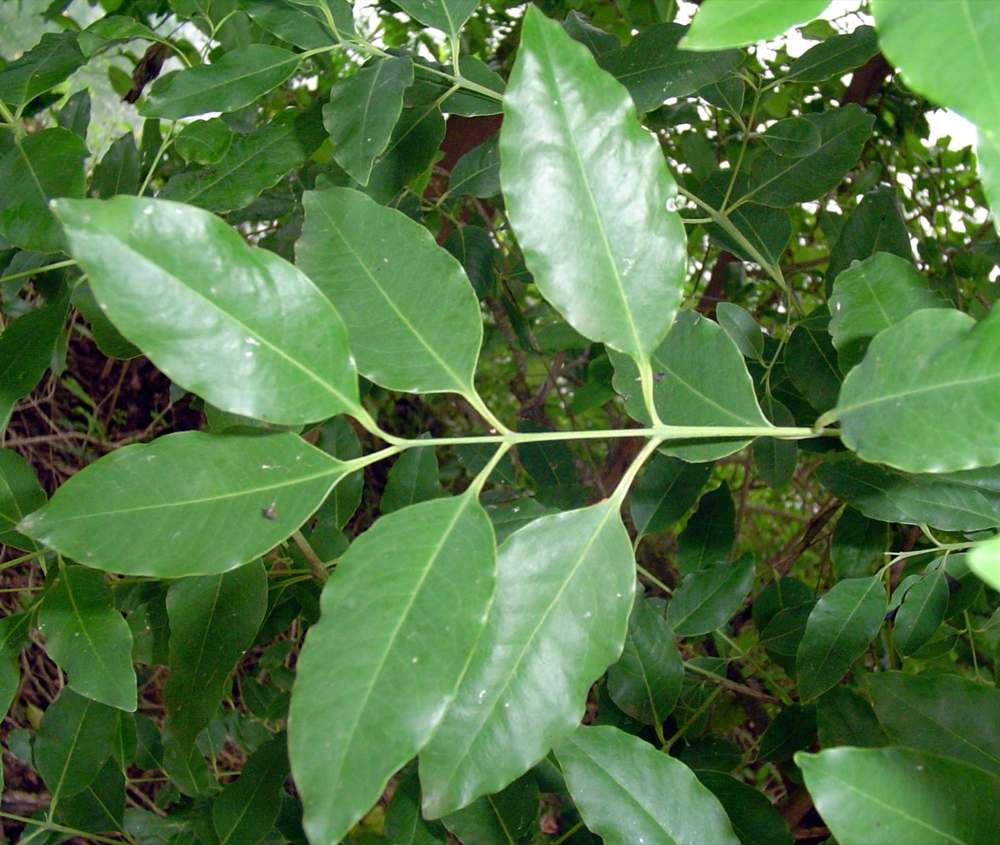

# Santalum album - Anindita

[TOC]

**Santalum album** is a small tropical tree and it is widely cultivated and long lived, although harvest is viable after 40 years.
## Uses
Skin diseases, Swelling, Inflammation, Itching,  Eczema, Acne, Bronchitis, Headache, Fever, Gastric, Chronic cough, Scabies.

## Parts Used
Fruits, Leaves.

## Chemical Composition
Many fragrant constituents and biologically active components, such as alpha- and beta-santalol, cedrol, esters, aldehydes, phytosterols, and squalene were present in the pericarp oils. This is the first report of the volatile composition of the pericarps of any Santalum species.

## Common names
| Language | Names |
| --- | --- |
| Kannada | Agarugandha, Bavanna |
| Malayalam | Chandanam, Chandana-mutti |
| Sanskrit | Anindita, Arishta-phalam |
| Tamil | Anukkam, Asam |
| Hindi | Chandan |
| English | Sandalwood, Indian sandalwood |

## Properties
Reference: Dravya - Substance, Rasa - Taste, Guna - Qualities, Veerya - Potency, Vipaka - Post-digesion effect, Karma - Pharmacological activity, Prabhava - Therepeutics.
### Dravya
### Rasa
Tikta (Bitter), Madhura (Sweet)
### Guna
Laghu (Light), Ruksha (Dry)
### Veerya
Sheeta (cold)
### Vipaka
Katu (Pungent)
### Karma
Kapha, Vata
### Prabhava
## Habit
Small tree

## Identification
### Leaf
Simple, Alternate, Leaf Shape is Elliptic-ovate to lanceolate

### Flower
Unisexual, 2-4cm long, Brownish-purple, 5-20, In axillary and terminal paniculate cymes and Flowering from December-April

### Fruit
Globose drupe, 7–10 mm, Fruiting throughout the year, Beaked with basal part of the style, dark black when ripe., -

### Other features
## List of Ayurvedic medicine in which the herb is used
## Where to get the saplings
## Mode of Propagation
Seeds, Cuttings.

## How to plant/cultivate
Seed beds of 3 ½ ft. width and 30ft length are prepared with one part sand and 2part mud and one part dry cowdung.

## Commonly seen growing in areas
Tall grasslands, Meadows, Borders of forests and fields.

## Photo Gallery

.](images/Santalum_album_(Chandan)_in_Hyderabad,_AP_W_IMG_0029.jpg)
.](images/Santalum_album_(Chandan)_in_Hyderabad,_AP_W_IMG_0028.jpg)
.](images/Santalum_album_(Chandan)_in_Hyderabad,_AP_W_IMG_0027.jpg)
.](images/Santalum_album_(Chandan)_in_Hyderabad,_AP_W_IMG_0025.jpg)
.](images/Santalum_album_(Chandan)_in_Hyderabad,_AP_W_IMG_0023.jpg)
_in_Hyderabad,_AP_W2_IMG_0023.jpg)

## References

## External Links
* [Essential oil content and composition of Indian sandalwood](https://link.springer.com/article/10.1007/s11676-013-0331-3)
* [Santalum album on agri farming.in](http://www.agrifarming.in/sandalwood-cultivation/)
* [antalum album on Indianforester.co.in](http://www.indianforester.co.in/index.php/indianforester/article/view/29134)
* [Santalum album on Useful Tropical Plants](http://tropical.theferns.info/viewtropical.php?id=Santalum+album)

## References

1. [constituents](Chemical)(https://www.ncbi.nlm.nih.gov/pubmed/22428257)
2. [Morphology](https://indiabiodiversity.org/species/show/31727)
3. [details](Cultivation)(http://contentzza.com/santalum-album-cultivation-techniques/)
