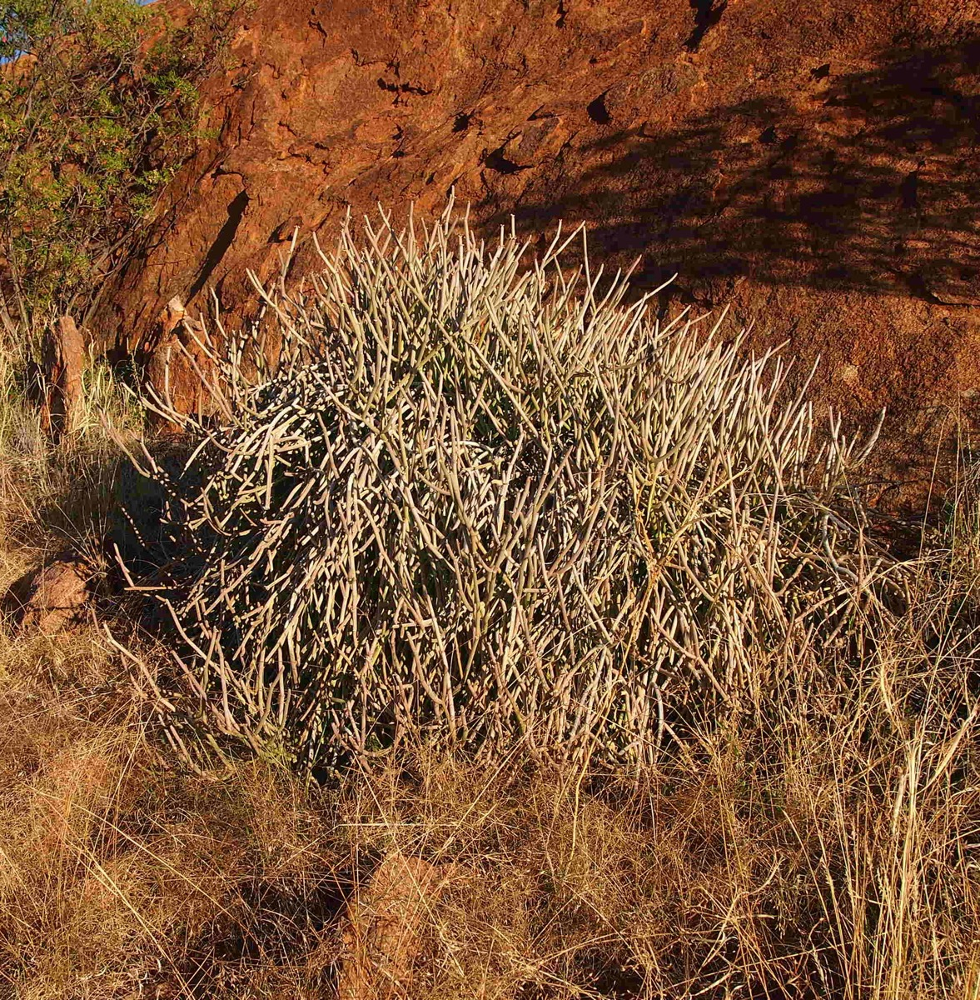

# Sarcostemma viminale - Caustic Vine

[TOC]

**Cynanchum viminale** is a leafless succulent plant in the milkweed family. The species is native to West Africa, the Indian Ocean and Western Pacific region.
## Uses
Eye treatments, Cuts, Snakebites, Curing liver disorders, Skin eruptions, Blotches, Pimples, Diarrhea, Sore throats

## Parts Used
Dried folaige, Whole herb.

## Chemical Composition
The major fatty acids isolated and identified were1-Hexadecene (C16H32), Hexadecanoic acid (C16H32O2), Octadecanoic acid(C18H36O2), 9-Octadecenoic acid (C18H34O2), 1- Docosene (C22H44)

## Common names
| Language | Names |
| --- | --- |
| Hindi | Khir-khimp |
| English | Caustic Vine, Milk rope |

## Properties
Reference: Dravya - Substance, Rasa - Taste, Guna - Qualities, Veerya - Potency, Vipaka - Post-digesion effect, Karma - Pharmacological activity, Prabhava - Therepeutics.
### Dravya
### Rasa
Tikta (Bitter), Kashaya (Astringent)
### Guna
Laghu (Light), Ruksha (Dry), Tikshna (Sharp)
### Veerya
Ushna (Hot)
### Vipaka
Katu (Pungent)
### Karma
Kapha, Vata
### Prabhava
## Habit
Tree

## Identification
### Leaf
Simple, Leaves reduced to small, triangular scales about 1-1.5 mm long. Photosynthetic material present in the green succulent branches which produce copious amounts of milky exudate when cut or broken.

### Flower
Unisexual, 7-8 mm long, Yellow, 5-20, Inflorescence a short raceme or fascicle. Flowering season is March-November

### Fruit
General, 7-9 x 0.4 cm, Follicles about 7-9 x 0.4 cm. Seeds about 5-6 x 1.5-2 mm, plumes about 15-17 mm long, 5-6, Fruiting season is March-November

### Other features
## List of Ayurvedic medicine in which the herb is used
## Where to get the saplings
## Mode of Propagation
Seeds, Cuttings.

## How to plant/cultivate
Cynanchum viminale is an easy species to grow that is suited for any well drained soil in full sun. But young plant are happy growing indoors, where they can easily reach the ceiling

## Commonly seen growing in areas
Hotter and drier parts of Africa, Coastal and inland region.

## Photo Gallery

.jpg)
.jpg)

## References

## External Links
* [Sarcostemma viminale on some magnetic island plants](https://www.somemagneticislandplants.com.au/index.php/plants/84-sarcostemma-viminale)
* [Sarcostemma viminale on zimbabwe flora.co.zw](https://www.zimbabweflora.co.zw/speciesdata/species.php?species_id=146060)
* [Sarcostemma viminale on flowers of india](https://www.flowersofindia.net/catalog/slides/Caustic%20Vine.html))

## References

1. [constituents](Chemical)(https://link.springer.com/article/10.1007%2Fs13596-014-0157-3)
2. [descripiton](Plant)(http://keys.trin.org.au/key-server/data/0e0f0504-0103-430d-8004-060d07080d04/media/Html/taxon/Sarcostemma_viminale_subsp._brunonianum.htm)
3. [and planting](Cultivation)(http://www.llifle.com/Encyclopedia/SUCCULENTS/Family/Asclepiadaceae/27584/Sarcostemma_viminale)
