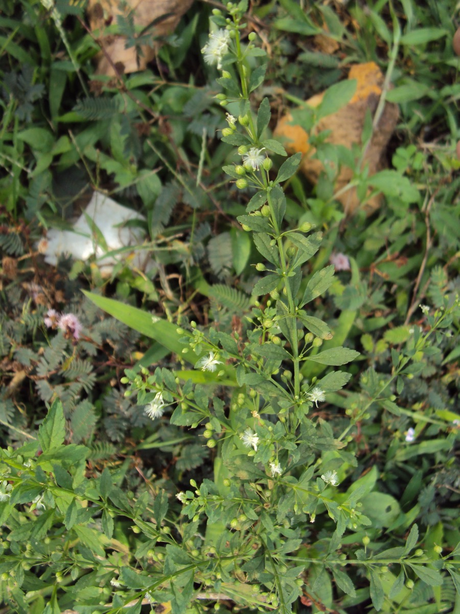

# Scoparia dulcis - Sweet Broom Weed

[TOC]

**Scoparia dulcis** is a species of flowering plant in the plantain family and It is native to the Neotropics but it can be found throughout the tropical and subtropical world.

## Uses
Gastralgia, Dysentery, Intestinal affections, Fever, Enteritis, Beriberi, Swelling, Diarrhea, Cough, Kidney complaints, Indigestion, Colic

## Parts Used
Leaf

## Chemical Composition
Palmitic acid, B-sitosterol, Glutinol, and a mixture of B-amyrin and Isomultiflorenol

## Common names
| Language | Names |
| --- | --- |
| Kannada | Manitumbe gida |
| Tamil | Sarakkotthini |
| Telugu | POttiboli |
| Hindi | Mithi patti, Jaldaniya |
| English | Sweet Broom Weed, Sweet Broom Wort |

## Properties
Reference: Dravya - Substance, Rasa - Taste, Guna - Qualities, Veerya - Potency, Vipaka - Post-digesion effect, Karma - Pharmacological activity, Prabhava - Therepeutics.
### Dravya
### Rasa
Tikta (Bitter), Kashaya (Astringent)
### Guna
Laghu (Light), Ruksha (Dry), Tikshna (Sharp)
### Veerya
Ushna (Hot)
### Vipaka
Katu (Pungent)
### Karma
Kapha, Vata
### Prabhava
## Habit
Annual plant

## Identification
### Leaf
Simple, Oblong-elliptic, Leaf Arrangement is Decussate or whorled

### Flower
Unisexual, 2-4cm long, white, 5, Flowers are Solitary or 2, axillary and Flowering throughout the year. Flowering from May to October

### Fruit
ellipsoid, 7–10 mm, Fruit are globose capsule and Fruiting throughout the year, Septicidal, Reticulate, Fruiting from May to October

### Other features
## List of Ayurvedic medicine in which the herb is used
## Where to get the saplings
## Mode of Propagation
Seeds.

## How to plant/cultivate
A common weed of lowland tropical and subtropical areas, found in areas where it rains all year round and also where there is a prolonged dry season[310 ]. Succeeds in most soils

## Commonly seen growing in areas
Subtropical area, Tropical area.

## Photo Gallery
_(3709163233).jpg)
.jpg)
_(2661183096).jpg)
.jpg)
_(3709156161).jpg)

## References

## External Links
* [Scoparia dulcis](http://ijpsr.com/bft-article/pharmacognostic-phytochemical-investigation-pharmacological-evaluation-of-scoparia-dulcis-linn-plant-extracts-for-nephro-protective-activity/?view=fulltext)
* [Scoparia dulcis on useful trophical plants](http://tropical.theferns.info/viewtropical.php?id=Scoparia+dulcis)
* [Scoparia dulcis on flowers of india](http://www.flowersofindia.net/catalog/slides/Sweet%20Broom%20Weed.html)
* [Scoparia dulcis on jircas.affrc.go.jp](https://www.jircas.affrc.go.jp/project/value_addition/Vegetables/089.html)

## References

1. [constituents](Chemical)(http://www.vjs.ac.vn/index.php/vjchem/article/view/4660)
2. [Morphology](https://indiabiodiversity.org/species/show/231128)
3. [details](Cultivation)(https://www.pfaf.org/user/Plant.aspx?LatinName=Scoparia+dulcis)
4. **Gurudeva, Magadi R. *Karnatakada Aushadhiya Sasyagalu (Vol. 2)*. Divyachandra Prakashana, Bengaluru, 2016, p. 583.**
   The plant has cytotoxic and antitumor activity due to scopadulcic acid. It shows analgesic, anti-inflammatory, sympathomimetic, and antiviral properties. Traditionally used for treating tumors, diabetes, and as a pain-relieving agent.