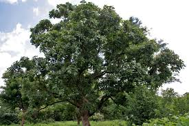
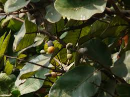
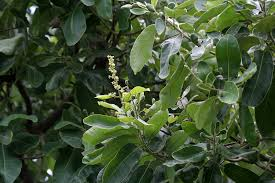
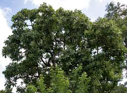
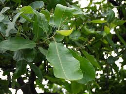

# Semecarpus anacardium - Agnimukh, Marking nut

[TOC]

**Semecarpus anacardium** is a native of India. it is found in the outer Himalayas to Coromandel Coast. It is closely related to the cashew.
## Uses
Dyspepsia, Strengthen the lungs, Arthritis, Aphrodisiac, Piles, Sexual health, Skin disease, Kapha,  Destroys worms, Wounds, Reduce urine flow

### Food
Semecarpus anacardium can be used in Food. Fresh or dried receptacles of the fruit are eaten raw. Kernel found inside the hard shell is eaten.

## Parts Used
Fruits, Gum, Pericarp.

## Chemical Composition
Anacardic acid, cardol, catechol, anacardol and fixed oit, sernicarpoi, bhilawanol.

## Common names
| Language | Names |
| --- | --- |
| Kannada | Geru, Geru-kayi |
| Malayalam | Thennukota, Alakcueer |
| Sanskrit | Angika, Agnimukh, Ballataka |
| Tamil | Kalakam, Kavaka |
| Telugu | Ballatamu |
| Hindi | Bealata, Bela, Bhilava |
| English | Marking nut |

## Habit
Tree

## Identification
### Leaf
Simple, Tri-foliolate,lanceolate, Leafs are 2.5-13.5 cm long to 1-5.5 cm wide. The leaflets are green above and a silvery grey-green beneath and are covered on their lower surfaces in small yellow glands.

### Flower
Unisexual, 14cm long, Yellow, papilionaceous, Typical of species belonging to the Leguminosae subfamily Papilionoideae, and resemble, for example, the pea ( Pisum sativum ) flower, Flowering from August to March

### Fruit
Ovoid, The nut is about 25 millimetres long, The seed inside the black fruit, known as godambi, is edible when properly prepared., Single seed, Fruiting from August to March

### Other features
## List of Ayurvedic medicine in which the herb is used
[Amrita Bhallataki](../medicines/Amrita_Bhallataki.md), [Dhanvantari Ghrita](../medicines/Dhanvantari_Ghrita.md), [Nilibringaraja Taila](../medicines/Nilibringaraja_Taila.md), [Pamarin](../medicines/Pamarin.md), [Bhallatakavati](../medicines/Bhallatakavati.md), [Sanjeevani vati](../medicines/Sanjeevani_vati.md)

## Where to get the saplings
## Mode of Propagation
Seeds.

## How to plant/cultivate
Plants are adaptable to a variety of tropical and subtropical conditions. Semecarpus anacardium is available through January to May

## Commonly seen growing in areas
Hotter parts, Deciduous forests of the Malaysian archipelago, Northern Australia.

## Photo Gallery

## References

## External Links
* [Pigeon pea on Agropedia](http://agropedia.iitk.ac.in/content/diseases-pigeon-pea)
* [Agnimukh on medicinalplantsanduses.com](https://www.medicinalplantsanduses.com/semecarpus-anacardium-benefits-uses)
* [Agnimukh on ncbi .com](https://www.ncbi.nlm.nih.gov/pmc/articles/PMC3249908/)
* [Agnimukh on krishnaherbals.com](http://www.krishnaherbals.com/semecarpus-anacardium.html)
* [Agnimukh on researchgate.net](https://www.researchgate.net/publication/255607921_Bhallatak_Semecarpus_anacardium_Linn-A_Review)
* [Agnimukh on envis.frlht.org](http://envis.frlht.org/plantdetails/22989c1b27bcda307d52f60fa81b0f96/ee6751f007818a9d07dda1be1ee996a4)

## References

1. [medicines](Bimbima)(https://www.bimbima.com/ayurveda/ayurvedic-herb-bhallataka-semecarpus-anacardium/331/)
2. [plants](Trophical)(http://tropical.theferns.info/viewtropical.php?id=Semecarpus+anacardium)
3. [ayurveda](Planet)(http://www.planetayurveda.com/library/bhallataka-semecarpus-anacardium)
4. **Gurudeva, Magadi R. *Karnatakada Aushadhiya Sasyagalu (Vol. 2)*. Divyachandra Prakashana, Bengaluru, 2016, p. 257.**
   The marking nut is a key drug in Ayurveda (Bhallataka) used extensively in treating rheumatoid arthritis. The nut milk extract has demonstrated hepatoprotective, anticancer, and antioxidant properties. It is also used for treating skin diseases including leucoderma and vitiligo, and has shown nemati. Nut processed carefully to remove toxic resin before use; oil applied externally for skin conditions; Bhallataka preparations used in Ayurvedic formulations for arthritis treatment.
5. "Forest food for Northern region of Western Ghats" by Dr. Mandar N. Datar and Dr. Anuradha S. Upadhye, Page No.134, Published by Maharashtra Association for the Cultivation of Science (MACS) Agharkar Research Institute, Gopal Ganesh Agarkar Road, Pune