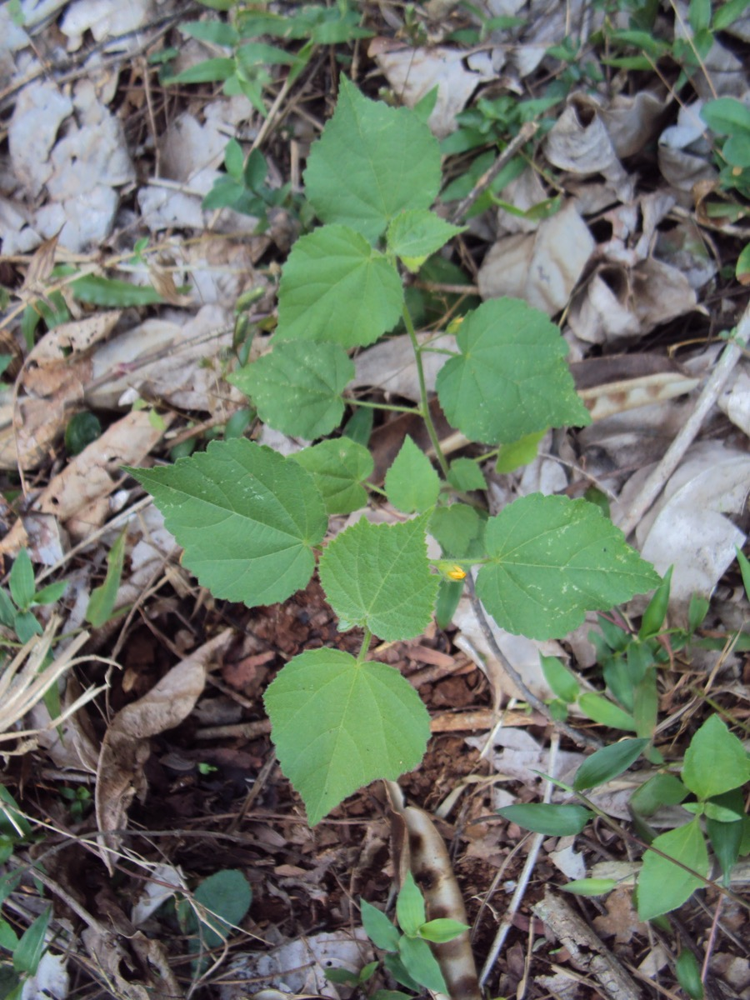

# Sida cordifolia - Bala

[TOC]

**Sida cordifolia** is a perennial shrub of the mallow family Malvaceae and it is native to India. its seeds and root are used to make medicine.

## Uses
Bleeding piles, Diarrhea, Fever, Gonorrhea, Aphrodisiac, wounds, Ophthalmia, Painful urination, Paralysis, headache, loss of voice

## Parts Used
Roots, seed, Leaves.

## Chemical Composition
The following alkaloids were reported from S. cordifolia growing in India and β-phenethylamine, ephedrine, pseudo-ephedrine, S-(+)-Nb-methyltryptophan methyl ester, hypaphorine, vasicinone, vasicinol, choline, and betaine.

## Common names
| Language | Names |
| --- | --- |
| Kannada | Hethutti, Bili kurunthotti |
| Malayalam | Vellooram, Velluram |
| Sanskrit | Bala, Batyalaka |
| Tamil | Mayir-manikham |
| Telugu | Chirubenda |
| Hindi | Bariar, Kungyi Khareti, Kharenti |
| English | Country mallow |

## Properties
Reference: Dravya - Substance, Rasa - Taste, Guna - Qualities, Veerya - Potency, Vipaka - Post-digesion effect, Karma - Pharmacological activity, Prabhava - Therepeutics.
### Dravya
### Rasa
### Guna
### Veerya
### Vipaka
### Karma
### Prabhava
## Habit
perennial shrub

## Identification
### Leaf
serrate, Heart shaped, The leaves are truncate, 2.5-7 cm long and 2.5-5 cm broad, with 7-9 veins.

### Flower
Small, 2.5 cm long, yellow or white in colour, Petals 5, solitary and axillaries; Calyx campanulate; lobes 5, triangular, densely pubescent outside. Petals 5, pale yellow. Stamens monadelphous and Plant flowers from August to December

### Fruit
Loculicidal capsule, 7.5–11 cm long, 1.5 cm broad, fruits are with 8 – 10 strongly reticulated mericarps, ciliate on the upper margins and fruiting from October to January., 12-20 seeds

### Other features
## List of Ayurvedic medicine in which the herb is used
* [Bala taila](Bala_taila.md)
* [Balarishta](Balarishta.md)
* [Ksheerabala 101 taila](Ksheerabala_101_taila.md)

## Where to get the saplings
## Mode of Propagation
Seeds.

## How to plant/cultivate
Prefers a lighter, sandy soil in a sunny position

## Commonly seen growing in areas
Tropical area, Subtropical area, Sandy soil area.

## Photo Gallery
_at_Kambalakonda_Wildlife_Sanctuary_02.JPG)
_at_Kambalakonda_Wildlife_Sanctuary_04.JPG)
_(17389129342).jpg)
_in_Hyderabad,_AP_W_IMG_9420.jpg)
_in_Hyderabad,_AP_W_IMG_9422.jpg)

## References

## External Links
* [Sida cordifolia on planet ayurveda](http://www.planetayurveda.com/library/bala-sida-cordifolia)
* [Bala (Sida Cordifolia) Medicinal Use and Health Benefits](https://www.bimbima.com/ayurveda/herb-information-balasida-cordifolia/614/)

* [Sida cordifolia-uses, side effects](https://easyayurveda.com/2012/10/03/country-mallow-sida-cordifolia-ayurveda-details-health-benefits/)
* [Sida cordifolia on medindia,net](https://www.medindia.net/alternativemedicine/bala.asp)

## References

1. ["Morphology"](http://eol.org/pages/703261/details)
2. [Details"]("Cultivation)(http://tropical.theferns.info/viewtropical.php?id=Sida+cordifolia)
3. [Medicinal Use and Health Benefits"](")(https://www.bimbima.com/ayurveda/herb-information-balasida-cordifolia/614/)
