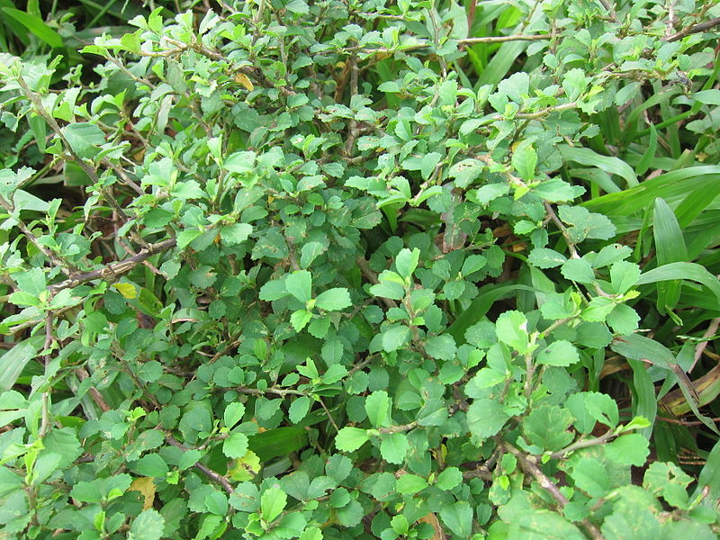

# Sida rhombifolia - Devabala

[TOC]

**Sida rhombifolia** is widely distributed in the tropics and occurs in almost all countries of tropical Africa.
## Uses
Fever, Indigestion, Snakebites, Headaches, Boils, Cramps, Rheumatism, Toothache, Chapped lips, Pimples

## Parts Used
Leaves, Fruits, Roots

## Chemical Composition
Alkaloids, steroids and saponins. In DPPH scavenging assay the IC50 value was found to be 50 μg/mL which was not comparable to the standard ascorbic acid

## Common names
| Language | Names |
| --- | --- |
| Malayalam | Vankuruntotti |
| Tamil | Kurundotti |
| Hindi | Sahadeva |
| English | Cuban jute, Jelly leaf |

## Properties
Reference: Dravya - Substance, Rasa - Taste, Guna - Qualities, Veerya - Potency, Vipaka - Post-digesion effect, Karma - Pharmacological activity, Prabhava - Therepeutics.
### Dravya
### Rasa
Tikta (Bitter), Kashaya (Astringent)
### Guna
Laghu (light), Snigda (heavy), Picchila (sticky)
### Veerya
Sheeta (cold)
### Vipaka
Madhura (sweet)
### Karma
Vata, Kapha
### Prabhava
## Habit
Subshrub

## Identification
### Leaf
Simple, Alternate, Arranged alternately along the stem, approximately 3/4 to inches long, with petioles that are less than 1/3 the length of the leaves

### Flower
Unisexual, 4 to 8 mm long, Yellow, 5, The seedlings with 2 heart-shaped cotyledons

### Fruit
simple, 7–10 mm, clearly grooved lengthwise, Lowest hooked hairs aligned towards crown, many

### Other features
## List of Ayurvedic medicine in which the herb is used
* [Vishatinduka Taila](../medicines/Vishatinduka_Taila.md) as *root juice extract*

## Where to get the saplings
## Mode of Propagation
Seeds, Cuttings.

## How to plant/cultivate
Grows wild in a range of soil types, from fertile to degraded condition

## Commonly seen growing in areas
disturbed fields, roadsides, rocky areas.

## Photo Gallery
_flower_at_Madhurawada.JPG)
_flower_at_Safilguda.JPG)

.jpg)

.jpg)
.jpg)
.jpg)

## References

## External Links
* [Sida rhombifolia-uses, remedies, side effects](https://herbpathy.com/Uses-and-Benefits-of-Sida-Rhombifolia-Cid4563)
* [Sida rhombifolia on plantnet.org](https://uses.plantnet-project.org/en/Sida_rhombifolia_(PROTA))
* [Anti-inflammatory and anti-oxidant properties of Sida rhombifolia](https://www.ncbi.nlm.nih.gov/pubmed/21970621)
* [Sida rhombifolia on holostic online.org](http://www.holistic-online.com/Herbal-Med/_Herbs/h_sida-rhombifolia.htm)

## References

1. ["Phytopharmacological"](https://www.ncbi.nlm.nih.gov/pubmed/24144125)
2. [description"]("leaves)(http://www.flowersofindia.net/catalog/slides/Jelly%20Leaf.html)
3. [Details"]("Cultivation)(http://tropical.theferns.info/viewtropical.php?id=Sida%20rhombifolia)
