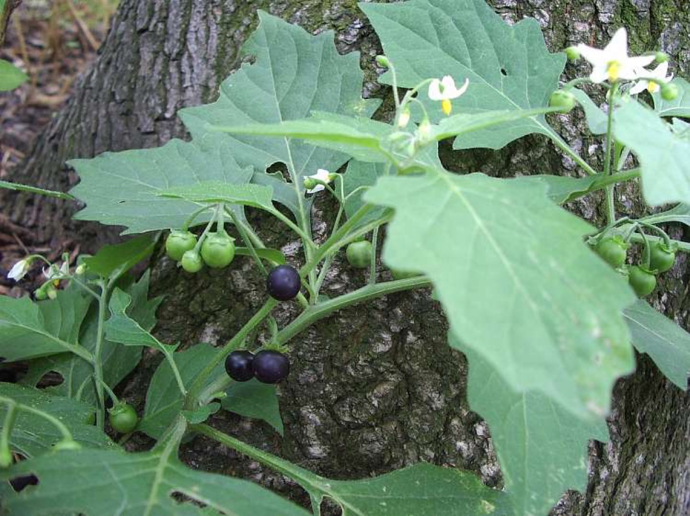
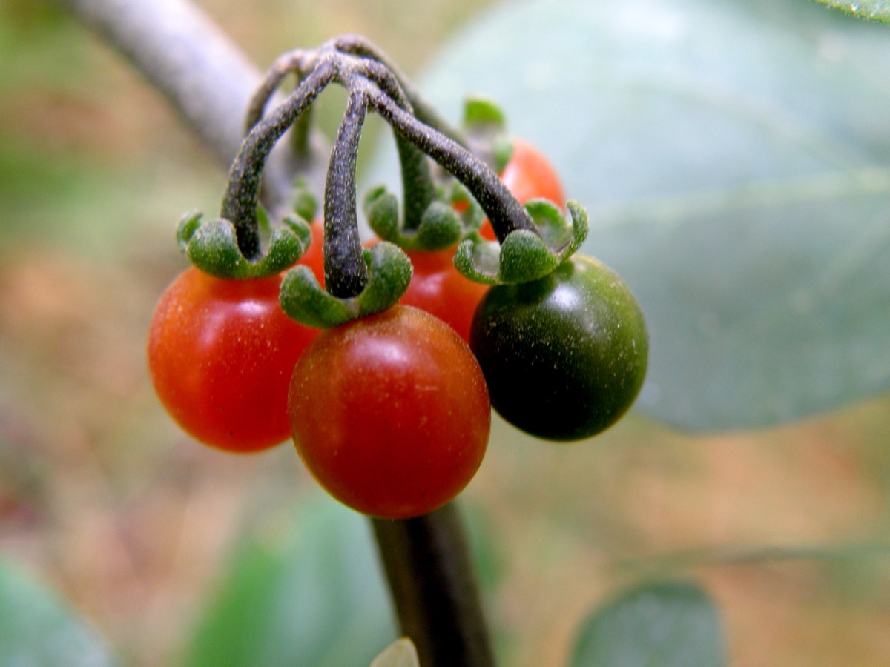

# Solanum nigrum - Kakamachi

[TOC]

**Kakamachi** is native to Eurasia and introduced in the Americas, Australasia, and South Africa. Parts of this plant can be toxic to livestock and humans. Nonetheless, ripe berries and cooked leaves of edible strains are used as food in some locales, and plant parts are used as a traditional medicine.

## Uses
Ulcer, Indigestion, Fever, Skin Diseases, Kidney problems, Jaundice, Pimples, Diarrhea, Sore throats

## Parts Used
Fruits, Leaves.

## Chemical Composition
Phytochemical screening yielded alkaloids, saponins, tannins, flavonoids, and proteins

## Common names
| Language | Names |
| --- | --- |
| Malayalam | Mulaku-thakkali |
| Tamil | Manatakkali |
| Telugu | Kasaka |
| Hindi | Mokoi |
| English | Black nightshade, Black-berry night shade |

## Properties
Reference: Dravya - Substance, Rasa - Taste, Guna - Qualities, Veerya - Potency, Vipaka - Post-digesion effect, Karma - Pharmacological activity, Prabhava - Therepeutics.
### Dravya
### Rasa
Tikta (Bitter)
### Guna
Laghu (Light), Snigda (slimy)
### Veerya
Ushna (Hot)
### Vipaka
Katu (Pungent)
### Karma
Kapha, Vata
### Prabhava
## Habit
Herb

## Identification
### Leaf
Simple, Alternate, The leaves are Blade ovate, elliptic or diamond-shaped, thin, margin large-toothed or sometimes entire

### Flower
Unisexual, 6–14 mm, White, 5, Flowers Season is July–October

### Fruit
Spherical, 5–10 mm, black or sometimes green when ripe, slightly wider than long, -

### Other features
## List of Ayurvedic medicine in which the herb is used
## Where to get the saplings
## Mode of Propagation
Seeds.

## How to plant/cultivate
Black nightshade is cultivated as a food crop on several continents, including Africa and North America. The leaves of cultivated strains are eaten after cooking

## Commonly seen growing in areas
Cultivated land, Heaps of earth, Wasteland areas.

## Photo Gallery

## References

## External Links
* [Solanum nigram Linn on natural home remedies](http://naturalhomeremedies.co/Snigrum.html)
* [Solanum nigram Linn on science direct](https://www.sciencedirect.com/topics/agricultural-and-biological-sciences/solanum-nigrum)
* [Solanum nigram Linn on gobotany.newenglandwild.org](https://gobotany.newenglandwild.org/species/solanum/nigrum/)
* [Solanum nigram Linn on trophical rainforest plants](http://keys.trin.org.au/key-server/data/0e0f0504-0103-430d-8004-060d07080d04/media/Html/taxon/Solanum_nigrum.htm)

## References

1. [Constituents "]("chemical)(http://www.stuartxchange.org/Lubi-lubi.html)
2. [description"]("plant)(http://www.luontoportti.com/suomi/en/kukkakasvit/black-nightshade)
3. [details"]("cultivation)(https://en.wikipedia.org/wiki/Solanum_nigrum)
