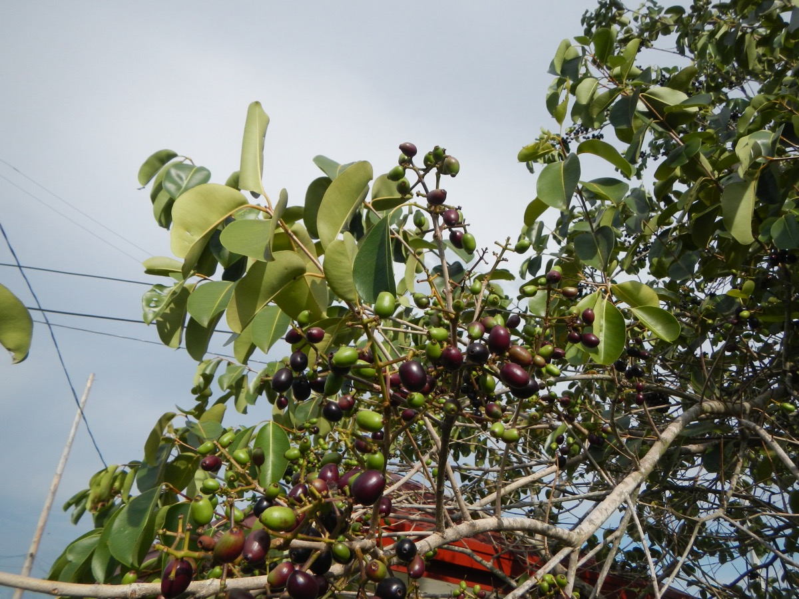

# Syzygium cumini - Jambu, Malabar plum

[TOC]

**Syzygium cumini** is an evergreen tropical tree in the flowering plant family Myrtaceae. Syzygium cumini is native to the Indian Subcontinent and adjoining regions of Southeast Asia.
## Uses
Diabetes, Dysentery, Snakebites, Hyperglycaemia, Glycosuria, Wounds, Irregular menstruation, Mouth ulcers, Diarrhoea.

### Food
Syzygium cumini can be used in Food. Mature fruits are eaten raw.

## Parts Used
Fruits.

## Chemical Composition
Total phenolics, anthocyanins and flavonoid contents of pulp, respectively. Kernel and seed coat contained total phenolics respectively.

## Common names
| Language | Names |
| --- | --- |
| Kannada | Jambunerale |
| Tamil | Nagai |
| Hindi | Jamun |
| English | Java plum, Jamun |

## Properties
Reference: Dravya - Substance, Rasa - Taste, Guna - Qualities, Veerya - Potency, Vipaka - Post-digesion effect, Karma - Pharmacological activity, Prabhava - Therepeutics.
### Dravya
### Rasa
Tikta (Bitter), Kashaya (Astringent)
### Guna
Laghu (Light), Ruksha (Dry), Tikshna (Sharp)
### Veerya
Ushna (Hot)
### Vipaka
Katu (Pungent)
### Karma
Kapha, Vata
### Prabhava
### Nutritional components
Syzygium cumini Contains the Following nutritional components like - Ascorbic acid, acetic acid; thiamine, riboflavin, niacin, fructose and glucose carotene, vitamin A; folic acid, palmitic, stearic, oleic and linoleic, dextrin, phytosterol, tannin, β-sitosterol. corilagin, ellagitannins, ellagic acid, gal-loyl-galactoside and gallic acid; chlorine, copper, iron, Magnesium, nitrogen, phosphorus, Potassium, Sodium, sulfur.

## Habit
Evergreen shrub

## Identification
### Leaf
Simple, The leaves are turpentine smell, and are opposite, 5-25 cm long, 2.5-10 cm wide, oblong-oval or elliptic, blunt or tapering to a point at the apex

### Flower
Unisexual, 2.5-10 cm, White, rose-pink, 5-20, These are fragrant and appear in clusters 2.5-10 cm long, each being 1.25 cm wide and 2.5 cm long

### Fruit
Oblong, 1.25-5 cm long, The fruit is usually astringent, sometimes unpalatably so, and the flavour varies from acid to fairly sweet, With hooked hairs, 2-5

### Other features
## List of Ayurvedic medicine in which the herb is used
* [Pushyanuga churna](Pushyanuga_churna.md)
* [Musli Khadiradi churna](Musli_Khadiradi_churna.md)
* [Ushirasava](../medicines/Ushirasava.md)

## Where to get the saplings
## Mode of Propagation
Seeds, Cuttings.

## How to plant/cultivate
A plant of the tropics and subtropics, where it is found at elevations up to 1500 metres. It grows best in areas where annual daytime temperatures are within the range 20 - 32°c, but can tolerate 12 - 48°c Seeds must be sown immediately after harvest, they germinate readily. Syzygium cumini is available through March to June.

## Commonly seen growing in areas
Tropical areas, Subtropical forest areas, Wet to fairly dry areas.

## Photo Gallery

## References

## External Links
* [Syzygium cumini Indianmirror.com](http://www.indianmirror.com/ayurveda/agrimony.html)
* [Syzygium cumini Pfaf.org](https://www.pfaf.org/user/Plant.aspx?LatinName=Agrimonia+eupatoria)
* [Syzygium cumini Herbal-supplement-resource.com](https://www.herbal-supplement-resource.com/agrimony-herb.html)
* [Syzygium cumini Globalherbalsupplies.com](https://www.globalherbalsupplies.com/herb_information/agrimony.htm)
* [Syzygium cumini Botanical.com](https://botanical.com/botanical/mgmh/a/agrim015.html)

## References

1. [constituents](Chemical)(https://www.ncbi.nlm.nih.gov/pubmed/20836162)
2. [Discription](Botanical)(http://ijpsr.com/bft-article/morphology-pytochemistry-and-pharmacology-of-syzygium-cumini-linn-an-overview/?view=fulltext)
3. [preparations](Ayurvedic)(https://easyayurveda.com/2013/01/29/jamun-benefits-usage-dose-side-effects-complete-ayurveda-details/)
4. [Details](Cultivation)(http://tropical.theferns.info/viewtropical.php?id=Syzygium+cumini)
5. "Forest food for Northern region of Western Ghats" by Dr. Mandar N. Datar and Dr. Anuradha S. Upadhye, Page No.145, Published by Maharashtra Association for the Cultivation of Science (MACS) Agharkar Research Institute, Gopal Ganesh Agarkar Road, Pune
