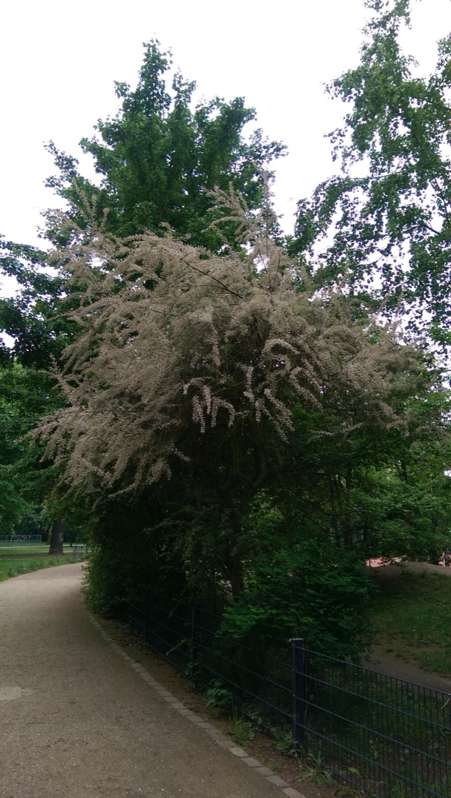

# Tamarix gallica - Bahugranthih

[TOC]

**Tamarix gallica** is a deciduous, herbaceous, twiggy shrub or small tree reaching up to about 5 meters high. It is indigenous to Saudi Arabia and the Sinai Peninsula, and very common around the Mediterranean region. It is present in many other areas as an invasive introduced species, often becoming a noxious weed. It was first described for botanical classification by the taxonomist Carolus Linnaeus in 1753, but had already been in cultivation since 1596.
## Uses
Wounds, Diarrhoea, Dysentery, Spleen trouble,
Leucoderma, Oxidative stress.

## Parts Used
Leaves.

## Chemical Composition
The major chemical constituents of Tamarix indica are tannin (50%), tamarixin, troupin, 4-methylcoumarin and 3,3-di-O-methylellagic acid.Several types of polyphenols (anthocyanins, tannins,flavonones, isoflavonones, resveratrol and ellagic acid)are currently reported. the presence of some antioxidantcompound i.e. terpenoids

## Common names
| Language | Names |
| --- | --- |
| Kannada | Pakke |
| Malayalam | Siru savukku |
| Sanskrit | Jhavuka |
| Tamil | Ciru-cavukku |
| Telugu | Pakke |
| Hindi | Jhaoo, Bari Mayee |
| English | Tamarisk, Manna Plant |

## Properties
Reference: Dravya - Substance, Rasa - Taste, Guna - Qualities, Veerya - Potency, Vipaka - Post-digesion effect, Karma - Pharmacological activity, Prabhava - Therepeutics.
### Dravya
### Rasa
### Guna
### Veerya
### Vipaka
### Karma
### Prabhava
## Habit
Deciduous Shrub

## Identification
### Leaf
Alternate, Very small, 1/16 inch and scale-like, pale green.

### Flower
Unisexual, Small, Lavender pink, 5, Numerous and occurring all along the twig, very attractive, appearing in early spring

### Fruit
Small, 7.5–11 cm long, 1.5 cm broad, Dry capsules containing small cottony seeds, ripen in late spring, Cottony seeds

### Other features
## List of Ayurvedic medicine in which the herb is used
## Where to get the saplings
## Mode of Propagation
Seeds, Cuttings.

## How to plant/cultivate
An easily grown plant, succeeding in most soils and tolerant of saline conditions. Grows well in heavy clay soils as well as in sands and even shingle

## Commonly seen growing in areas
Moist region.

## Photo Gallery

_-_DSC03778.JPG)

## References

## External Links
* [Tamarix gallica-uses,benefits,side effects,nutrients](https://herbpathy.com/Uses-and-Benefits-of-Tamarix-Gallica-Cid5199)
* [Tamarix gallica on natural medicinal herbs](http://www.naturalmedicinalherbs.net/herbs/t/tamarix-gallica=manna-plant.php)
* [Tamarix gallica on himalay wellness](http://www.himalayawellness.com/herbfinder/tamarix-gallica.htm)

## References

1. [constituents](Chemical)(http://saspublisher.com/wp-content/uploads/2014/08/SAJP35363-365.pdf)
2. [Morphology](http://dendro.cnre.vt.edu/dendrology/syllabus/factsheet.cfm?ID=400)
3. [Ecology](http://practicalplants.org/wiki/Tamarix_gallica)
