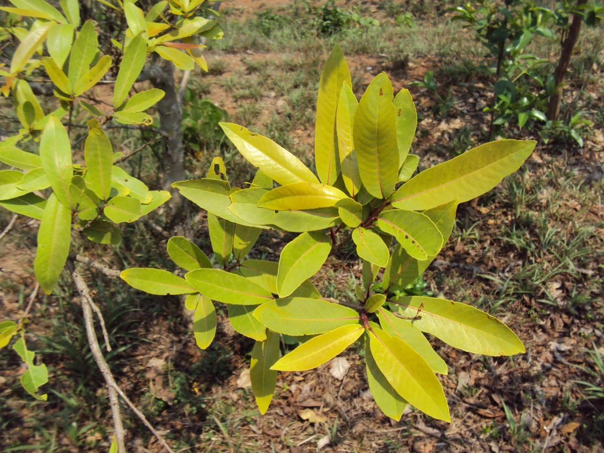

# Terminalia arjuna - Arjuna, White Marudah

[TOC]

**Terminalia arjuna** is a tree of the genus Terminalia. The arjuna grows upto 20–25 metres tall. Usually has a buttressed trunk and forms a wide canopy at the crown, from which branches drop downwards. This plant is belongs to Cobretaceae family.
## Uses
Atherosclerosis, Coronary artery disease, Myocardial infarction, Shortness of breath, Angina pectoris, Dyslipidemia, Hyper cholesterol, Hemorrhages, Bone Fractures.

## Parts Used
Bark, Leaves.

### How to use
* Cut out a slice of the bark to use. A thin slice of 2mm to 5mm should do.
* Terminalia Arjuna usually sheds a thin layer of its bark in the run up to summer. This is not to be mistaken with the bark that is used for medicinal purpose.

## Chemical Composition
Main chemical constitutes are tannins, triterpenoid saponins (arjunic acid, arjunolic acid, arjungenin and arjunic acid), flavonoids, gallic acid, ellagic acid and phytosterols.

## Common names
| Language | Names |
| --- | --- |
| Kannada | Kere matti |
| Malayalam | Neer maruthu |
| Sanskrit | Arjuna |
| Tamil | Maruda maram |
| Telugu | Thella maddi |
| Hindi | Arjuna |
| English | Arjuna tree |

## Properties
Reference: Dravya - Substance, Rasa - Taste, Guna - Qualities, Veerya - Potency, Vipaka - Post-digesion effect, Karma - Pharmacological activity, Prabhava - Therepeutics.
### Dravya
### Rasa
Tikta (Bitter), Kashaya (Astringent)
### Guna
Laghu (Light), Ruksha (Dry), Tikshna (Sharp)
### Veerya
Ushna (Hot)
### Vipaka
Katu (Pungent)
### Karma
Kapha, Vata
### Prabhava
## Habit
Tree

## Identification
### Leaf
Simple, Opposite, Conical and oblong leaves. Leaves have a green color on the top and brown color below..

### Flower
Unisexual, 2-4cm long, Yellow, 5, Flowering Time is March and June

### Fruit
General, 2 to 5 cm, Fruition Time	Between September to November, It has fibrous woody fruits, Many

### Other features
## List of Ayurvedic medicine in which the herb is used
## Where to get the saplings
## Mode of Propagation
Seeds.

## Season to grow
Seeds are sown in nursery beds in early summer.

## Soil type required
The tree prefers alluvial loamy or black cotton soils.

## Ecosystem/Climate
Under natural conditions in India Terminalia arjuna grows along streams and rivers, from sea-level up to 1200 m altitude.

## How to plant/cultivate
Its fruit is dried in the sunlight and than stored up to 6 -12 months. Seeds are pretreated by soaking in the water for 48 hours before sowing in beds.

## Commonly seen growing in areas
Humid areas, Red lateritic soils, Borders of forests, Fertile lateritic soils.

## Photo Gallery

_tree_at_Vivekananda_park_in_Kakinada.jpg)

## References

## External Links
* [Medicinal properties of Terminalia arjuna (Roxb.) Wight & Arn.: A review](https://www.sciencedirect.com/science/article/pii/S2225411016000262)
* [Summary of Terminalia arjuna](https://examine.com/supplements/terminalia-arjuna/)
* [Terminalia arjuna on world agro forestry.org](http://www.worldagroforestry.org/treedb2/speciesprofile.php?Spid=18136)

## References

1. [Constituents](Chemical)(http://www.motherherbs.com/terminalia-arjuna-extract.html)
2. [description](Plant)(https://www.ayurtimes.com/terminalia-arjuna-arjun-tree/)
3. Karnataka Aushadhiya Sasyagalu By Dr.Maagadi R Gurudeva, Page no:175
4. [methods](Cultivation)(http://www.ecoindia.com/flora/trees/arjun-tree.html)
5. [type required](Soil)(https://www.echarak.in/echarak/templates/Terminalia%20arjuna%20%20Wt.%20and%20Arn..pdf)
6. [to grow](Season)(https://vikaspedia.in/agriculture/crop-production/package-of-practices/medicinal-and-aromatic-plants/terminalia-arjuna)
7. [Ecology](https://uses.plantnet-project.org/en/Terminalia_arjuna_(PROTA)#:~:text=Under%20natural%20conditions%20in%20India,(pH%208.5%E2%80%9310.5).)
