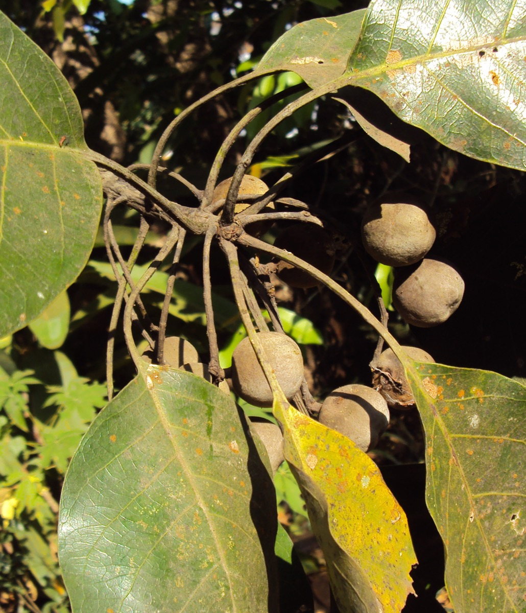

# Terminalia bellerica roxb - Bibhitaki

[TOC]

**Bibhitaki** is growing widely throughout the Indian subcontinent, Sri Lanka and  SE Asia. In the  Traditional  system  of  medicine   like   Siddha and  Unani.  Medicinal uses  have  been described  as  it  is  works  in  disease  of  every  system. This plant is belongs to Combretaceae family.
## Uses
Indigestion, Respiratory problems, Diarrhoea, Chronic constipation, Hoarseness, Cough, Sore eyes, Sore throats

## Parts Used
Seeds, Fruits.

## Chemical Composition
Beta-sitosterol,gallic acid,ellagic acid,ethyl gallate,galloyl glucose,chebulagic acid.

## Common names
| Language | Names |
| --- | --- |
| Kannada | Thare, Tare Mara |
| Malayalam | Thani, Thannikka |
| Sanskrit | Akshah, Kasaghnah |
| Tamil | Semmaram, Vibidagam |
| Telugu | Karshaphalamu |
| Hindi | Bahuvirya, Bahera |
| English | Bedda nut tree, Belliric myrobalan |
.

## Properties
Reference: Dravya - Substance, Rasa - Taste, Guna - Qualities, Veerya - Potency, Vipaka - Post-digesion effect, Karma - Pharmacological activity, Prabhava - Therepeutics.
### Dravya
### Rasa
Kashaya (Astringent)
### Guna
Laghu (Light), Ruksha (Dry)
### Veerya
Ushna (Hot)
### Vipaka
Madhura (Sweet)
### Karma
Kapha, Pitta
### Prabhava
## Habit
Deciduous tree

## Identification
### Leaf
Simple, Alternate or opposite, The leaves are spiral, clustered at the twig ends and petiole 3-10 cm long, obovate, elliptic or obovate-elliptic, margin entire, secondary veins 7 - 10 pairs, pinnate, prominent, tertiary veins reticulate.

### Flower
Unisexual, 2-4cm long, Creamy white, 5-20, Inflorescence axillary spikes and flowers sessile, Flowering season is March-May

### Fruit
Ovoid, 3 cm across, Slightly 5 ridged, With hooked hairs, 1-seeded, Fruiting season is March-May

### Other features
## List of Ayurvedic medicine in which the herb is used
## Where to get the saplings
## Mode of Propagation
Seeds.

## Season to grow
Summer.

## Soil type required
Suitable for: light (sandy), medium (loamy) and heavy (clay) soils and prefers well-drained soil.

## Ecosystem/Climate
## How to plant/cultivate
The plant has a wide ecological range, succeeding in tropical and subtropical climates, but does not grow above 600 m altitude.  It is found at elevations up to 1,400 metres in China.

## Commonly seen growing in areas
Scattered forests, Sunny mountain slopes.

## Photo Gallery

_(3393800009).jpg)

_(3392698146).jpg)
_(3391882571).jpg)

## References

## External Links
* [Terminalia bellerica on Pharmacological activities of Baheda ](http://www.phytojournal.com/archives/2016/vol5issue1/PartC/4-4-28.pdf)
* [Terminalia bellerica on planet ayurveda](http://www.planetayurveda.com/library/bibhitaki-terminalia-bellerica)
* [Terminalia bellerica on banajata.org](http://www.banajata.org/bahada.htm)

## References

1. [Phytochemicals](https://www.mdidea.com/products/proper/proper06003.html)
2. Kappatagudda - A Repertoire of  Medicianal Plants of Gadag by Yashpal Kshirasagar and Sonal Vrishni, Page No. 368
3. [Details](Cultivation)(http://tropical.theferns.info/viewtropical.php?id=Terminalia+bellirica)
4. Karnataka Aushadhiya Sasyagalu By Dr.Maagadi R Gurudeva, Page no:151
5. [type required](Soil)(https://pfaf.org/user/Plant.aspx?LatinName=Terminalia+bellirica#:~:text=Terminalia%20bellirica%20is%20a%20deciduous,and%20prefers%20well%2Ddrained%20soil.)
6. [names](Common)(https://sites.google.com/site/efloraofindia/species/a---l/cl/combretaceae/terminalia/terminalia-bellirica)
