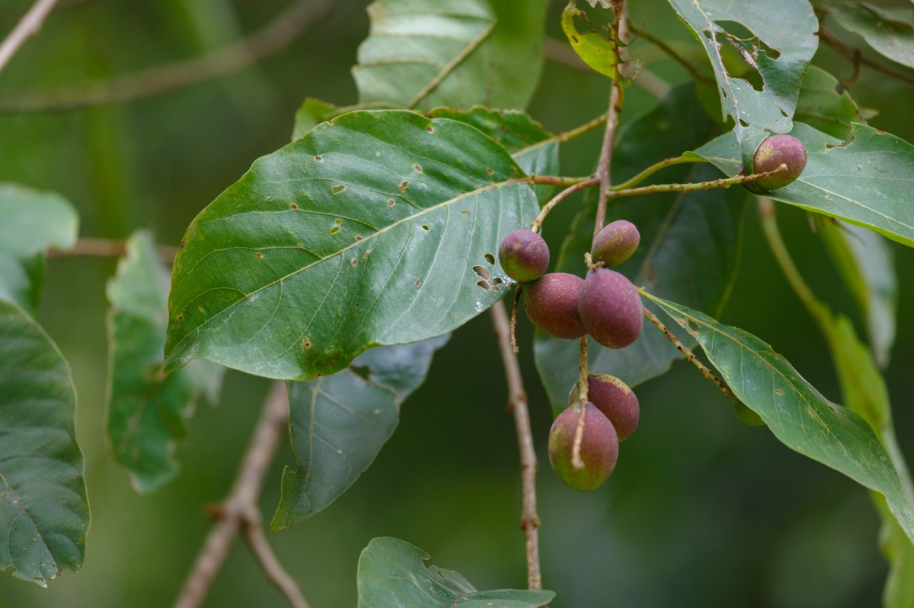

# Terminalia chebula - Haritaki

[TOC]

**Terminalia chebula** is regarded as a universal panacea in Ayurveda and in the traditional Tibetan medicine. The fruit also provides material for tanning leather and dyeing wool,silk and cotton.

## Uses
Hair loss, Acne, Ulcers, Skin Allergies, Cough, Cold, Diabetes, High blood pressure, Dysentery

## Parts Used
Leaves.

## Chemical Composition
Main chemical constitutes are chebulagic acid, chebulinic acid, corilagin, beta-sitosterol, gallic acid, ellagic acid, ethyl gallate, tannic acid, galloyl glucose & chebulaginic acid.

## Common names
| Language | Names |
| --- | --- |
| Sanskrit | Abhaya, Kaayasta, Shiva, Pathya, Vijayaa |
| English | Myrobalan |
| Gujarati | Hirdo, Himaja, Pulo-harda |
| Hindi | Harre, Harad, Harar |
| Kannada | Alalekai |
| KS | Halela |
| Malayalam | Nerinjil |
| Marathi | Sarate, Gokharu |
| Punjabi | Halela, Harar |
| Tamil | Kadukkai |
| Telugu | Karaka, Karakkaya |

## Properties
Reference: Dravya - Substance, Rasa - Taste, Guna - Qualities, Veerya - Potency, Vipaka - Post-digesion effect, Karma - Pharmacological activity, Prabhava - Therepeutics.
### Dravya
### Rasa
Tikta (Bitter), Madhura, Amla, Katu, Tikta, Kashaya
### Guna
Laghu (Light), Ruksha (Dry)
### Veerya
Ushna (Hot)
### Vipaka
Madhura (Sweet)
### Karma
[Deepana](Deepana.md), Hridya, Meedya, Rasayana, Anulomana

### Prabhava
## Habit
Evergreen tree

## Identification
### Leaf
Simple, The leaves are divided into 3-6 toothed leaflets, with smaller leaflets in between

### Flower
Unisexual, 2-4cm long, Yellow, 5-20, Flowers are simple or branched axillary spikes. Flowering from March-May

### Fruit
Obovoid, 7–10 mm, Fruiting April onwards, Oblong-ellipsoid drupe, faintly angled, glossy, glabrous, seed solitary

### Other features
## List of Ayurvedic medicine in which the herb is used
[Ballātakādi Modaka](../medicines/Ballātakādi_Modaka.md), [Triphala churna](Triphala_churna.md), [Lohaasava](Lohaasava.md)

## Where to get the saplings
## Mode of Propagation
Seeds, Cuttings.

## How to plant/cultivate
Succeeds in tropical and subtropical areas up to an elevation of 1,500 metres, exceptionally to 2,000 metres. It grows best in areas where the mean maximum and minimum annual temperatures are within the range 22 - 35°c, though it can tolerate

## Commonly seen growing in areas
Scattered in teak forest, Mixed deciduous forest.

## Photo Gallery

_(3641857568).jpg)
_(3496496138).jpg)

## References

## External Links
* [The development of Terminalia chebula Retz. (Combretaceae) in clinical research](https://www.ncbi.nlm.nih.gov/pmc/articles/PMC3631759/)
* [Learn How to grow Haritaki](https://haritaki.org/cultivation-of-haritaki-myrobalans-terminalia-chebula/)
* [Terminalia chebula on pitchandikulam-herbarium.org](http://www.pitchandikulam-herbarium.org/contents/description-leaf.php?id=149)
* [Terminalia chebula on planet ayurveda](http://www.planetayurveda.com/library/haritaki-terminalia-chebula)

## References

1. [constituents](Chemical)(http://www.motherherbs.com/terminalia-chebula-extract.html)
2. [Morphology](https://indiabiodiversity.org/species/show/31838)
3. [Details](Cultivation)(http://tropical.theferns.info/viewtropical.php?id=Terminalia+chebula)
